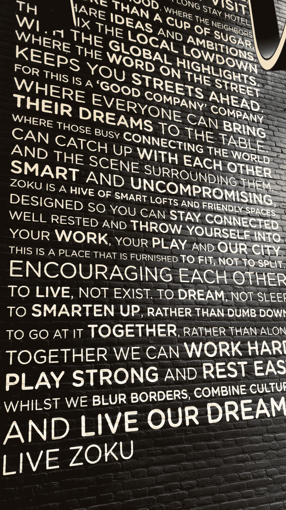
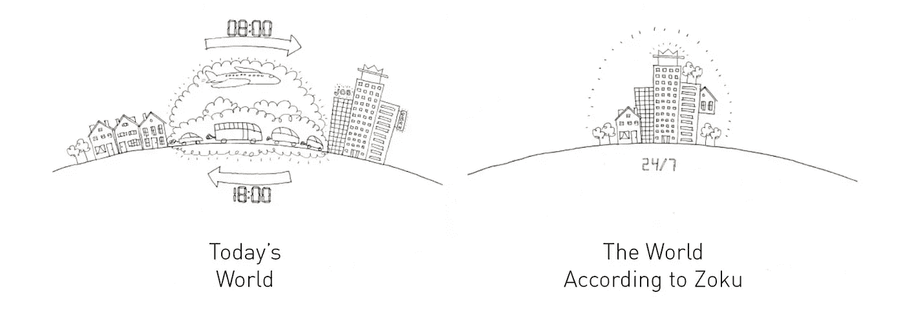

# 这个世界需要更多像 Zoku 这样的创新居住空间

> 原文：<https://medium.com/swlh/the-world-needs-more-innovative-coliving-spaces-like-zoku-4ef98685433e>

这是工作生活平衡的缩影吗？

Photo Courtesy LiveZoku.com

从街上看，Zoku 就像是阿姆斯特丹市中心郊区的另一座灰色建筑。但是走进去，这是一个*完全不同的故事*。

我最近在阿姆斯特丹测试不同的合作会员时发现了 Zoku，它以最好的方式震撼了我的心灵。请允许我向您介绍我认为在当今零工经济中提高工人生活质量的理想模式。

# 活的 Zoku——概述

Welcome to Zoku

# 欢迎来到佐库

从我到达的那一刻起，我就能感觉到有些不同。贴在 Zoku 大厅墙上的是他们的使命宣言:

Zoku Manifesto

# 佐库宣言

我已经被激起了兴趣，但当我到达他们的屋顶社交空间时，我仍然不知道会发生什么，被描述为:

> "嗡嗡作响的酒吧、舒适的客厅、热闹的厨房、公共工作空间和一些华丽的屋顶露台."

当电梯门打开到 6 楼时，我听到喘息声。仿佛我正站在通往天堂的大门前，一条绿色和环境光的走廊展现在我面前，尽头是一个蜡烛照亮的共同工作的乌托邦等待着我。我立即抓起手机，在 Instagram 上捕捉这一体验。*这是什么地方？*

在温室般的玻璃隧道两侧，可以一览城市和郊区的美景。感觉自己踏入了一个梦幻的世界，但马上就要变好了。

我花了很长时间走到大厅的尽头，Zoku 的常驻社区经理 Hidde 带着温暖的微笑和一杯燕麦牛奶卡布奇诺向我打招呼。他很兴奋地向我展示了“公共区域”——但是良性的术语不可能公正地描述这个地方。我真的觉得我在另一个星球的未来孵化器里。

> 仿佛我正站在通往天堂的大门前，一条绿色和环境光的走廊展现在我面前，尽头是一个蜡烛照亮的共同工作的乌托邦。

[Tour Zoku Amsterdam](http://youtube.com/travelingwithkristin)

# 一个对所有人开放的空间

毫无疑问，Zoku 创造了一个屋顶天堂，里面装满了你在 21 世纪生存所需的一切。散布在周围的是一系列角落、缝隙、书桌和桌子——非常适合工作、阅读或聊天。

此外，还有会议室、活动空间、多个露台和平台、一个全方位服务的“生活”厨房、游戏、电话亭和配备办公用品的更大的电话亭。

> **有想法？你可以在墙上画出来。**

在整个空间里，有免费的水果和水，还有大量充满活力的食物和饮料可供购买。他们还提供一日三餐家常菜和有机食品——如果你想分享的话。

内部是质朴的，其装饰实现了将 WeWork 的实用性与[修复五金](https://www.restorationhardware.com/)展厅的舒适和别致相结合的壮举。

> 我重复一遍——佐库是名副其实的千年天堂。

这是一个你永远不想离开的地方。幸运的是，你不必这样做。主要会员区每天 24 小时开放，下面有 5 层长住酒店客房。哦，是的——你实际上可以住在 Zoku，在他们 144 个阁楼式公寓中的一个。

# 公寓

每间公寓都备有全套设施，并配有:

*   有供应品的工作区；
*   配有咖啡机的完整厨房；
*   带一张特大床的独立睡眠空间；
*   生活区；
*   大厨房餐桌；
*   私人浴室；
*   24/7 入住；
*   你甚至可以定制墙上的艺术品，让它更具个性。

该网站警告说，如果你离开，你可能会患上分离焦虑症。我相信他们。

# 价格是多少？

房间起价约为每晚 130€英镑，不含早餐和 6%的城市税。价格还取决于房间大小和日期，如果您感兴趣，还可以选择长期住宿。

# 包括什么？

您可以使用房间设施，还可以进入 Zoku 的所有社交空间，包括咖啡吧、游戏室、厨房、共同工作空间、音乐角和治疗室。

Zoku 几乎考虑到了一切，让您住得方便和有效率。他们提供移动应用程序、社区管理器、定期活动、家政、自行车租赁、洗衣以及获取办公用品和材料等服务。甚至还有一台 3d 打印机！

# 为什么需要更多的佐库？

现代生活方式损害了全球人口的健康。我们的钱包、身体和头脑能够承受的压力、通货膨胀和压力是有限的。这是在讨论孤独、抑郁、关系以及人类今天面临的许多心理健康挑战之前。

在我的文章中，[合住是住房的未来吗？中，我讨论了我们当前住房模式的缺点，以及合住可以解决这些缺点的潜在方法。](https://entrepreneurs.maqtoob.com/is-co-living-the-future-of-housing-4b2c2b7a6f4b)

 [## 合住是住房的未来吗？

### 休斯顿，我们有一个住房问题:我们目前的模式是昂贵的，不灵活的，有限的，和孤立的。

entrepreneurs.maqtoob.com](https://entrepreneurs.maqtoob.com/is-co-living-the-future-of-housing-4b2c2b7a6f4b) 

**如今的职场人士想要:**

*   超快速、可靠的 WiFi
*   最新的技术
*   高效工作空间
*   便利的便利设施
*   安全舒适的生活和工作环境
*   参加当地活动、娱乐和休闲的机会
*   高品质的食物和饮料、精酿啤酒和咖啡
*   流体和无缝运输选项
*   降低他们的生活成本和日常生活的复杂性
*   委派、外包或消除诸如洗衣服或支付每月账单等任务的能力
*   有机会在生活的各个领域与他人进行深层次的交流:商业、社交和浪漫

像 Zoku 和 [Roam](https://www.roam.co/) 这样的合住解决方案处于满足当今数字游牧者和自由职业者需求的最前沿。他们还整合了客户所重视的社会和环境意识元素。

例如，Zoku 是一座获得 LEED 和绿钥匙金牌认证的建筑，其建造和设计都考虑到了可持续性。这种可持续发展延续到其他经营领域，甚至延伸到他们为客人和社区成员提供的食物。

# 展望大企业的未来和机遇

The World According to Zoku

与过去几年的体力劳动相比，人类正在承担不成比例的脑力劳动。几十年来，人们已经适应了长时间的通勤，因为人们普遍认为他们可能负担不起工作地点的生活费用。从事自由职业、加入零工经济或远程工作的人的比例正呈指数级增长。比起加薪，人们现在更看重工作中的自由和灵活性。渴望在郊区一个大而孤立的家里与人交流。

我们需要政府和政治家迅速向智能城市设计、负责任的分区和深思熟虑的城市规划迈进。但是——与此同时——通过为现在和未来的人群创造前瞻性的共同工作、共同生活和住房解决方案，企业有很多未开发的潜力来解决这些问题。

[***克里斯汀·威尔森***](https://www.travelingwithkristin.com/about-1/) *通过她的两家* [*搬迁公司*](http://www.pokerrefugees.com/) *已经帮助超过 1000 人搬迁到> 25 个国家。*

她现在也是一名作家和演说家，她教人们如何在数字游牧生活方式中获得成功，并帮助公司为其员工准备远程工作任务。了解更多 [*此处*](https://www.travelingwithkristin.com/speaking-workshops/) *。*

## 这篇文章发表在 [The Startup](https://medium.com/swlh) 上，这是 Medium 最大的创业刊物，拥有+385，976 名读者。

## 在这里订阅接收[我们的头条新闻](http://growthsupply.com/the-startup-newsletter/)。

