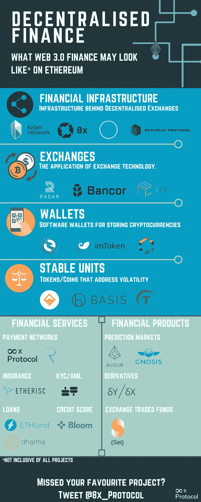

# 金融界正在重建。

> 原文：<https://medium.com/swlh/the-world-of-finance-is-being-rebuilt-81dbb49ffae1>

## 以太坊上分散金融的兴起。

Photo by [Pepi Stojanovski](https://unsplash.com/@timbatec?utm_source=medium&utm_medium=referral) on [Unsplash](https://unsplash.com?utm_source=medium&utm_medium=referral)

## 淘汰旧的。

从 Mt. Gox 的垮台和集中交易所偶尔出现的安全漏洞等例子来看，金融领域的集中化已被置于负面影响之下。

这推动了一些项目创建基础设施，避免集中化。主要的基础设施之一是引入了允许分散交换(DEX)和令牌交换方法的技术。

然而，dex 的推出不仅仅是交易员和投资者的胜利，也是金融业未来的胜利。

## 跟上新的潮流。

在以太坊，基础设施的创建允许开发者社区构建我们遗留系统的去中心化的对应部分。

目前这方面的例子包括:

*   付款。
*   买保险。
*   创造贷款和放贷。
*   创建市场并能够在所述市场上下注。
*   加密货币的交易篮子。
*   购买衍生品。

去中心化金融的用户流大概是这样的:

*DEXs - >钱包- >金融应用/产品。*

这只是去中心化的金融世界的开始，随着正确的基础设施到位，我们当前世界的去中心化的对等物可以在 web 3.0 中建立起来。

然而，分散融资的成功依赖于解决可扩展性和大规模采用等问题。看看事情会如何发展会很有趣。

## 8x 协议——区块链上的循环稳定支付

*作者是 8x 协议的团队成员，该协议旨在促进循环加密支付，而不会使消费者或企业暴露于加密货币的波动性。*

网站/白皮书:【https://8xprotocol.com/】
推特:[https://twitter.com/8x_Protocol](https://twitter.com/8x_Protocol)
电报社区:[https://t.me/eightexprotocol](https://t.me/eightexprotocol)

## 这个故事发表在 [The Startup](https://medium.com/swlh) 上，这是 Medium 最大的创业刊物，拥有 351，974+人关注。

## 在此订阅接收[我们的头条新闻](http://growthsupply.com/the-startup-newsletter/)。

