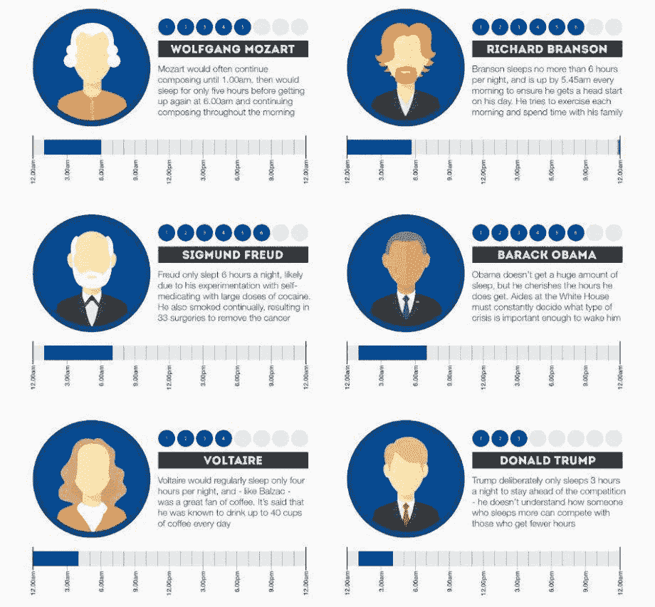
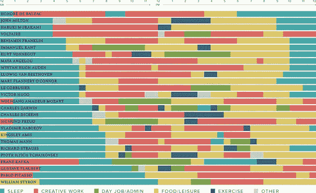
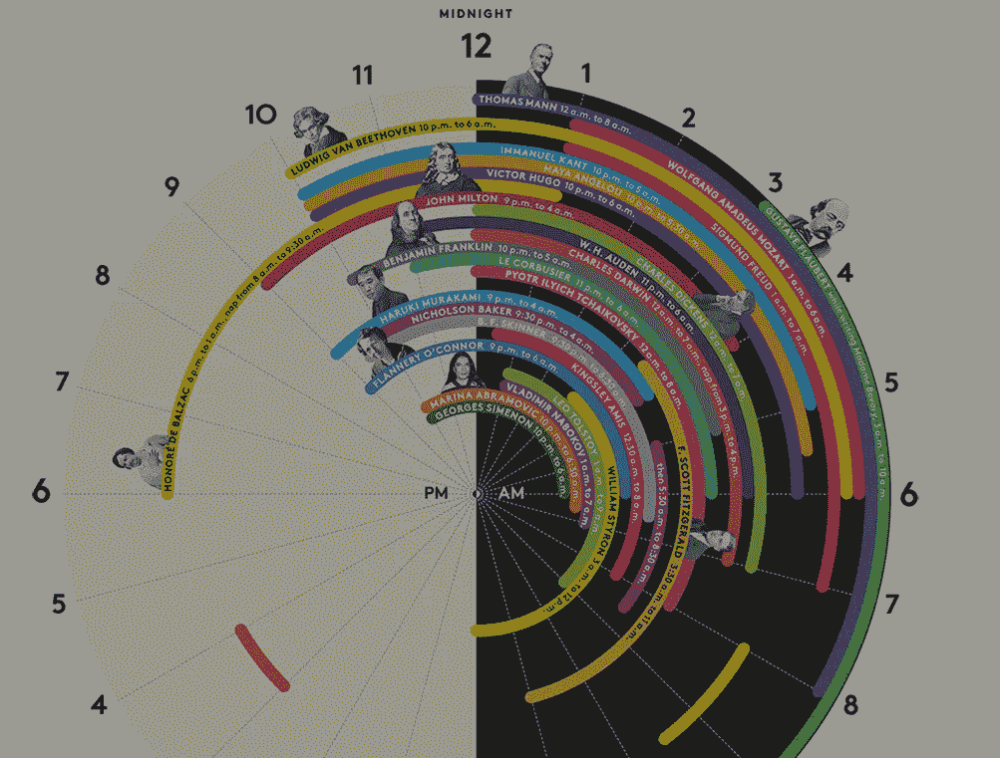

# 世界上最有价值的商品:时间

> 原文：<https://medium.com/swlh/the-world-s-most-valuable-commodity-time-e5b35318170b>

想象一下，有一家银行每天早上向你的账户存入 86，400 美元。它每天都没有余额。每天晚上，它会删除你当天没有用完的余额。你会怎么做？取出每一分钱。我们每个人都有这样一家银行。这叫时间。每天早上，它会给你 86400 秒。每天晚上，它都会把你未能明智投资的东西记为亏损。它没有平衡。它不允许透支。每天，它都会为你开一个新账户。如果你没有使用天的存款，损失是你的。没有回头路了。没有对抗明天的图纸。你必须用今天的存款活在当下。抓住每一个机会。时钟在走。你必须充分利用今天，就在此时此地。

# 时间不等人

追踪每一条线索。珍惜每一秒。总是关闭。错过的每一个机会都意味着金钱的损失。记住，昨天已经成为历史。明天是一个谜。今天是一份礼物。所以才叫现在。

*   要想知道一年**的价值，去问留级的学生。**
*   想知道**一个月**的价值，去问一位早产的母亲。
*   想知道**一周**的价值，去问周报的编辑。
*   想知道**一小时**的价值，就去问刚刚错过火车的人。
*   想知道**一秒**的价值，就去问侥幸躲过一场事故的人。
*   想知道一毫秒的价值，就去问奥运会上获得银牌的人。

# 如何对抗时间

或者 gan ize。如果你像大多数每天睡六到八个小时的人一样，剩下十六到十八个小时的时间来赚钱，你会很快意识到时间的价值。时钟在走…

*   设置您的日历。说明一切。睡眠、健身、旅行、个人任务、工作任务、通话、会议、阅读、培训等。
*   这可能是你第一次意识到你的时间有多重要，一旦崩溃，你可能会害怕。克服这一点，你很快就能完成比以往任何时候都多的事情。
*   对自己负责。很容易把事情推到第二天。现在不是成为时间牺牲品的时候。你的心态需要变成充分利用每一秒钟。与他人共享您的日历。让他们知道他们可以渴望什么。击中每一个目标。超出预期。
*   你很快就会开始意识到睡眠相对于时间的价值。六到八个小时？赢的是时间，不是你。是时候掌控全局了。停止胡说八道。
*   自动化日程安排。试试 [YouCanBook.me](https://youcanbook.me/) 。这是一个免费的在线预订应用程序，已经帮助安排了数十万次会议、约会和聚会。你现在可以更明智地利用时间了。这里没有隶属关系。只是一个伟大的产品。
*   你会在一定程度上理解时间。它会变得疯狂。了解你愿意牺牲什么和完成什么，并据此制定计划。

# 对有一天出名感兴趣

我写这篇文章的时间到了。

*发表于* **创业、旅游癖和生活黑客**

-