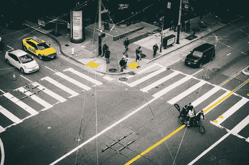

# 错误的生活方式

> 原文：<https://medium.com/swlh/the-wrong-way-to-live-life-8fa82b35db8>

*我们决定的结果不会永远存在*

Photo by [Yoel J Gonzalez](https://unsplash.com/photos/omRFB9rakQo?utm_source=unsplash&utm_medium=referral&utm_content=creditCopyText) on [Unsplash](https://unsplash.com/search/photos/wrong-way?utm_source=unsplash&utm_medium=referral&utm_content=creditCopyText)

当我审视我的生活时，有时我觉得我过着错误的生活。我想知道我是如何来到这里的，这很令人难过，因为我应该知道我是如何来到这里的。我想更好的问题是为什么我选择了现在的位置。

回想起来，我所有的决定都是有原因的。有些是实际的，有些是基于金钱，有些可能是一种行为…