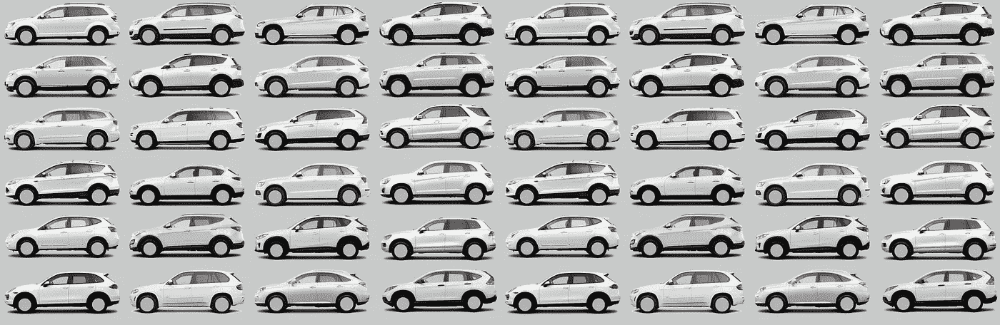
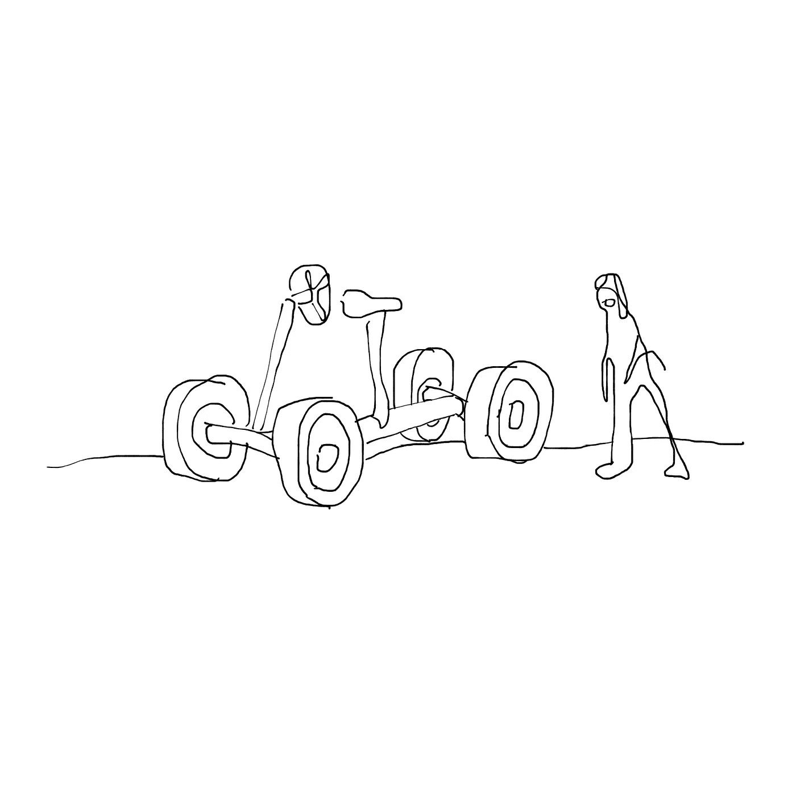
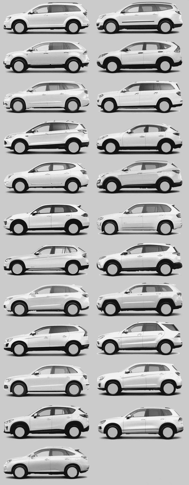
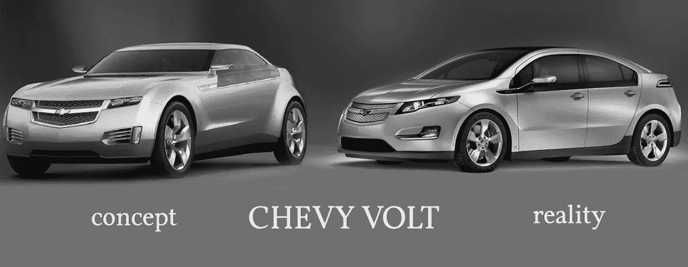
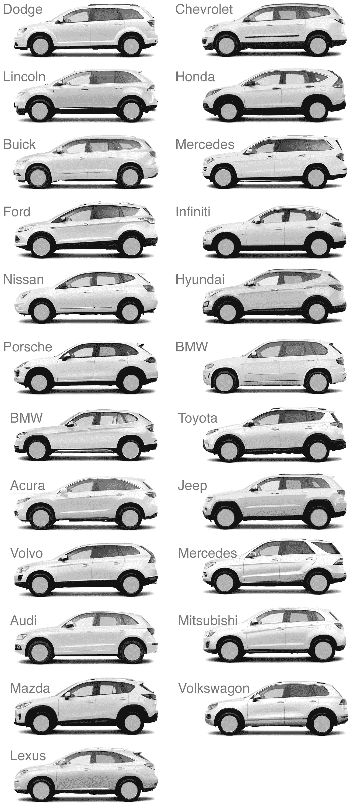

# 僵尸手机

> 原文：<https://medium.com/swlh/the-zombie-mobile-b03932ac971d>

**活死人之术，第十六章**

***还记得我们小时候吗？每辆车看起来都如此不同，如此独一无二。这只是燕麦片。”—杰瑞·宋飞***

**如果我告诉你，经过一百年的激烈竞争，汽车制造商终于制造出了完美的汽车，你会怎么想？你会相信汽车设计的发展已经达到了如此完美的程度，以至于每个制造商都同意生产相同的车型吗？那将是荒谬的，不是吗？然而，在 2013 年，如果你对汽车进行比较，你可能会得出这样的结论。汽车之间的差异从来没有像现在这样小。下图包含了 21 家制造商的 23 款汽车。看看你能否分辨出谁制造了什么。这是怎么发生的？**

**买车是这样发生的:首先你决定品类。“我想要一辆车。”然后你确定品牌。“我喜欢本田。”然后你决定子类别。“我应该买雅阁还是思域？”然后你选一种颜色。"我要红色的雅阁。"注意到你在决策过程中的任何时候都不会有超过几个选择吗？这不是偶然的。**

****

**人们认为他们需要各种各样的选择，但是多样性削弱了我们做出简单决定的能力。汽车公司给人一种多样化的错觉，同时保持实际类别非常基本。这就是为什么你只有 5 种颜色选择，而不是从 pantone book 中选择。与选择火红色或樱桃红相比，选择红色和白色更容易。**

**汽车公司明白，为了让你购买，他们不能给你太多选择。有数百万种汽车、品牌和选择的组合，但是通过将选择分解成微小的决定，销售人员能够克服我们的优柔寡断。广泛的类别(汽车、卡车、货车)引导客户进行购买。**

**有时，即使是宽泛的分类也不足以完全消除善变客户的犹豫不决。为了满足那些无法在卡车、轿车、货车或 SUV 之间做出选择的消费者，一个新的类别诞生了。这就是所谓的交叉。跨界车是终极的一刀切产品。它是一辆卡车，但不是卡车。它是一辆车，但不是一辆车。不是 SUV 就是 SUV。它是一辆小型货车，但不是一辆小型货车。它速度快，省油，强劲，宽敞，安全。这就好像汽车公司拿走了每一种消费者的愿望清单，然后把它们都放在一辆汽车里。**

**如果你斜眼看一辆跨界车，你可以把任何你想要的车强加到它平淡无奇的外表上。它具有汽车的圆形线条。它有着 SUV 的粗犷姿态。它有旅行车的加长车尾。它有一个迷你货车的最大化空间的泡沫形状。它没有一个平板床，但添加一个挂钩和牵引包，你的内部卡车的声音将得到满足。**

**在过去的十年里，每一个汽车制造商都接受了这一新的类别，跨界车的销售非常出色。消费者喜欢购买跨界车时不做决定。**

****

**Can you match the crossover to its corresponding brand? The answers are at the bottom of this post.**

**跨界不是对产品设计的掌握，而是对市场调研的突破。汽车公司无意中涉足这一普通领域。可以肯定的是，每个制造商通过这种模仿的方式比通过差异化和创新获利更多。随着竞争力量达到平衡，汽车公司不会在整个范围内均等地展示各种产品。相反，他们就在最有利可图的地段隔壁开店。品牌专家坚持认为，成功来自于提升你的独特属性，但实际上，差异化不如整合有利可图。在博弈论中，这被称为纳什均衡，它可以在麦当劳对面的汉堡王或山姆俱乐部隔壁的好市多的每个十字路口看到。竞争不会产生多样性，它会导致商品化，直到我们只剩下 23 种相同的车辆。**

**品牌活动花费数百万来掩盖这个肮脏的小秘密。结果，我们被品牌信息洗脑，以至于我们不再看到我们购买的产品的内在含义。行业分析师 Horace Dediu 这样描述汽车行业的分类，**

> **“他们和其他人一样有同样的车、同样的尺寸、同样的模式，他们都是用同样的工艺制造的……同样的工艺、同样的成本结构、同样的质量。所以你不能再区分了。”**

**[品牌化是捷径](/@ade3/shortcut-addiction-9e7e8c622371#.ipn1639uz)，还记得吗？当我们沉迷于品牌捷径时，实际的产品差异化会妨碍决策。我们并不寻找拥有最佳引擎的汽车，我们寻找的是在集体文化意识中与制造质量联系在一起的标志。想象一下，如果所有的跨界车看起来都大不相同。突然之间，购买决定变得很难。如果我认为自己是一个丰田人，但我喜欢起亚的车身风格，我将无法决定。如果我在寻找豪华，但福特看起来更豪华，我再次陷入困境。通过统一所有品牌的风格，每个品牌都卖得更多，因为决策更容易。你所要做的就是挑选你的品牌，告诉他们你喜欢 5 种颜色中的哪一种。你不能责怪汽车公司利用无头脑的大众赚钱。**

**我们喜欢把品牌看作是对他们制造的产品或多或少的准确描述。最终发生的是，一个品牌变得与产品无关，而更多的是对购买产品的人的描述。丰田以制造可靠的汽车而闻名，但今天很难找到任何品牌的汽车能跑 15 万英里。品牌不再是可靠性的代表，而是一群重视可靠性的人的代表。梅赛德斯并不是奢侈品的体现，而是一种象征，吸引那些能够支付额外费用的人，让他们与奢侈品联系在一起。所有的汽车都含有外国部件，但购买福特或雪佛兰可以让你在个性上贴上“美国制造”的标签。**

**汽车品牌不再体现差异化，而是体现时尚。正如著名的博朗设计师迪特·拉姆斯多年前所观察到的那样，这并非完全没有先例，**

> **“我讨厌一切受时尚驱使的东西。在 60 年代，我讨厌美国的风格，尤其是汽车。他们每两年更换一次款式，以销售与优秀设计毫无关系的新款式。"**

**不同的是，在 60 年代，一种时尚的风格可以增加一个品牌的吸引力。今天，太多的天赋会损害销售，因为品牌宣传的公众害怕接受偏离常规的风险。车企的压力不是创新，而是从众。结果不是品牌化，而是*讨好*。**

**汽车不仅仅是美学，毫无疑问，不同汽车的驾驶体验也不仅仅是统一的外观。在闪亮的油漆工作之下是不同质量的不同部件。这是否足以原谅 blanding 效应？我不这么认为。现实情况是，汽车的外观应该与它的基本形式有某种联系。没有形式和功能之间的认可，这个设计只是多余的点缀。罗伯特·皮尔西格写道，**

> **“其结果相当典型的现代技术，整体沉闷的外观令人沮丧，必须覆盖一层‘风格’的饰面才能让人接受。对于任何对浪漫品质敏感的人来说，这只会让事情变得更糟。现在它不仅乏味得令人沮丧，而且是虚假的。把这两者放在一起，你会得到一个对现代美国技术相当准确的基本描述。”**

**为了给人一种与众不同的感觉，制造商宁愿冒不符合标准的风险，也要在交叉路口加上无意义的字符线。甚至连轮子都是品牌线索。如果车轮在对比照片中没有被涂白，品牌会更容易识别。**

**品牌符合度排行榜中最让我惊讶的公司是保时捷。保时捷的设计遗产毋庸置疑。无论保时捷是 60 年代还是 90 年代制造的，人们都能一眼认出它。保时捷的跨界车 Cayenne 完全摒弃了它的传统。**

**为什么一家跑车公司会做跨界车？原因是保时捷在 90 年代几乎破产。为了生存，他们聘请了一位新的首席执行官，名叫温德林·魏德金。魏德金的哲学可以用他自己的话来概括，**

> **“每个产品都要挣钱。否则，你只是在追求一种业余爱好，这对于汽车行业来说不是一项任务。”**

**换句话说，制造汽车不是为了制造艺术，而是为了赚钱。从这个角度来看，保时捷是跨界车的早期采用者也就不足为奇了，如果他们没有直接用 Cayenne 来创造跨界车的话。纯粹主义者感到震惊的是，保时捷将建立除了跑车以外的东西，但这是有意义的财务决定。魏德金解释道，**

> **“保时捷要想保持独立，就不能依赖市场上最易变的细分市场……我们必须确保自己有足够的利润来支付未来的发展。”**

**魏德金对“善变”一词的使用很能说明问题。翻译过来就是“有品味的人都很挑剔。赚钱的唯一途径就是满足那些无法辨别质量的人。”质量之水被保时捷愿意将他们的品牌借给非艺术人士所污染。**

**制造 Cayenne 的决定并不是拒绝创造伟大跑车的传统，而是一种妥协，让他们能够生存下来，从而仍然能够制造他们真正热爱的对象。为了不断生产艺术，保时捷由满足僵尸、从众驱动的产品资助。你仍能买到像 Cayman 一样出色的车型的唯一原因是，保时捷最畅销的车型是 Cayenne crossover。别无选择。保时捷要么倒闭，要么向僵尸妥协。**

**另一个屈服于跨界车热潮的强大品牌是宝马。他们有一个很棒的口号，**

> **“我们只做一个东西，终极驾驶机器。”**

**哇，一件事。这就是品牌的精髓，把一件事和你的公司联系起来。得知宝马实际上提供 71 款车型，你会感到惊讶吗？这也不包括他们的摩托车部门。有十几辆宝马跨界车可供选择，令人惊讶的是，善变的消费者可以决定买哪一件“东西”。**

****

**Although they claim to only make one thing, their product lineup contains over 70 products, and that doesn’t count motorcycles.**

**你有没有想过为什么概念车如此创新，但量产车型最终却如此平淡无奇？许多汽车开始时都有大胆的想法，但后来却打了折扣。一辆伟大的概念车之所以令人惊叹，是因为它代表了一种新的理念。概念车能抓住人们的想象力，因为人们以前从未见过这样的东西。当车展上让车迷们叫绝的汽车出现在展厅时，艺术似乎已经被挤出去了。**

****

**围绕概念车的炒作和兴奋足以将该车从概念变为现实。这种跳跃通常发生在事情分崩离析的时候。该项目从梦想家手中移交给去年制造最畅销车型的工作人员。在你意识到之前，“下一件大事”已经被预算、委员会、焦点小组和胆小的工程师的审查冲淡了。给汽车注入生命的艺术无法在僵尸的风洞中存活。**

**在字面和隐喻的风洞中，每一个独特的角度和不同的形状都受到质疑。一个接一个，每个最初的想法都被置于空气压力之下，直到它最终折叠。我们得到的不是创新，而是梦想汽车的略圆版本。太多时候，从风洞的另一端出来的唯一东西就是从众。**

**符合标准的压力不仅限于汽车设计，它影响到一切。甚至在 1966 年，布鲁诺·穆那里就观察到，**

> **“因此，在最近的过去，我们有了空气动力学风格，它不仅被应用于飞机和汽车，而且被应用于电熨斗、婴儿车和扶手椅。有一次，我甚至看到了一辆空气动力学灵车，这是空气动力学风格所能达到的极限(加速离去的客人？)."**

**在莱特兄弟(我们稍后将深入研究他们)的手中，风洞改变了世界。在没脑子的丧尸手里，它已经成了拐杖。它不再是一种工具，而是创新的扭曲的程序替代品。这并不是说空气动力学不是一个有价值的领域。危险在于，它没有把风洞作为改进的工具，而是变成了一个不受审查的过程。风洞的有用性已经被滥用来使对进步的破坏合法化。**

**如果你认为自己是艺术家，你可能会觉得生活很像一个风洞。风总是直接吹在你的脸上。你分不清自己是真的在动，还是周围的空气在动造成的错觉。风暴露了你的独特性，而这种独特性很快就会被打上标记，接受痛苦的审视。角落变圆了，边缘磨平了，如果你屈服于阻力，你就会变成理想自我的普通降级。风洞想把你变成福特金牛座。**

**社会不欣赏你的独特。你对僵尸群体的价值在于你的服从能力。如果你不是交叉型的，他们不知道该拿你怎么办。逆风如此强大，你是如何保持独立的？为什么我们会惊讶于自己的艺术遇到了风阻？**

**在风洞里，你只能往两个方向走；你要么被吹走，要么迎风前进。在抗拒的感觉中获得安慰，这意味着你正朝着正确的方向前进。塞思·戈丁说得好，**

> **“我们想做以前从未做过的事情，这意味着你周围的人通常不会鼓励你去做……如果他们**鼓励你去做，那么其他人已经在做了，这就不是独一无二的了。”****

**如果你*感觉不到风阻，那么你可能在风洞中走错了方向。品尝风吹在你皮肤上的感觉。你的英雄们面对同样的风，克服了相似的反对意见。最终，逆风产生了升力，将他们的工作推向天空。***

# **应答键:**

****

**How many did you get right?**

## **你能帮我推荐和分享这一章吗？这个简单的步骤对鼓励我继续写作大有帮助。谢谢大家！**

****想继续读书？下面是第十七章:** [**里面还是外面。**](/@ade3/inside-or-out-767884695959)*【活死人艺术】可用* [*印刷*](http://www.amazon.com/Art-Living-Dead-Adrian-Hanft/dp/1495945871) *或作为电子书供*[*Kindle*](http://www.amazon.com/Art-Living-Dead-Adrian-Hanft/dp/1495945871)*或*[*iPad*](https://itunes.apple.com/us/book/art-of-the-living-dead/id939444869?mt=11)*。其他章节贴在介质上，* [*从这里开始*](/@ade3/art-of-the-living-dead-e5ecd9093ae7) *。***

**如果你喜欢这个，这里有一些我其他的热门帖子:
1。[来自一封久违的艾萨克·阿西莫夫来信](/@ade3/brainstorming-advice-from-a-long-lost-isaac-asimov-letter-be79f513964a?source=your-stories)的头脑风暴建议
2。[我是如何差点成为儿童百万富翁的](/@ade3/how-i-almost-became-a-child-millionaire-b64dd6685113?source=your-stories)
3。[未来每个人都将有 15 分钟的创意时间](/@ade3/in-the-future-everyone-will-be-creative-for-fifteen-minutes-4c8f8d84911a?source=your-stories)**

****

**发表于*[**【SWLH】**](https://medium.com/swlh)**(***创业、流浪、生活黑客)****

************