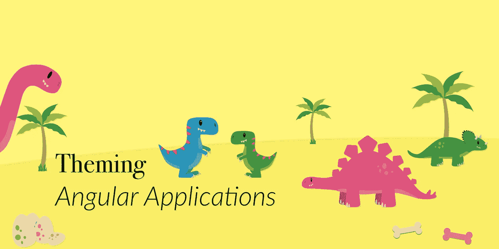
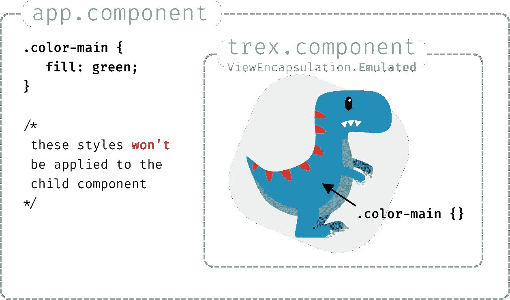
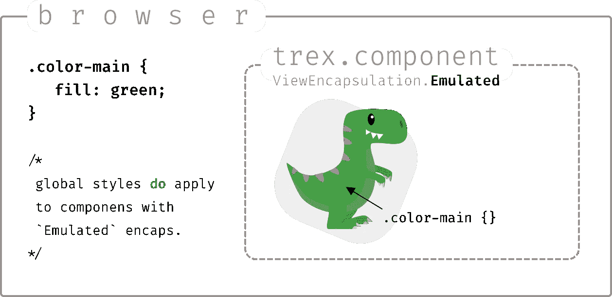
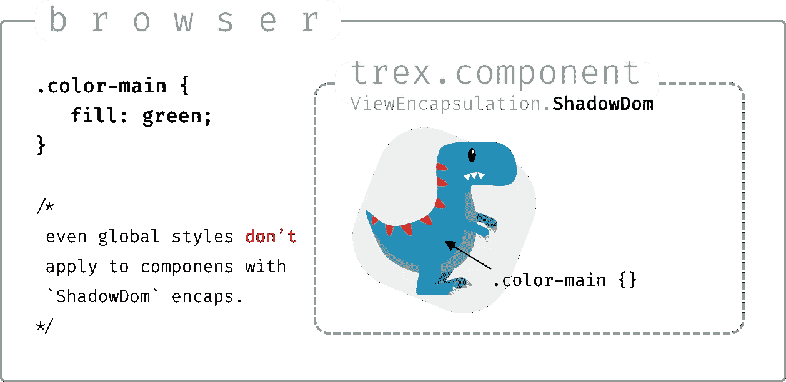
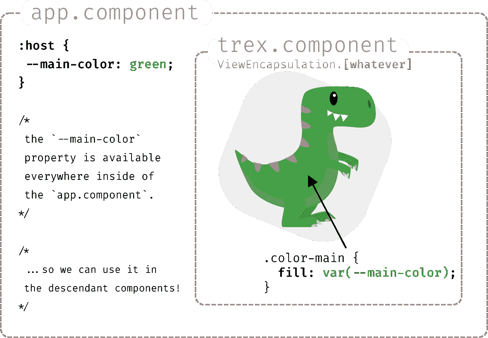
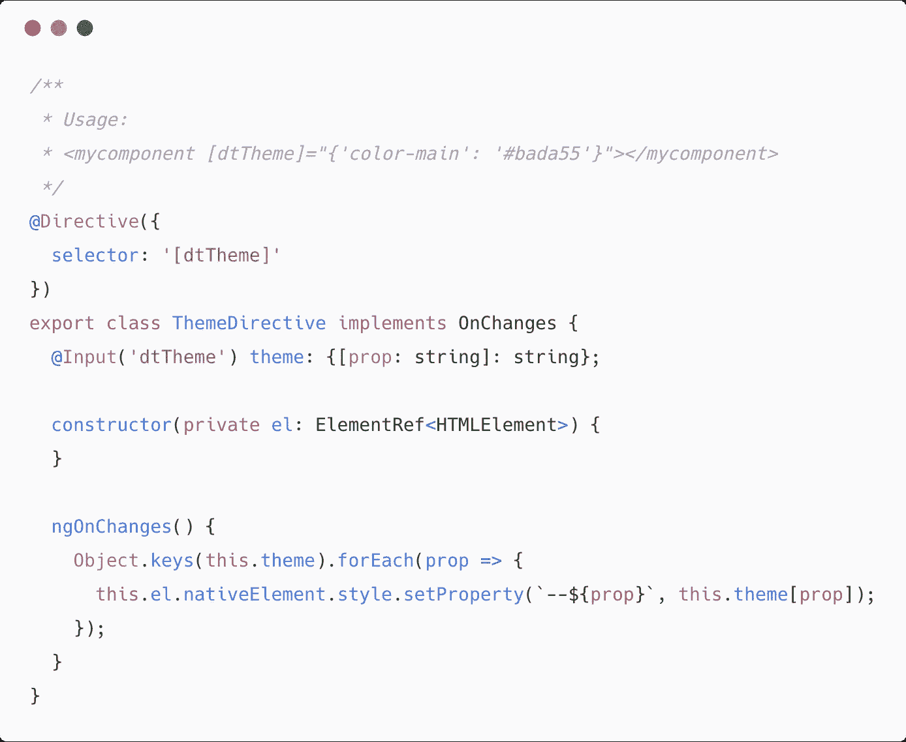
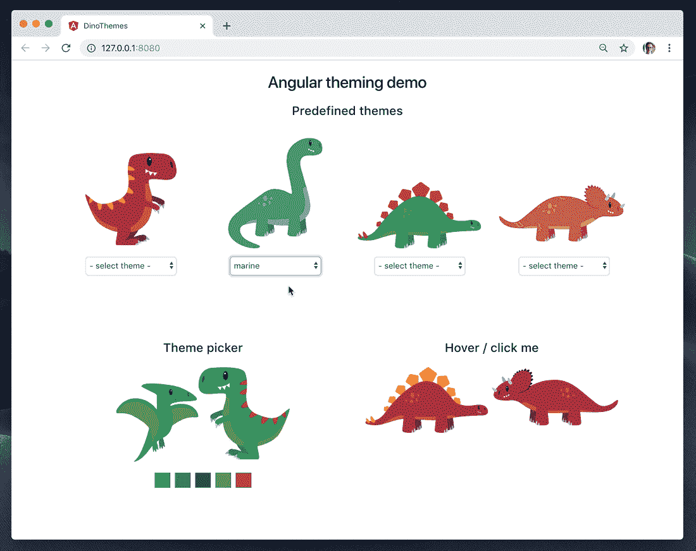

# 主题角度

> 原文：<https://medium.com/swlh/theming-angular-c869827738c3>



## 突破视图封装给恐龙上色

角度组件有一个有趣的行为叫做 *ViewEncapsulation —* 它使得为组件定义的样式在范围上仅限于那个特定的组件。根据它的设置，覆盖这些样式可能会很棘手。那么，我们如何着手对角度应用进行主题化呢？

# 问题是

假设您有一个`TrexComponent`，并在`trex.component.scss`文件中定义它的样式。多亏了`ViewEncapsulation.Emulated` (这是默认设置)这些样式不会影响应用程序的任何其他部分。

但是反过来也一样:比如说，如果你的根`AppComponent`定义了一些样式，它们就不会被应用到子组件上。



With `ViewEncapsulation.Emulated`, styles defined in the ancestor component **don’t** impact a descendant component.

你可以在全局样式文件(通常是`src/styles.scss`)中设置一个全局样式，但它是为应用程序中的所有组件设置的，更重要的是，你不能动态地这样做，例如，当载入一些用户偏好并想基于此改变一个样式时。



Globally set styles **do** impact components… but they are hard to change dynamically.

这个影响组件风格的问题在设置`Native`(现在不推荐)或`ShadowDom`封装的情况下更加明显。因为 is“隐藏”了一个*阴影根*后面的组件，所以即使是全局样式也不会影响你的组件。

即使你在典型的应用程序中不使用`ViewEncapsulation.ShadowDom`，一旦你想创建一个可重用的 [Web 组件](/@tomsu/building-web-components-with-angular-elements-746cd2a38d5b)，这是必须的——所以这确实是一个我们需要学习如何解决的问题。



With `ViewEncapsulation.ShadowDom`, global styles also **don’t** impact a descendant component.

# 解决方案

为了解决这个问题，我们将使用 [CSS 自定义属性](https://developer.mozilla.org/en-US/docs/Web/CSS/--*)，也就是 CSS 变量。

> 以`--`为前缀的属性名，如`--example-name`，代表*自定义属性*，它包含一个值，该值可以在使用`[var()](https://developer.mozilla.org/en-US/docs/Web/CSS/var)`函数的其他声明中使用。

这意味着您可以像定义普通 css 属性一样定义一个自定义属性，例如`"font-size: 16px"`,并且它可以在级联中的任何地方被引用(在与您定义属性时使用的选择器相匹配的元素的整个子树中)。)



现在，如果你还没有使用过 css 自定义属性，需要一段时间才能理解(从经验上讲…)，但是它是一个非常强大的工具。重要的是不要把它们看作是 [SASS](http://sass-lang.com) 或 [Less](http://lesscss.org/) 变量的替代——这些变量只在编译期间计算，所以它们是*静态的。*相反，像对待任何其他 CSS 属性一样对待它们(想想:`font-size`)。

例如，你可以:

*   在不同的组件中设置不同的值("*GreenDinosComponent*vs "*PinkDinosComponent "*)，
*   用伪类(`:hover {--main-color: darkgreen}`)来改变它们
*   …或媒体询问
*   最后，用自定义指令动态设置它们！

像下面这样简单的指令就足够了。



see the source: [https://gist.github.com/sulco/6860711bd1f7d72344f317118a28ff4f](https://gist.github.com/sulco/6860711bd1f7d72344f317118a28ff4f#file-theme-directive-ts)

需要注意的一点是，`[ngStyle]="{....}"`类型的绑定现在还不能工作——参见这个 [Github 问题](https://github.com/angular/angular/issues/9343)中的讨论——所以像这样的自定义指令是可能的解决方法之一。

# 演示应用程序



好了，我已经给你们展示了一些插图，一些代码片段，但是如何把它们放在一起呢？它真的有用吗？:-)好吧，你自己看吧:

*   你可以在这里玩应用程序
*   参见 [Github](https://github.com/sulco/dino-themes) 上的源代码

需要注意的事项:

*   除了使用`ViewEncapsulation.ShadowDom`的霸王龙，所有恐龙都使用默认的`ViewEncapsulation.Emulated`——所以你可以看到这两种情况下的主题化工作。
*   你实际上不需要把自定义属性`[dtTheme]`直接放在一个组件上，它可以应用在你的应用程序中的任何 HTML 元素上。该主题将应用于内部的所有内容:

```
<div **[dtTheme]**="getCustomTheme()">
   **<dt-ptero></dt-ptero>
   <dt-trex></dt-trex>**
</div>
```

*   我在这里同时使用了*自定义 CSS 属性*和 *SASS 变量*。是的，没有什么能阻止你同时使用这两种方法，实际上这很有意义(见下一个“尾声部分”)
*   当前所有浏览器都支持自定义属性(如果没有 IE，请参见[兼容表](https://developer.mozilla.org/en-US/docs/Web/CSS/Using_CSS_variables#Browser_compatibility))。

# 收场白

所以现在你有了一个使用*自定义属性*的好例子，你可能会想:我们还需要像 SASS 变量这样的东西吗？如果答案是肯定的，那么什么时候使用哪种方法存储 CSS 值呢？

一般的回答是:

*   当您需要静态设置值时，当您需要在应用程序编译期间执行一些操作(例如``$color2 = lighten($mycolor)`)时，请使用 SASS/Less。用途是定制你的一般 css 结构。量身定制你的自举/基础/等。满足你的需求。
*   当您需要动态更改值时，请使用自定义属性，例如，让用户设置无限种颜色组合。当您需要组件的这种主题化功能时，请使用它们:)

如果你还有任何疑问，看看[粉碎杂志](https://www.smashingmagazine.com/2018/05/css-custom-properties-strategy-guide/)上这篇精彩的文章。

和往常一样:**如果你学到了新东西，请:**

**→鼓掌👏按钮** below️这样更多的人可以看到这个
**→** [**在 Twitter 上关注我**(@ sulco)](https://twitter.com/sulco)这样你就不会错过以后的帖子:

[](https://twitter.com/sulco) [## tomek sukowski(@ sulco)|推特

### Tomek sukowski(@ sul co)的最新推文。# TypeScript # JavaScript @ Angular trainer & Angular Tricity…

twitter.com](https://twitter.com/sulco) [](https://medium.com/swlh)

## 这篇文章发表在 [The Startup](https://medium.com/swlh) 上，这是 Medium 最大的创业刊物，拥有+386，297 名读者。

## 在这里订阅接收[我们的头条新闻](http://growthsupply.com/the-startup-newsletter/)。

[](https://medium.com/swlh)