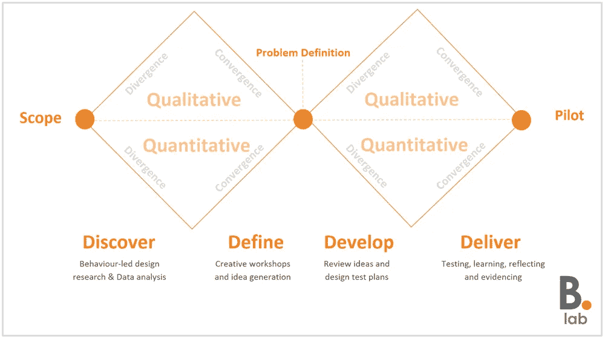
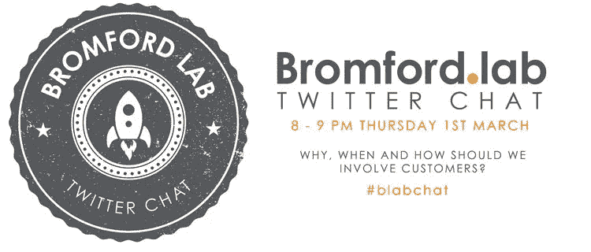

# 没有完美的解决方案，只有取舍。

> 原文：<https://medium.com/swlh/there-are-no-perfect-solutions-only-trade-offs-8c8757d12d33>

> *“设计思维过程归根结底是一个发散和收敛的思维过程。没有完美的解决方案，只有取舍。迭代不可或缺。”*

—刘以豪，ICF 国际的首席 UX 建筑师

服务设计是一个协作和迭代的过程，它利用发散和收敛思维的力量来找到正确的问题和正确的解决方案。设计委员会开发的双钻石模型通过钻石本身的形状表达了发散和汇聚的愿景。

虽然钻石在宏观层面上说明了这一点，但在钻石内部的微观层面上，我们在四个设计阶段的每一个阶段都进行了活动，发散和收敛的思维也在发生。

虽然该模型给人一种线性方法的印象，但在实践中，我们经常可以回到早期阶段，以重复我们的想法。

双钻石是设计思维的同义词，虽然经常会有变化，但该模型已被许多世界上最著名的设计机构作为操作标准采用。

在最初的项目服务设计会议之后，我们能够以 [10 个‘我们如何做’问题](https://trello.com/b/DUUozEVO/bromford-exploration-pipeline)的形式定义一组问题陈述。我们使用这些问题陈述作为一组发现会话的基础。

我们最近在这些会议中进行了一半，利用一周左右的休息时间，我们决定抽出一些时间，以便[反思他们如何进行](http://www.bromfordlab.com/lab-diary/2018/2/12/discovery-sessions-a-reflection)。

能够总结哪些工作做得好，哪些工作做得不太好是很有用的，虽然我们已经能够确定在一周左右的会议继续之前我们需要努力的一些领域，但我们也对我们的同事如何热情地投入到练习中和他们提出的想法感到非常兴奋。

通过带领同事进行广泛(发散)思考，然后在微观层面上进行明智(收敛)思考，我们能够运用设计思维的原则，为我们提出的“我们如何做”的问题产生一系列高层次的想法或解决方案。

当我们在 Bromford Lab 谈论联合设计时，我们会让同事和客户一起参与我们的设计之旅，但重要的是我们要认识并理解何时以及如何让他们参与进来。

我们将在 3 月 1 日星期四围绕这个话题举办一场 Twitter 讨论，如果你能在晚上 8 点到 9 点之间参加，那就太好了。我们需要同事和客户成为开发创意不可或缺的一部分，但我们也认识到，要让创意变得足够有形，让组织能够接受，让我们能够进行测试，我们需要在课程结束后做一些自己的工作，在同事在研讨会期间奠定的基础上构建一个细节层。

周二，Innovation and Insight 坐下来筛选我们迄今为止在研讨会期间获得的所有成果，旨在创建一个行动和后续步骤的列表。我们希望尽早开始这项工作，以便利用会议期间产生的能量和动力，但尽管我们都是为了快速测试和快速学习，我们也不想为了测试而测试，并在工作的质量或完整性上妥协。

在会议之外，我们工作的关键部分将是研究这些想法如何适应我们更广泛的变革计划，以及我们如何制定一套相互补充的可靠的测试计划。重要的是要把研讨会的成果看作是*可能成为*的早期迭代，而不是*将成为*的坚实蓝图。

在我们开始测试之前还有很多工作要做，所以请关注这个空间的更新，并和我们一起踏上旅程。

— -

[@simon_penny](https://twitter.com/Simon_Penny) 和 [@ChelleKButler](https://twitter.com/ChelleKButler)

封面图片:[威廉·艾文](https://unsplash.com/@firmbee)在 Unsplash 上

[注释](http://www.bromfordlab.com/lab-diary/2018/2/14/discovery-sessions-the-next-steps#comments-outer-wrapper)

*原载于*[*www.bromfordlab.com*](http://www.bromfordlab.com/lab-diary/2018/2/14/discovery-sessions-the-next-steps)*。*

## 这个故事发表在 [The Startup](https://medium.com/swlh) 上，这是 Medium 最大的企业家出版物，拥有 297，332+人。

## 在这里订阅接收[我们的头条新闻](http://growthsupply.com/the-startup-newsletter/)。

