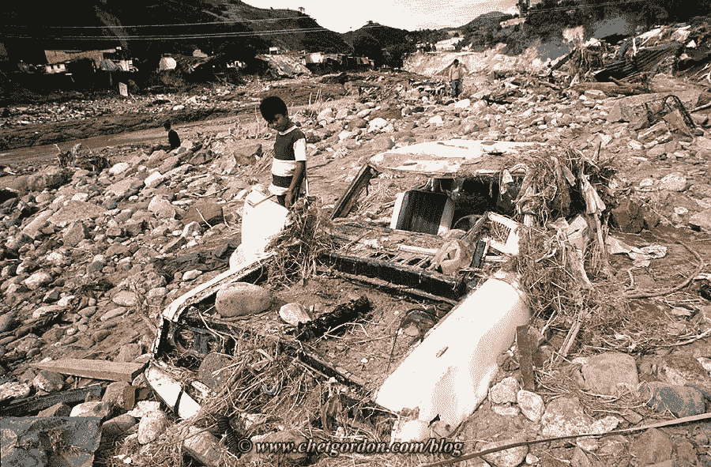

# 最没用的事情莫过于高效地做一些根本不应该做的事情

> 原文：<https://medium.com/swlh/there-is-nothing-so-useless-as-doing-efficiently-something-that-should-not-have-been-done-at-all-8c5d2282319d>

# 世界领先的专家研究了挑战，发现了机会，并不惜代价构建了解决方案。太完美了。它的表现和预期的一样。而且，没用。

最近，术语“中断”经常被使用和误用。

在商界，颠覆被用来描述经济转型、消费者购买路径的改变、向数字消费的转变、“零售末日”和失业。

在我们位于中美洲的工厂，颠覆有了更深的含义。

洪都拉斯是一个经常遭受毁灭性飓风袭击的国家。这些巨大的破坏性风暴摧毁桥梁，造成山体滑坡，使该地区陷入瘫痪。

桥梁是早期应急人员、疏散和供应链的重要生命线。

为了应对巨大的需求，一些世界上最伟大的建筑师聚集在洪都拉斯，计划并建造一座独一无二的桥梁——一座可以抵御最严重飓风的桥梁。

这些专家研究了每一种已知材料在每一种可预见的压力下的耐受性。他们回顾了大量的历史气象学和建筑数据，分析了数千张受损桥梁的“之前和之后”的照片，研究了地下水和砾石成分——设计并建造了一座能够抵御 100 年一遇风暴的桥梁。

这座桥成为洪都拉斯最伟大的建筑成就，也是国家的骄傲。来访的显要人物在被护送到宫殿之前先参观了这座桥。

不可避免的是，最终的考验在大桥完工后不久到来，当时飓风米奇袭击了中美洲——这是 T2 200 年来最具破坏性的风暴——5 级飓风，持续风速接近每小时 200 英里。

飓风米奇在不到 12 小时内给洪都拉斯带来了超过 36 英寸的狂风暴雨。

**在许多方面，建筑师和工程师都是成功的。**

这座桥经受住了暴风雨，几乎没有损坏，这是一个令人难以置信的成就。

我有一张照片，下面*。*

这座桥完好无损……然而，暴风雨移动了河流，摧毁了道路。

著名管理顾问彼得·德鲁克曾经说过:

> "最没用的事莫过于高效地做一些根本不应该做的事。"

# 历史上的成功可能是明天失败的先兆。

对于拥有成功传统的公司和管理者来说，依赖以前可靠的最佳实践是一种障碍。在大混乱时期，我们不能依赖历史战略、流程、信息或专业知识。

在混乱时期，我们需要新的视角、新的问题、新的衡量标准和新的目标。这种范式转变对于长期管理者和公司来说是非常困难的。

对于传统公司来说，激进的创新不会服务于当前的客户，通常效率很低，而且会破坏传统文化和最佳实践。对于初创企业来说，颠覆是一种诱惑。

在当今快速发展的商业环境中…提出新的问题，监控新的绩效指标，并创造新的实践。

*大卫·j·卡茨，2018*

*桥的故事，作者在 2017 年 WWD 峰会上发表*

*关于“颠覆”的一个注解*

1995 年，哈佛商学院的 Clay Christensen 教授创造了术语“颠覆”。在过去的 20 年里，颠覆理论已经成为自身成功的牺牲品。

> 该理论的核心概念被广泛误解，其基本原则经常被误用。这个术语经常被用来描述任何一个行业被撼动、先前成功的在位者被绊倒的情况或创新。但这种用法太宽泛了。”

按照克里斯滕森教授的定义，“[颠覆性战略](http://hbr.org/2015/12/what-is-disruptive-innovation)断言新技术本质上不是颠覆性的；这取决于相对于现有产品或服务的商业模式，它如何被部署到市场中。

## 这个故事发表在 [The Startup](https://medium.com/swlh) 上，这是 Medium 最大的创业刊物，拥有 319，931+人关注。

## 在此订阅接收[我们的头条新闻](http://growthsupply.com/the-startup-newsletter/)。

