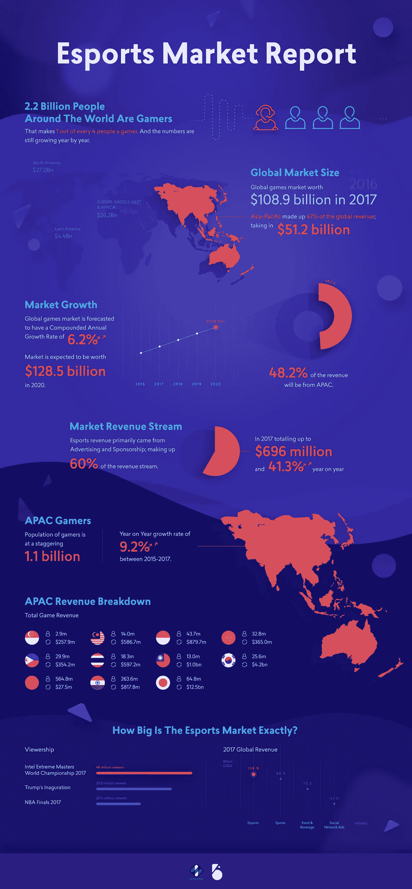

# 亚洲的电子竞技产业有一个巨大的未开发市场&如果你忽视它，你会失去它

> 原文：<https://medium.com/swlh/theres-a-huge-untapped-market-for-the-esports-industry-in-asia-you-ll-lose-out-if-you-ignore-it-cb261cc8cea>

[*Bountie*](http://bountie.io) *是亚洲的一个平台，它让游戏玩家拥有一种可以获得游戏报酬的生活方式。*

随着今年晚些时候 Bountie 加入竞争，你们中的许多人可能想知道我们为什么要这样做。简单:随着电子竞技和游戏市场的蓬勃发展，我们希望帮助创造一个未来，任何游戏玩家都可以获得报酬，玩他们想玩的游戏。

我们可以诚实地告诉你，东南亚的电子竞技和游戏市场真的很大。这是我们的意思(感谢 Newzoo)。

Property of [Bountie](http://bountie.io)

# 新加坡

游戏人数:290 万
付费游戏玩家:120 万
游戏收入:3.18 亿美元
年均支出:258 美元

*概述:新加坡虽然市场小，但总体消费能力高。该国的游戏市场仍然专注于免费游戏。该国目前在全球电子竞技收入排名中排名第 36 位。*

# 马来西亚

游戏人口:1400 万
付费游戏玩家:710 万
游戏收入:5.87 亿美元
年均支出:82.04 美元

*概述:马来西亚有大量的博彩人口，他们在博彩方面的消费能力一般。越来越多的玩家愿意付费玩他们的游戏，无论是手机游戏、游戏机游戏还是个人电脑游戏。*

# 印度尼西亚

游戏人口:4370 万
付费游戏玩家:2500 万
游戏收入:8.8 亿美元
年均支出:33.90 美元

*概述:印尼的游戏大众消费较少，因此是一个容量市场。因为该领域有大玩家，印尼游戏收入市场能够实现高收入。*

# 菲律宾

游戏人口:2990 万
付费游戏玩家:1600 万
游戏收入:3.54 亿美元
年均支出:21.93 美元

概述:菲律宾 54%的游戏玩家在游戏上花钱，其中大多数人都是中产阶级收入。他们在全球电子竞技收入中排名第 29 位。

# 越南

游戏人数:3280 万
付费游戏玩家:1600 万
游戏收入:3.65 亿美元
年均支出:21.57 美元

概述:大多数越南游戏玩家愿意在游戏上花大钱。他们在全球电子竞技收入中排名第 26 位。

# 泰国

游戏人口:1830 万
付费游戏玩家:1070 万
游戏收入:5.972 亿美元
年均支出:55.78 美元

*概述:低收入的游戏玩家比例很低，其中四分之一愿意在游戏上花费平均金额。他们在全球电子竞技收入排名中排名第 20。*

> 这就是亚洲在电子竞技方面的表现，而且预计只会越来越好。问题是，你准备好了吗？

*最初发表于* [*bountie.io*](https://bountie.io/blog/state-gaming-southeast-asia/)

## 这个故事发表在 [The Startup](https://medium.com/swlh) 上，这是 Medium 最大的创业刊物，有 316，638+人关注。

## 订阅接收[我们的头条新闻](http://growthsupply.com/the-startup-newsletter/)。

