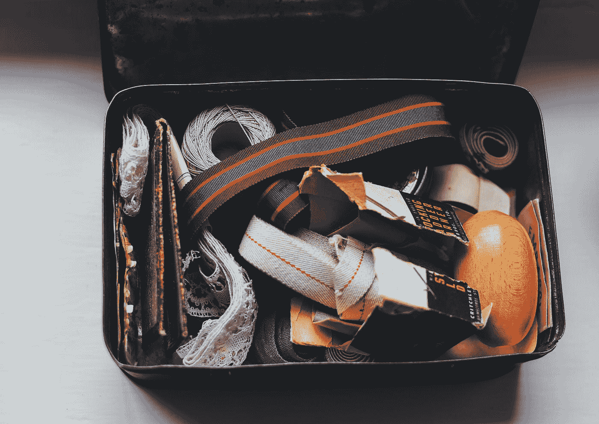

# 没有比把自己放在盒子里更简单的跳出盒子思考的方法了

> 原文：<https://medium.com/swlh/theres-no-easier-way-to-think-outside-the-box-than-to-put-yourself-in-one-ba8e83d3125f>

*如何战胜分析麻痹*

“Open craft box containing sewing supplies, haberdashery and metal buckles” by [Annie Spratt](https://unsplash.com/@anniespratt?utm_source=medium&utm_medium=referral) on [Unsplash](https://unsplash.com?utm_source=medium&utm_medium=referral)

听我说完。有一个原因是为什么有一大群在学校表现惊人的应届毕业生，他们现在不知道该怎么过他们的生活。

他们都是*沙盒玩家*。给他们一套预先定义的界限和规则，他们就会玩…