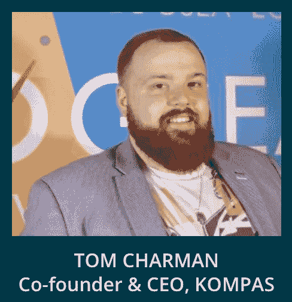
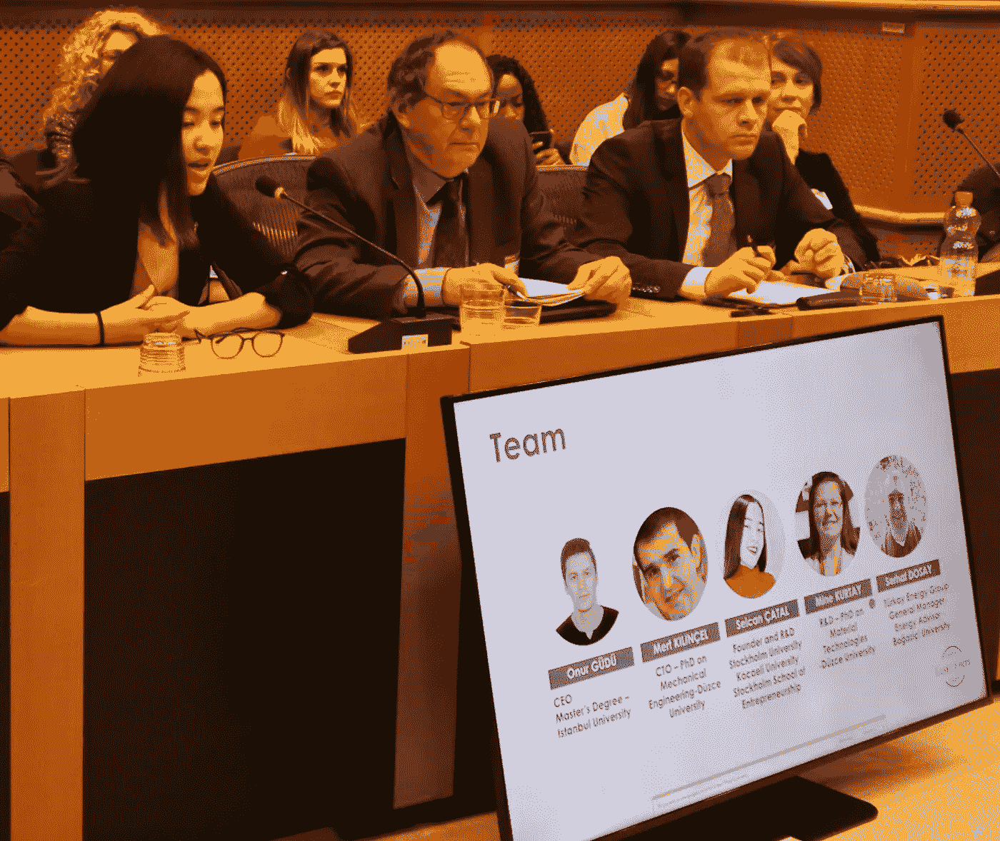
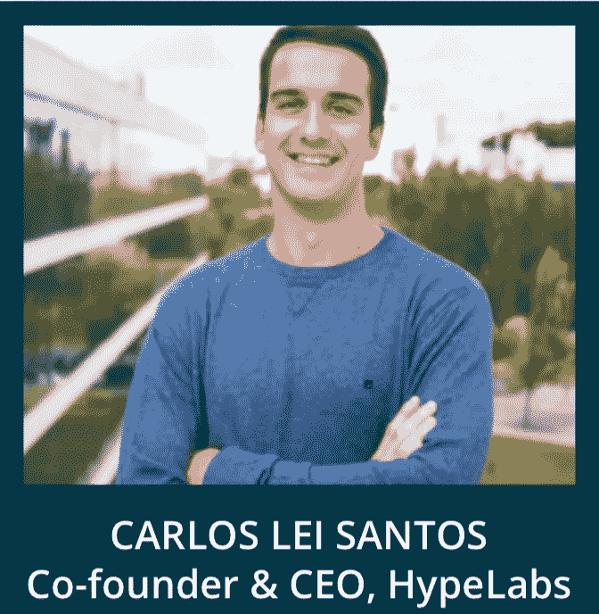

# 这 18 家创业公司被邀请到欧洲议会演讲——了解他们将如何破坏我们的未来！

> 原文：<https://medium.com/swlh/these-18-startups-were-invited-to-pitch-in-the-european-parliament-learn-how-they-will-disrupt-1e8b200dd751>

众所周知，在一些世界上最成功的创始人背后，你会发现伟大的导师。马克·扎克伯格得到了史蒂夫·乔布斯的指导，杰克·多西得到了慈善家雷·钱伯斯的指导，销售团队的马克·贝尼奥夫得到了甲骨文公司首席执行官拉里·埃里森的指导，微软的比尔·盖茨和保罗·艾伦得到了个人电脑发明者埃德·罗伯茨的指导。

> 每个伟大的梦想家在人生的某个阶段都会有一个导师，而导师被认为是建立一个成功的创业公司的重要基础。

我参与创立了[欧盟 50 强](http://www.eutop50.eu)，其使命是授权给那些正在开发突破性产品和技术以满足欧洲最迫切需求的欧洲创业者。与[知识 4 创新](https://www.knowledge4innovation.eu)一起，我们相信最好的方法是将他们与下一代[成功的年轻创新领导者](https://www.eutop50.eu/eutop50-2017/innovation-leaders-2/)的信任社区联系起来，他们可以根据自己将产品推向市场的经验直接传授知识。

在过去的几个月里，我一直在招募欧洲最有前途的初创企业创始人，他们利用技术构建可扩展的解决方案，解决欧洲最紧迫的挑战，并将他们与我们的导师联系起来。

这里有 18 个值得一看的冒险！

1.  [**奥尔德斯通**](http://www.aldstone.global) **，** [**苏珊娜·努里娅·格雷罗·洛佩兹**](https://www.linkedin.com/in/susananuriaguerrerolopez/) **，英国**

> **您知道吗，建筑行业每年产生 13 亿吨全球垃圾，预计到 2025 年将达到 22 亿吨。**

**Susana Nuria Guerrero Lopez, Founder ALDStone**

到 2026 年，全球地板市场预计将达到 4000 亿€。目前，用于建筑的材料回收或再利用的比例非常低，其余的被拆除、浪费或送往填埋场。这不仅在经济上，而且在环境上也是不可持续的。

英国初创公司 [ALDStone](http://www.aldstone.global) 集成了循环系统，允许几乎任何材料的瓷砖——包括石头、陶瓷和木材——被移除并在其他地方重新使用。这通过再利用和共享模型提供了成本节约，加上对经济和有限环境资源的长期保护。奥尔德斯通减少了我们的资源开采、污染和浪费，并最终实现闭环。奥尔德斯通的技术不仅成功地用于办公室，也用于学校，并有许多住宅应用。[奥尔德斯通](https://medium.com/u/28ce2efc2fad?source=post_page-----1e8b200dd751--------------------------------)的创始人苏珊娜·洛佩兹预计到 2019 年新客户将达到 100 家。

预计奥尔德斯通的未来影响是建筑环境部门从线性到循环的转变。这将提供一个更可持续的经济模式和更可再生的环境保护，通过减少自然资源的浪费和更多地利用我们已经拥有的资源。

# 奥尔德斯通 EUTOP50 导师:[艾琳-玛丽·西利格](http://irenemarieseelig.com)

[Irene-Marie Seelig](https://www.linkedin.com/in/irenemarieseelig/) 是消费品行业循环、可持续和下一代制造创新的先驱。

2017 年，艾琳因“创造明天的产品”而获得福布斯 30 岁以下 30 岁以下奖,她的初创公司生产由蘑菇而不是动物皮制成的素食皮革替代品。她一直是[即插即用](https://medium.com/u/4da0a0c2c511?source=post_page-----1e8b200dd751--------------------------------) [的时尚好加速器](http://fashionforgood.plugandplaytechcenter.com)的一部分，并因此获得了 [2016 年开云可持续时尚创新奖](http://sustainable-fashion.com/blog/congratulations-to-the-winners-of-the-kering-award-for-sustainable-fashion/)。此外，Irene 是施华洛世奇的创新开发经理，管理着价值 1500 万欧元的产品组合，领导着一个由设计师、材料科学家和工程师组成的团队，从构思到推出，为他们的 B2B 客户将新的创新产品商业化。在施华洛世奇任职之前，Irene 曾在斯特拉·麦卡特尼的全球营销和企业社会责任团队工作，领导所有内部和外部数字平台的产品营销战略开发。

**2。**[**babyndex . eu**](https://babyndex.eu)**[**Zajzon BODó**](https://www.linkedin.com/in/zajzon-bodó-80626510/)**、匈****

> **你知道吗，女性可以用一种便宜的可重复使用的家用唾液测试来确定她们什么时候可以怀孕，准确率高达 98%。**

********

**在经合组织国家，每年有一百万个试管婴儿治疗周期。然而，大多数妇女使用不准确的体温排卵测试，因为它们是可重复使用的，或者使用昂贵的尿液测试来准确监测生育力。 [Zajzon Bodó](https://www.linkedin.com/in/zajzon-bodó-80626510/) 共同创立了[Babyndex](https://babyndex.eu) 并开发了一种家庭唾液测试，该测试可重复使用，同时还可以通过检测干燥唾液中的小晶体来判断生育能力，而不仅仅是排卵日。怎么会？使用者擦干一滴唾液，在显微镜下寻找晶体。然而，这些晶体很难看到。因此，匈牙利初创公司 Babyndex 提出了一个解决方案，用计算机视觉来补充唾液测试。用户拿着显微镜对着她的智能手机，拍摄样本的图像，然后上传图像进行分析。该算法可以检测晶体，并且可以在日历中显示生育日期，用户还可以将日历显示给她的妇科医生。此外，如果在月经期间出现晶体，它们有时表明早期怀孕。PCT 专利申请正在申请中。**

****

# **BABYNDEX EUTOP50 导师:JAKUB ZIELINSKI**

**Jakub Zielinski 是一位连续的互联网企业家、投资者和 Nextweb Holdings 的管理合伙人。他在媒体、广告和数字健康领域创办了几家成功的初创公司，拥有超过 2000 万独立用户。**

**Jakub Zielinski 曾在大型国际媒体公司担任首席数字官，负责 20 多个国家的在线运营。**

**[**3。雄蜂料斗**](https://www.drone-hopper.com) **，** [西班牙巴勃罗·弗洛雷斯·培尼亚](https://www.linkedin.com/in/flores-pena-pablo-192b54114/)**

> ****你知道无人机可以在晚上扑灭野火，容量 600 升吗？****

**欧盟平均每年有 1500 平方英里的面积被烧毁。每年夏天，欧洲都要与野火作斗争，尤其是在地中海周围，仅去年在葡萄牙和西班牙就有 66 人丧生。这些火灾是通过有人驾驶的空中灭火来扑灭的，灭火发生在水上飞机和直升机上。行动发生在极其困难的情况下，消防员不知疲倦地试图从黄昏到黎明控制火势，因为他们的工作不能中断。**

**西班牙初创公司[无人机料斗](https://www.drone-hopper.com)，已经创建了一个野生料斗平台，允许容量为 600 升水的无人机全天候运行。由于其先进的专有稳定系统，它们可以抵御强风。他们使用重型半自动多旋翼无人机来创建防火墙和防线，以保护社区和财产。**

**由于无人驾驶飞机是无人驾驶的，他们不会危及任何人的生命。专利水雾喷射技术的使用产生了极其精确的释放，提高了单位体积释放保护面积的效率。此外，减少了 15 分钟的周转时间(本地操作，使用热机)和以协作模式操作几架无人机的可能性(群体操作)，允许以较低的购置和拥有成本快速和有力地保护野火。**

****

# **无人机 HOPPER EUTOP50 导师:汤姆·查曼**

**[汤姆·查曼](https://www.linkedin.com/in/tcharman/)是 [KOMPAS](https://www.kompasapp.com) 的联合创始人兼首席执行官，KOMPAS 是一家数据科学初创公司，专注于利用数据通过机器学习提供空间和兴趣洞察。Tom Charman 是一位经验丰富的创始人，曾在科技公司工作，专注于了解和分析用户。**

**2016 年，汤姆做了一个关于人工智能和“技术未来”的 TEDx 演讲，并被公认为行业领导者，他在包括[移动世界大会](https://www.mwcbarcelona.com)和[签证未来](https://futures.visaeurope.com)在内的活动中发表了演讲。Tom 还就数据对更广泛社会的影响向政府和机构提供建议，并被商会命名为创新和技术的未来代表。最近，他被列入 30 个南部的 30 个权力名单。**

**[**4。Bioseco**](http://bioseco.com) **，**[**Michal Rybak**](https://www.linkedin.com/in/rybakmichal/)**，Poland****

> **你知道吗，到 2022 年，多达 500 万只鸟将因风力农场而死亡。其中许多是稀有和濒危物种。**

**全球风能理事会估计，到 2022 年将安装 840.000 兆瓦的风能。这意味着每年大约有 250 万到 500 万只鸟类死亡，包括稀有和濒危物种。**

**波兰初创公司 [Bioseco 的](http://bioseco.com)使命是保护风力发电场的鸟类，同时帮助风力发电场所有者更好地应对其植物对鸟类的有害影响所带来的负面后果。**

**[Bioseco](http://bioseco.com) 开发了 multi rej estator——鸟类保护系统，他们建造了用于自动远程检测和避免碰撞的创新设备，这些设备已经在欧洲的几个风力发电场得到了验证。怎么好奇？查看下面的视频:**

**核心团队由嵌入式、光学和 IT 工程师组成，他们与鸟类学家一起工作。**

**基于他们的经验和技术，Bioseco 也在研究一种在机场避免鸟碰撞的系统。每年有 40，000 起鸟撞事件记录在案，这给乘客的生命带来了危险，并造成了大约 23 亿美元的经济损失。**

# **BIOSECO EUTOP50 导师:[雅各布·杰林斯基](https://www.linkedin.com/in/jakubzielinski/)**

**[**5。史诗蓝**](https://www.epic.blue)**[**弗雷德里克·马列塞维奇**](https://www.linkedin.com/in/frederik-malesevic-4602014/) **，比利时******

> ****你知道吗，我们 85%的时间都在没有 GPS 的环境中度过。****

****无缝和实时访问室内和室外定位信息越来越成为关键任务。由于运营管理效率的显著提高，更好地了解我们的位置会产生高达 27%的直接影响。鉴于我们 85%的时间都生活在没有 GPS 的环境中，单靠卫星信号是不可能的。为了确保业务运营的连续性，无论我们在哪里，比利时软件公司 [epic.blue](https://www.epic.blue) 开发了基于传感器融合和机器学习技术的下一代定位平台。一款坚固的可穿戴设备是与全球领先的数字技术研发和创新中心 [imec](https://www.imec-int.com/en/about-us) 合作设计的，旨在引领和增强独特的 [epic.blue](https://www.epic.blue) 技术到任何操作环境中。这有助于公司掌握和连接他们的位置，因此他们可以提高安全性，释放业务洞察力，优化效率和增加员工参与度。****

# ****史诗。蓝色 EUTOP50 导师:[汤姆·查曼](https://www.linkedin.com/in/tcharman/)****

******6。** [**基因组表达**](http://www.genomicexpression.com)**[**吉特**](https://www.linkedin.com/in/proximity/)**&**[**莫滕·佩德森**](https://www.linkedin.com/in/morten-lorentz-pedersen-7250985/) **，丹麦********

> ****你知道吗，只有四分之一的癌症治疗能延长生命？与此同时，我们在毒品上花费了 1000 亿美元，每年有 800 万人死亡！****

********

****OneRNA 通过对 RNA 进行测序，并将可操作的过度表达或表达不足的 RNA 与疗法和临床试验联系起来，从而拯救生命并使医疗保健服务更加有效。我们的数据表明，OneRNA 可以改善大多数患者的预后。****

****为了证明我们筹集了 800 万美元对 OneRNA 在 4 种癌症中进行临床验证，重点是女性癌症。****

****[Gitte Pedersen](https://medium.com/u/e5a0eb8f4be4?source=post_page-----1e8b200dd751--------------------------------) 和莫滕·佩德森将于 2019 年推出 OneRNA，作为一种诊断产品，为患者提供救命的好处。****

****OneRNA 平台实现了从一种疾病、一种标志物和一种药物到一个患者、许多标志物和超越药物的多种治疗选择的范式转变。这可能会扰乱目前的护理制度标准。****

********

# ****基因组表达 EUTOP50 导师:[诺埃米·马尔斯卡](https://www.linkedin.com/in/noemi-malska-8b09b075/)****

****Noemi 在以色列的以色列商会联合会工作期间，积累了丰富的国际商务经验。****

****后来，她以分析师的身份加入了一家风险投资基金，之后她成为了一家投资组合公司的管理委员会和首席运营官的成员，目前是 [Hyperion VC](http://www.hyperionalfa.pl) 的投资经理。她还是一家与网络安全领域相关的公司的监事会主席。****

****[第七期**。KIT-AR，**](https://www.kit-ar.com)**[**Manuel Oliveira**](https://www.linkedin.com/in/manuelfradinho/)**，英国********

> ****你知道吗，制造业的技能差距正在扩大，全球有 1000 万个职位空缺。****

****随着技术的进步，制造业所需的技能也发生了变化。因此，制造业不能满足全球化市场的需求，不能满足日益增长的产品个性化需求，同时也缺乏处理日益复杂的产品和相关制造过程的能力。研究报告称，由于技能短缺，美国制造商每个现有员工平均损失 3000 美元，每个空缺职位还会损失 14000 美元。这些损失与欧盟相似，在未来 5-10 年内只会增加。****

****英国初创公司 [KIT-AR](http://KIT-AR) 创造了一个工业增强现实解决方案，通过在需要时向工人提供所需的知识，以数字方式增强他们在车间的工作。工人导航一系列语音激活的步骤。使用正在申请专利的技术， [KIT-AR](http://KIT-AR) 分析从车间工人的行动中捕获的数据，以判断是否触发干预来帮助工人或警告他们可能的错误。****

****[KIT-AR](https://www.kit-ar.com) 是最近从两家欧洲顶级研究机构(Sintef 和伦敦大学学院)和一家基于 H2020 人类制造(人类)研究项目成果的获奖游戏学习公司(HighSkillz)剥离出来的。该公司正在与航空航天、机器人制造和家具制造垂直行业的早期采用者合作。 [KIT-AR](https://www.kit-ar.com) 目前正在寻求种子投资资金。****

******8。******[**塞尔坎**](https://www.linkedin.com/in/selcancatal/) **、土耳其**********

> ****你知道每年汽车会产生 15 亿个废轮胎吗？****

********

****欧洲每年有 4 亿个废弃轮胎。世界不再能够维持它们，它们助长了自然灾害和有害疾病。如何减少这个惊人的数字是一个挑战。****

****Laska Energy 将废弃轮胎转化为生物燃料，用于生产清洁能源，并以安全、清洁的方式从轮胎中提取有价值的原材料，同时防止硫等对环境有害的物质释放。****

****拉斯卡能源公司通过节省超过一百万棵树消耗的二氧化碳，创造了巨大的潜在气候影响——这相当于 4000 公顷的森林，或中央公园的 12 倍，冯德尔公园的 84 倍，或海德公园的 21 倍。****

********

# ****拉斯卡能源 EUTOP50 导师:约西帕·马吉奇****

****约西帕·马吉克是 ID Guardian 的创始人兼首席执行官，这是一家总部位于伦敦的公司，在萨格勒布和帕洛阿尔托设有办事处，分析生物识别数据并开发带有生物传感器的智能设备。****

****ID Guardian 最终帮助世界各地的个人和公司以无缝和无障碍的方式照顾他们的整体健康和福祉。 [Josipa Majic](https://medium.com/u/cd120289fce5?source=post_page-----1e8b200dd751--------------------------------) 是 ID Guardian 产品和整体战略背后的主要远见卓识者，负责与全球财富 100 强客户建立成功的客户关系。她被《T2 时代》杂志评为年度十大最具创新性产品的发明者。约西帕是全球企业家峰会的[主题演讲人，她与奥巴马总统一起参加了小组讨论，出现在](https://youtu.be/GzpfFjQPHis?t=2480)[英国广播公司](https://medium.com/u/64fb1ab2365b?source=post_page-----1e8b200dd751--------------------------------)、福克斯新闻频道、[华尔街日报](https://medium.com/u/18ebb660d0b9?source=post_page-----1e8b200dd751--------------------------------)、[福布斯](https://medium.com/u/3126f7dd42c1?source=post_page-----1e8b200dd751--------------------------------)、 [CNN](https://medium.com/u/374a801b3eb2?source=post_page-----1e8b200dd751--------------------------------) 和许多其他媒体上。****

******9。**[**LOQR**](https://loqr.io)**[里卡多·科斯塔](https://www.linkedin.com/in/rafcosta/)、葡******

> ******您知道吗，仅去年一年，全球 20 个国家就有超过 9.78 亿成年人遭遇过网络犯罪，其中大部分都与身份盗窃有关。******

******银行和其他金融服务提供商现在面临着更加严格的合规法律，使得合规性要求更加繁多和复杂。遵守 PSD2、GDPR、5AML 和其他特定法规需要额外的可靠身份验证(IDV)投资和改进的策略。 [LOQR](https://loqr.io) 统一身份管理平台提供一个集成的集中式解决方案，通过一个可在一个组织内的所有服务上使用的单一可信身份孤岛，提供身份验证(客户入职、客户尽职调查、AML 和 eID 生成)、身份参与(包括基于风险的强适应性身份认证(KBA)和身份提供商)。使用这种方法，LOQR 提供了一个集中的以客户为中心的移动一站式服务，始终按照最佳隐私和安全标准以及开箱即用的合规性需求来管理数字身份的整个生命周期。他们的解决方案适合每个市场，目前在欧洲和亚洲的多个国家运营。******

************

# ******导师:卡洛斯·雷·桑托斯******

******卡洛斯是 [HypeLabs](https://medium.com/u/81202dfd388e?source=post_page-----1e8b200dd751--------------------------------) 的联合创始人兼首席执行官，该公司开发网状网络软件，允许任何设备——从移动设备到桌面设备到物联网设备——即使在没有互联网连接的情况下也能安全连接。******

******该公司是 [AngelPad](https://medium.com/u/68ff4b30847b?source=post_page-----1e8b200dd751--------------------------------) 的校友，并与电信领域的一些最大的公司合作和投资，即德国电信、爱立信、NovaBase 等。******

******Carlos 从 14 岁开始从事 IT 工作，早年曾是 IT 团队经理，在接下来的几年里，他为 IBM、BPI Bank、Santander、Zon 电信和 Glintt 等公司提供帮助和工作。凭借计算机科学背景，他的创业技能得到了一些组织的认可，如[Thiel Fellowship Summit](https://thielfellowship.org)Inc .、杂志、圣加仑大学和 [Kairos Society](https://medium.com/u/fd704d16362f?source=post_page-----1e8b200dd751--------------------------------) 。如今，他担任首席执行官，并指导各种各样的初创公司参加全球多个加速项目******

******[**10。Nect**](http://Nect.com) **，** [**本尼班纳特尤尔根斯**](https://www.linkedin.com/in/bennybennet/) **，德国********

> ****您是否知道，对银行业和保险业等旧经济数字化的最大威胁是数字和现实世界身份之间缺失的环节？****

****法律要求受监管公司对其客户的身份高度保密(KYC)。作为服务系统已知的 ID 验证具有低至 50%的低转换率，导致了糟糕的用户体验。更多用户友好的系统不能在公司需要的水平上验证文档的真实性。这使得身份验证需求成为保险公司数字化的最大外部威胁。****

****[Nect](http://nect.com) 让身份验证像自拍一样简单，比面对面验证更安全。在与一些最大的德国保险公司合作的第一个月，Nect 已经证明转化率可以达到 90%以上，从而直接成为数字化的加速器。****

****Nect 正在加速他们正在申请专利的专有深度技术中的人工智能。他们服务于价值 200 亿美元的身份验证服务市场，使 [Nect](http://nect.com) 成为一个有价值的投资案例。****

********

# ****NECT EUTOP50 导师:[艾莉娜·格拉施娜](https://www.linkedin.com/in/alinagratschner/)****

****Alina 在欧洲、美国、非洲和亚洲各地生活和工作，积极参与连接和开发各大洲的创新生态系统。****

****[阿丽娜](https://www.linkedin.com/in/alinagratschner/)是“加速韩国”的管理合伙人和联合创始人，专注于与公共和私营部门合作的跨境孵化和加速项目。她对指数级和颠覆性技术塑造我们的未来和推动经济发展充满热情，并作为顾问、客座讲师和导师为各种组织做出贡献。****

****[**11。nodewaver**](https://www.nodeweaver.eu)**[**卡洛达法拉**](https://medium.com/u/b85040ce80a7?source=post_page-----1e8b200dd751--------------------------------) ，意******

> ****您是否知道大多数企业数据都是在远离云数据中心的边缘处理的？如果那里出了问题会怎么样？****

****绝大多数软件系统运行在舒适的云数据中心之外，IT 人员可以立即处理故障和错误，并为您恢复。许多任务关键型系统运行在边缘——在偏远或难以到达的地方，在危险的环境中，在工业控制系统中，硬件故障意味着工厂停工，或者您的客户无法获得任何服务。 [NodeWeaver](https://www.nodeweaver.eu) 可以执行任何软件、虚拟机或容器，以便在没有用户干预的情况下绕过硬件和软件故障，这要归功于 [Nodeweaver 的](https://www.nodeweaver.eu)人工智能引擎，它可以学习并适应新的条件和事件；知识被分发到所有其他节点，因此它们可以作为分布式智能同时学习和教学。 [NodeWeaver](https://www.nodeweaver.eu) 在 13 个国家安装了超过 230 个软件，让您的软件在世界任何地方都不会停止运行。****

********

# ****NODEWEAVER EUTOP50 导师:[克里斯蒂安·塔马斯](https://www.linkedin.com/in/cristiantamas/)****

****克里斯蒂安是 TypingDNA 的联合创始人& CMO，该公司旨在根据人们在键盘上打字的方式保护所有在线账户。****

****TypingDNA 结合了人工智能和行为生物识别技术，作为一种识别验证工具，准确率高达 99%。****

****由于超过一半的数据泄露是由弱密码和被盗密码直接导致的，TypingDNA 为多用户案例(如金融和医疗保健)提供了破坏性的解决方案，防止了身份盗窃。TypingDNA 在[产品搜索](https://medium.com/u/b8b4445269d0?source=post_page-----1e8b200dd751--------------------------------)中赢得了当天的产品，并被[disruption 100](http://www.disrupt100.com)选为影响、改变或创造新的全球市场的潜在颠覆者。****

****[**12。努阿达**](http://nuada.pt)**[**菲利佩**](https://www.linkedin.com/in/filipequinaz/) **，葡萄牙********

> ****您知道吗，欧洲有 290 万人患有关节炎，这严重影响了他们的手部力量。****

********

****数百万人遭受力量不足或手部疼痛之苦。手部限制的问题不仅仅局限于关节炎，还包括中风、衰老或高要求的专业活动，这些都对人们的生活造成了巨大的负面影响。****

****幸运的是，葡萄牙的创业公司 Nuada 让较弱的手能够完成日常工作。 [Nuada](http://nuada.pt) 是一款智能柔软的手部外骨骼，看起来像普通的手套。它与一个特殊的手镯相连，用户可以在双手完全放松的情况下承受 40 公斤的重量。****

****手套内部的传感器可以检测用户的所有动作。因此， [Nuada](http://nuada.pt) 能够提供与用户的无缝交互，以及针对医疗保健和行业应用的附加软件服务。****

****由于这种新的支持系统，工人可以在高要求的活动中得到帮助，防止受伤，重新获得自主权并与周围的世界重新联系。Nuada 目前正在与大型汽车制造商和国际康复诊所合作，并将在 2019 年扩大试点和预售。****

********

# ****导师:米哈尔·普里瓦塔****

****[Michal Prywata](https://medium.com/u/3988e86b39fd?source=post_page-----1e8b200dd751--------------------------------) 是一位先驱发明家，专注于创造对人类有重大影响的技术，并为股东创造长期财富。作为一名经验丰富的企业高管，他已经筹集了 5000 多万美元。****

****作为机器人、航空航天和人工智能领域的技术和商业领袖，Michal 是一家高度创新的机器人公司 [Bionik Laboratories](https://www.bioniklabs.com) 的创始人，该公司的产品销往全球超过 25 个国家。他也是 Skypod Aerospace 公司的创始人，该公司专注于创新的军用和民用垂直起降飞机。****

****13。 [**法尔姆生物科技**](https://www.pharem.se)**[**马丁瑞恩**](https://www.linkedin.com/in/martin-ryen-ab4a4635/)**[**克里斯蒂安瑞恩**](https://www.linkedin.com/in/christian-ryen-80196a49/) **，瑞典**********

> ****你知道吗，环境中多达 80%的抗生素和其他药物来自厕所里的尿液和粪便。****

********

****当谈到可持续水资源时，有机微污染物如药物和激素干扰化学品是主要关注的问题之一。Pharem 公司开发了两项新技术，提供了防止这些污染物进入环境的新方法。Pharem 过滤系统(PFS)为市场提供了一种新的商业模式，为客户带来最低的资本支出和低 OPEX。pCure 提供了一个世界上独一无二的解决方案，使私人消费者和企业能够通过一个类似于马桶圈的简单应用程序，在减少最终进入环境的药物量方面发挥作用。Horizon 2020 支持 Pharem 在 2020 年前在国际范围内引入 PFS 系统，pCure 的目标是在 2019 年进入 5 个国际市场。****

********

# ****法尔姆·欧托普 50 导师:[莫妮卡·佐乔斯卡](https://www.linkedin.com/in/monikazochowska/)****

****Monika Zochowska 是 Phenicoptere Sp .的联合创始人兼首席执行官。Z o.o .是一家总部位于华沙的公司，在 60 多个国家有销售业务。****

****莫妮卡在化妆品行业创造了一种颠覆性的 GLOV 品牌产品，彻底改变了日常的卸妆方式。这个想法就是只用清水卸妆，简化了传统的卸妆流程。莫妮卡获得了许多奖项，其中包括:安永的年度企业家，BRIEF 的最具创造力的企业家，她被 Szminką(与福布斯合作)评为 2016 年年度女商人。除了在 Phenicoptere 工作，Monika 还经营着一家钻石咨询公司，是 HRD 认证的钻石分级师。在此之前，她在安特卫普钻石区为 Boulle Rough Diamonds 工作了两年，担任开发超豪华钻石珠宝品牌的营销经理。莫妮卡一直生活在佛罗里达州杰克逊维尔、巴伦西亚、安特卫普、布鲁塞尔、巴黎、伦敦、迪拜&华沙。****

****[**14。Shayp**](https://www.shayp.com) **，** [**亚历山大·麦科马克**](https://www.linkedin.com/in/alexandremccormack/) **k、格雷瓜尔·德·亨普廷、津内丁·瓦克林、比利时。******

> ****你知道吗，由于建筑、基础设施和家庭的漏水，超过 35%的分配水被浪费了？****

****世界各地的水成本逐年上升，但超过三分之一的分配水由于泄漏而浪费，从公共基础设施的裂缝到家庭卫生设施的泄漏。一些漏水甚至会导致水损坏，这是造成 40%财产保险索赔的原因。 [Shayp 团队](https://medium.com/u/fbc3060a561a?source=post_page-----1e8b200dd751--------------------------------)使用可自行安装的物联网和智能辅助工具节约用水并减轻水害。从 5 分钟内安装好的单个测量点，Shayp 可以立即评估建筑物供水系统的泄漏情况。当费用或风险很高时，Shayp 会通过他们的保险来帮助业主进行快速维修。仅仅在 4 个月内，Shayp 就已经与顶级全球保险公司合作，并为市政当局降低了 30%的水费。****

********

# ****SHAYP EUTOP50 导师:CARITTA SEPPA****

****卡丽塔·塞帕是首席运营官和 Tespack 的联合创始人，Tespack 是一家专注于移动能源的公司，其客户和合作伙伴包括沃达丰、国际计划和救助儿童会。****

****Caritta 被 [Forbes](https://medium.com/u/3126f7dd42c1?source=post_page-----1e8b200dd751--------------------------------) 30 Under 30 Europe 评选为 2018 年重塑世界的年轻创新者之一，她被选为 2018 年 [One Young World](https://medium.com/u/8835b82772d0?source=post_page-----1e8b200dd751--------------------------------) 峰会的一名年轻世界青年领袖和发言代表之一，这是未来青年领袖的领先峰会，也聚集了世界各地的国家元首。卡丽塔入选安永会计师事务所 2018 年可穿戴设备百强女性和 2017 年获奖女企业家之一。Caritta 热衷于技术和赋权他人，是有抱负的年轻企业家和学生的导师和顾问。Caritta 是 2018 年利马首届女性科技论坛的共同组织者之一，也是她与 [Techstars](https://medium.com/u/d12b11b4aabd?source=post_page-----1e8b200dd751--------------------------------) 共同组织的巴伦西亚首届女性科技日活动的女性科技跟踪负责人。****

******15。**[**Sibreax**](https://sibreax.com)**[**Tim Horlacher**](https://www.linkedin.com/in/tim-horlacher-1334a0173/)**、瑞士********

> ****您知道吗，超过 50%的药物开发失败是因为候选药物不能有效地输送到体内药物应该发挥作用的部位。****

********

****为了具有药物活性，药物必须有效地到达体内药物治疗疾病的部位。然而，超过 50%的药物物质在开发中未能做到这一点，例如，因为该物质没有以足够的量到达靶组织，或者因为该药物也在非靶组织中起作用而引起副作用。****

****[SiBreaX](https://sibreax.com) 通过触发易碎的硅酸盐纳米颗粒将药物靶向输送到不同的组织，从而提高药物疗效并减少副作用，从而开发药物。****

****[SiBreaX](https://sibreax.com) 纳米颗粒首次允许将肽、蛋白质和 RNA 有效输送到靶细胞中，并将药物物质特异性输送到肺组织中——从而打开了突破性治疗方法的大门。****

****作为第一个易于实施的先导药物， [SiBreaX](https://sibreax.com) 开发出副作用更低、疗效更高的肺癌化疗药物，造福成千上万的患者。****

********

****Sibreax will receive 6 months of mentorship from Kamil Adamczyk****

# ******SIBREAX 导师:卡米尔·亚当奇克******

****Kamil Adamczyk 是一名医学博士，也是 Cardio Technology 公司的创始人，该公司致力于一个肿瘤项目，致力于帮助患有恶性脑瘤的患者。在 Cardio Technology，他们为他们提供了一种大脑植入物，可以在不伤害健康大脑的情况下破坏癌细胞。****

****此前 Kamil 是 Inteliclinic 的首席执行官，该公司赢得了 LeWeb Paris startup competition 的最佳初创公司奖，并被 HealthXL 选为最佳睡眠初创公司。在德克萨斯州奥斯汀举行的 SXSW 大会上，Inteliclinic 获得了 Neuroon 最具创新性产品一等奖。****

****[**16。smartex**](http://www.smartex.pt)**[**吉尔伯托洛雷罗**](https://www.linkedin.com/in/gilberto-loureiro/) **、葡萄牙********

> ****您知道吗，由于生产缺陷，纺织行业每年浪费 730 亿美元。****

****纺织业是世界上的主要行业之一，每年出口超过 3 万亿美元。有缺陷的产品严重影响了高产量。像其他部门一样，自动化流程是强制性的，但质量控制和检查仍由人工进行。这是一个巨大的问题，尤其是因为大多数缺陷几乎是肉眼看不见的。 [SMARTEX](http://www.smartex.pt) 公司开发了一种硬件和软件解决方案，使用计算机视觉算法和人工智能来检测和预防所有缺陷和不均匀性。有了 [SMARTEX](http://www.smartex.pt) 系统，现在每台圆型针织机都可以将次品率降至 0%。****

# ****SMARTEX EUTOP50 导师:CARLOS LEI SANTOS****

****[**17。维尔托罗**](https://www.vertoro.com) **，**创始人:[迈克尔·布吉特](https://www.linkedin.com/in/drmichaelboot/) & [帕诺斯·库里斯](https://www.linkedin.com/in/panoskouris/)，荷兰****

********

> ****你知道吗，大自然每年产生的木质素是我们从地下抽取石油的五倍。****

****大自然在几亿年前发明了木质素，让植物群从水生栖息地过渡到陆地栖息地。今天，木质素约占所有陆地生物量的 20%。这种独特的分子是一种天然的抗氧化剂、树脂、紫外线阻挡剂以及抗微生物/细菌剂。****

****我们的愿景和使命是一切化石燃料都可以由木质素制成，我们将成为推动这一范式转变的催化剂。我们的粗木质素油(CLO)使平稳转移成为可能。CLO，像它的化石同类一样，有潜力成为整个价值 5 万亿美元的石化工业的唯一原料。****

****[Vertoro](https://www.vertoro.com) 成立于 2017 年，2018 年初获得种子资金。截至 2018 年底，该公司通过股权和非摊薄融资逾 70 万美元。到 2019 年年中，该公司将在美国和荷兰以每天一桶的速度试验其技术。****

# ****导师:艾琳-玛丽·西利格****

****18。俄罗斯阿纳斯塔西娅·乌萨诺瓦****

> ****你知道每三个人中就有一个需要视力矫正吗？****

****欧洲有数万名眼球震颤患者。百分之七的儿童和百分之四的成人患有斜视。眼球震颤和斜视的治疗目前仍采用外科手术进行，手术成功后，眼球震颤经常在 12 个月内复发。****

****视频眼图仪允许简单地通过使用光治疗来解决这个问题，避免任何手术风险或长时间的康复期。这是第一个使用计算机视觉和机器学习的复杂眼睛跟踪解决方案，用于对多种疾病(神经障碍、内耳疾病、视力疾病等)进行准确的非接触式诊断。)通过自发的眼球运动和瞳孔反应以及眼睛病变的无创治疗。****

****VideoOculograph 的技术在与包括 ISTC 费多罗夫网络医疗诊所(眼部显微手术)在内的领先诊所的合作试验中得到了科学验证，结果有 300 多名眼球震颤患者得到了成功治疗。****

****现在，为来自世界各个角落的病人进行诊断成为可能。一切都通过他们的互动平台进行，他们在平台上监控用最小 120 fps 摄像机创建的眼部视频，患者将收到带有诊断数据的协议。****

****他们的革命性技术将永远改变我们过去进行视觉诊断和治疗的方式。****

# ****导师:米哈尔·普里瓦塔****

****有兴趣了解更多信息吗？请联系 karolina@glowfly.eu****

********

## ****这篇文章发表在 [The Startup](https://medium.com/swlh) 上，这是 Medium 最大的创业刊物，拥有+405，714 名读者。****

## ****订阅接收[我们的头条新闻](http://growthsupply.com/the-startup-newsletter/)。****

********