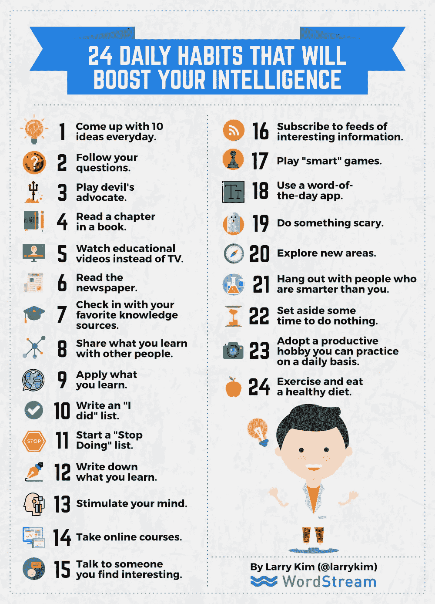

# 这 24 个日常习惯会让你变得更聪明

> 原文：<https://medium.com/swlh/these-24-daily-habits-will-make-you-smarter-2ebe023eed87>

改变你的日常生活真的能提高你的智力吗？

人脑的内部运作仍然是人类最大的谜团之一。

随着神经科学的进步，我们已经知道，我们可以训练我们的大脑[更清晰地思考](http://www.inc.com/geoffrey-james/train-your-brain-to-think-more-clearly.html)，[更积极](http://www.inc.com/jessica-stillman/4-ways-to-train-your-brain-for-positivity.html)，[更好地表达创造力](https://mobilemonkey.com/articles/how-to-be-productive)。

事实上，[史蒂夫·乔布斯著名的训练他的大脑](http://www.inc.com/geoffrey-james/how-steve-jobs-trained-his-own-brain.html)使用禅定冥想来减少压力，提高清晰度，增强他的创造力。

# 如果你真的可以训练你的大脑变得更聪明呢？

最近 Quora 的一个帖子提出了一个问题:人们可以做些什么简单的事情来提高他们的智力？

100 多名专业人士提出了他们最喜欢的让自己变得更聪明的策略——在日常工作中容易实践的习惯。[商业内幕专栏作家斯凯·古尔德](http://www.businessinsider.com/24-daily-habits-that-will-make-you-smarter-2015-6)采纳了这些建议，制作了下面的信息图。

你可能有“要做的事情”清单。我知道我桌子上通常会有一个。但是你有没有列过一个“我做了”的清单，逐项列出你每天的成就？这是一种不同的方式来规划你每天要完成的任务，它实际上可以帮助你变得更聪明。

写下你学到的东西是另一个只需要几分钟的策略，但它可以帮助你更好地记住信息，并巩固你从会议、研讨会、结构化课程等中学到的东西。

有些建议更有趣，比如“使用每日一词应用程序”这是一种不置可否的方式来建立你的词汇，并变得更聪明，只需要花几秒钟来检查应用程序。

以下每个想法都是为了[提高你的智力](http://www.inc.com/larry-kim/math-language-amp-7-other-intelligence-types-you-need-to-know.html)。虽然没有一种策略会让你的智商一飞冲天，但它们可以帮助你保持敏锐，变得更聪明，一天一次。

看看这个:

*上榜依据:* [*斯凯古尔德/商业内幕*](http://www.businessinsider.com/24-daily-habits-that-will-make-you-smarter-2015-6)

# 做驴海里的独角兽

获取我的最佳独角兽营销和创业成长秘诀:

1.  [**报名直接发到你邮箱**](https://mobilemonkey.com/blog-subscription)

**2。** [**通过 Facebook Messenger 注册偶尔的 Facebook Messenger 营销新闻&提示。**](http://m.me/447438332063924?ref=e58448cdd16367419b279793544e132f5388067506f92c92e6)

# 关于作者

拉里·金是全球最好的 Facebook Messenger 营销平台提供商 MobileMonkey 的首席执行官。他也是 T21 的创始人。

你可以在 [Facebook Messenger](http://m.me/447438332063924?ref=e58448cdd16367419b279793544e132f5388067506f92c92e6) 、 [Twitter](https://twitter.com/larrykim) 、 [LinkedIn](https://www.linkedin.com/in/larrykim) 、 [Instagram](https://www.instagram.com/kim_larry/) 上和他联系。

原贴于*[*Inc.com*](http://www.inc.com/larry-kim/adopt-these-24-daily-habits-to-make-yourself-smarter-infographic.html)*