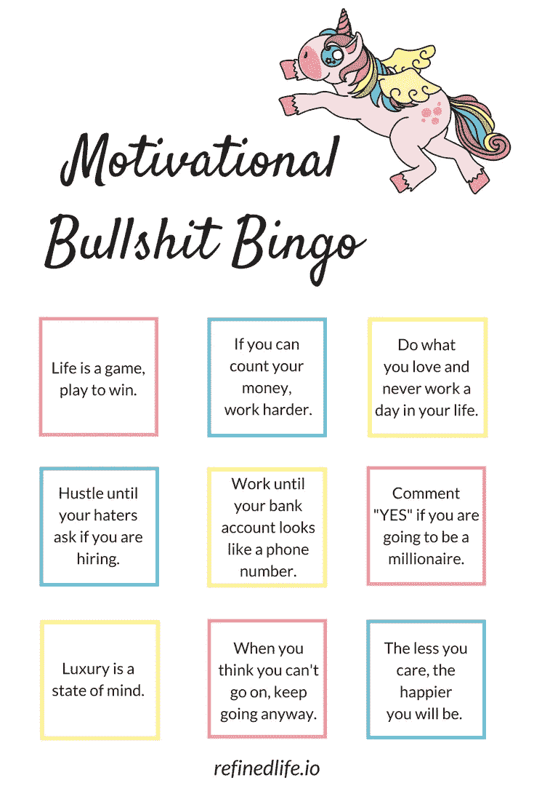

# 这 9 条励志名言会让你作呕

> 原文：<https://medium.com/swlh/these-9-motivational-quotes-will-make-you-gag-63f78c781b6b>

## 动机扯淡宾果

> 生活是一场游戏，为了赢而玩。
> 
> 如果你能数钱，那就更努力吧。
> 
> 做你喜欢的事，一生中一天也不要工作。
> 
> 努力工作，直到你的仇人问你是否在招聘。
> 
> 工作到你的银行账户看起来像一个电话号码。
> 
> 如果你要成为百万富翁，请说“是”。
> 
> 奢侈是一种心态。
> 
> 当你觉得自己走不下去的时候，无论如何都要继续走下去。
> 
> 你在乎的越少，你就会越快乐。

# 你最喜欢的废话是什么？

我很想在评论中听到这些:)，或者如果你想成为百万富翁，就评论“是”。

## 这篇文章发表在《初创企业》杂志上，这是 Medium 最大的创业刊物，有 343，876 人关注。

## 订阅接收[我们的头条新闻](http://growthsupply.com/the-startup-newsletter/)。

