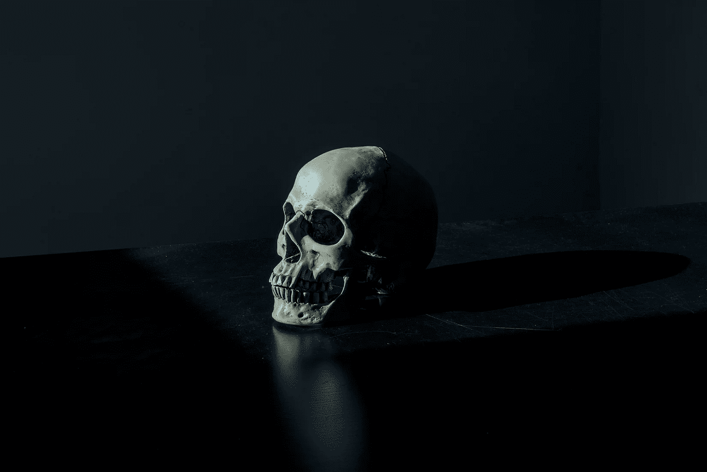

# 这些是产品驱动型创业者的 7 大罪

> 原文：<https://medium.com/swlh/these-are-the-7-deadly-sins-of-product-driven-founders-47c7c66cc783>

你正在犯这些扼杀公司的错误吗？

> *“不管你最初的产品或想法多么伟大，如果你不能建立一个伟大的公司，那么你的产品将不会持久。”——布莱恩·切斯基，AirBnB*

许多以产品为导向的创始人变得过于执着于先做产品再做其他事情。

是的，你需要一个产品和愿景来凝聚一个团队，但一个伟大的产品本身并不足以扩大规模。这种关注不仅会成为限制增长的近视，还会不幸地引发其他错误，甚至会毁掉最有希望的想法。

怎么会这样呢？在见过数百名创始人之后，根据我自己作为产品驱动型创始人的经验，我收集了一些阻碍甚至扼杀最优秀、设计最精良的产品驱动型创业公司成长的盲点。以下是我看到的产品驱动型创始人犯下的七个最致命的错误:

**1。不搬过去经典产品方正幻想(“如果我造出来，他们会来”)**

产品创始人有那么多超能力。你可以结合设计思维来设计一个优雅、有用甚至令人愉快的产品体验。你甚至可能有一种特殊的天赋，通过开发一个有思想、有同情心的产品来满足你自己或你的用户的需求。但是这些都不够。这些都不会帮助你从“项目”过渡到“商业”，更不用说过渡到“可投资的商业”甚至“独角兽”了。

记住:项目和业务之间被遗忘的差距是“货币化”企业和可融资企业之间的差距是规模。可资助的业务与利润丰厚甚至独角兽规模的业务之间的差距在于，所有这些事情都必须发挥作用，团队需要像冠军一样执行:在市场、收购、产品重点和关键人员招聘方面做出正确的决策。在像 health tech 和 edtech 这样的复杂市场中，找到买家的结构性挑战是如此之大，以至于从一个产品开始(即使是解决重要用户需求的产品)可能就是死刑判决。矛盾的是，一些最成功的公司从一个付款人开始，并逆向工作，而不是从一个问题开始，并试图找到一个愿意付钱来解决它的人。

如果你的目标不是独角兽，那也没关系。但是，如果你的目标是 1 亿美元以上的退出，没有纪律和大量的市场导向，你很难实现。说明这一点的两个例子是 AirBnB 和 Firebase。VRBO 和 HomeAway 远远早于 AirBnB。AirBnB 基本上复制了他们的产品概念，并以一种比其他任何服务都更吸引年轻、更多城市用户的方式进行包装。他们没有任何重要的概念性产品见解，尽管他们做了一些改进(例如，由 AirBnB 出资拍摄的大型专业房源照片)。他们的成功在于围绕产品的跑腿工作——特别是客户获取——而不是产品本身。

另一个很好的例子是 Firebase(完全披露:我们是早期投资者)。他们的产品新颖，但更重要的是，詹姆斯确保在每个阶段都与关键影响者进行产品社交。正是他们的支持帮助它在早期获得了发展。这里有更多关于他们的故事。

当然，世界上最具传奇色彩的“产品创始人”实际上更应该因其营销天才而受到赞誉，这是有原因的。直到乔布斯为消费者找到了令人信服的必备价值主张——通常是成千上万种可能的产品优势的子集(“你口袋里有一百万首歌”)，没有一款标志性的 I-产品取得了成功。

**2。没有尽早测试(WTP)支付意愿**

请不要太势利，不要把财务考虑和支付意愿(WTP)作为你产品绝对关键的设计考虑因素。你必须在产品开发的早期测试 WTP，这样你就不会走上一条漫长而昂贵的道路，最终证明你的产品是失败的。简而言之，如果你的产品的采用取决于价格，而你却关注并优化一个不切实际的价格点，那该怎么办？

是的，你的产品(无论什么类别)可能值得流口水，设计华丽，但这不足以克服你的客户对未公布的价格点的抵制。在硬件上，这种罪恶确实可以是悲剧性的。当你选择了材料，制造路线，几个月或几年的迭代和打磨一个早期版本——所有这些都在市场测试之前——你最不想发现的事情就是没有人会为此买单！

我们经常问:

*   该团队熟悉买方组织中的买方(特定人员或角色)吗？他们能成功接触到他们吗？
*   买家的购买决策涉及哪些考虑因素？
*   销售可能存在哪些障碍？这包括难以转向新的解决方案、缺乏明确的预算、销售周期长以及一个巨大的问题:惯性，或“足够好”的问题
*   价值主张是否足以成为克服上述障碍的倍增器？(认为 10 倍比 2 倍更好)

这里有一篇[精彩的文章](http://firstround.com/review/its-price-before-product-period/)提供了关于这一现象的另一个案例研究。

**3。解决用户问题，而不是买家的痛点**

因为你如此热衷于解决你的目标用户的问题，所以经常很容易跳过验证是否确实存在买家痛点的步骤；那就是有人真的会花钱修理它。(这一条我一直心虚，所以特别能产生共鸣。)这种错误的一个症状是，当你的推销中包括“这个问题需要解决”这句话时，却没有任何人拿出预算来解决这个问题。不幸的是，货币化不会奇迹般地出现在你的公司里——它不会以那种方式发生。

即使你偶然发现了一个商业模式，你还有一个漫长而痛苦的旅程要走，以找到适合市场的产品，这可以通过从一开始就专注于解决买家的观点来避免。虽然潜在用户总是会对产品的承诺“哦”和“啊”，甚至是早期版本，如果他们不愿意投入他们的钱包或时间…嗯，正如一个比我更有名的人所说，“但是”之后什么都不重要。这就是为什么永远不要跳过这个问题是如此重要:“你准备好购买这个了吗？”—紧随其后的是报名表或意向书，以捕捉购买意向。

至于解决你的买家涂料点，已经写了很多关于验证你的想法的市场([这个](http://theleanstartup.com/)、[这个](https://www.amazon.com/Lean-Startup-Entrepreneurs-Continuous-Innovation/dp/0307887898)和[这个](http://www.guidearama.com/guides/fwb.html))，我不需要在这里重复。简单地说:你忽视了设计研究中的市场部分，后果自负。

**4。不知道您的销售周期有多长**

你可能擅长用户研究，但是你可以从花几个用户测试周期来理解购买者角色和用例中获益匪浅。这对于理解你的采纳曲线以及你应该如何为你的创业公司配备员工和提供资金是至关重要的。根据我之前自己创业的经历，完成一笔销售交易平均需要 18 个月，这拖累并最终破坏了我们的增长。

一些轶事可以说明我看到的一些场景:一个企业 SaaS 平台，平均合同价值(ACV)高达 25 万美元，但 18 个月的销售周期可能很难及时获得客户反馈，以在创始人(更不用说投资者)的现金用完之前进行迭代。相比之下，一个月 500 美元的产品有 10 天的周期，团队可以从反馈中学习，并在同一个窗口中多次迭代。

最关键的方面是:谁是组织中的确切买家，谁做决策，什么影响他们，以及可能最关键的是，经历整个决策和购买周期需要多长时间。换句话说，你能现实地预测销售周期需要多长时间？如果一个创始人不能回答这些问题，我不认为他们是销售就绪。

幸运的是，所有这些都是完全可以测试的。要记住的关键一点(归功于 Eric Ries)是将你的销售过程本身视为你正在迭代和测试的东西。

销售周期可以决定您需要等待多长时间才能对您的价值主张进行有意义的验证，但隐藏的、最终更重要的成本可能是您的学习曲线。

**5。误解 MVP**

精益创业大师埃里克·里斯(Eric Ries)和史蒂夫·布兰克(Steve Blank)合写了七本书，但我仍然发现创始人对最小可行产品(MVP)的确切含义理解不足。

基本上，如果你发现自己一次又一次地回到你的工程团队，说“再多一个功能，然后他们就会购买，”很可能你是一个胖的创业公司，而不是一个瘦的。您可能已经知道 MVP 包含了让客户购买所需的最少功能集，但真正的关键是能够将关键功能(客户愿意花信用卡购买的功能)与维生素和“有得必有失”区分开来。

众所周知，企业 SaaS 的产品可能非常简单，但功能强大，能够取得成功。我经常建议种子期前和种子期创始人在 A 轮融资之前，专注于为销售而非产品进行过度优化。除非有一些有趣的、令人难以置信的独特的核心技术，否则很少有初创公司因为在产品路线图上超额交付而获得资金，而相反的情况是绝对必要的。

也有像 Twitter 这样的消费者例子(他们在 10 年里几乎没有改变他们的基本格式)。总有反例，但在这个更成熟的技术领域，如果你看不到你能建造的最简单的东西有很大的吸引力，那么回到绘图板可能比给泰坦尼克号添加躺椅更有价值。

进一步阅读:这篇文章的原型当然是这里的，但你也可以也应该阅读这篇文章的经典之作 *(* [*)精益创业*](http://theleanstartup.com/) *。)*

**6。设计公司时不考虑采用曲线**

如果你不了解你的用户对你的产品/服务的采纳曲线，那么作为一个创始人，你已经戴上了眼罩，这将使设计你的公司取得成功变得异常困难。你的客户的增加绝对会影响你的支出和人员配备(也就是说，你的销售周期的长短将决定你应该雇佣多少销售人员，以及什么样的销售人员)，这就是为什么尽早了解这一点是至关重要的。需要思考的几个问题:你的产品是免费增值还是付费？你会做内部销售还是付费获客？第一次体验是高触还是低触？这些都导致了根本不同的用户采用曲线，并需要不同的团队到位。

例如，我最近遇到了一个企业 SaaS 团队，他们试图扩展一个组织内部使用的设计精美的生产力工具。不幸的是，他们遇到的用例与其说是止痛药，不如说是维生素。它非常适合免费增值，你可以尝试一些东西，然后在几个月(或几年)内慢慢爱上它；而不是在你神魂颠倒时或为了止血而快速购买。然而，他们没有计划和准备 Github 式的免费增值推广，而是希望通过更好的营销和客户支持来突破他们的采用曲线，因此，他们的烧钱率是天文数字:他们有六名全职工程师，只有一名销售人员。当我看到一个团队由于错误的部署、人员配备和扩展模型而浪费了一个不可思议的产品时，我感到沮丧。

如果你想尝试更多的策略，我个人最喜欢的书是这本书，或者你也可以从 GrowthHackers.com 社区的案例研究中学到很多。最后，记住如果你不擅长销售，雇佣擅长销售的人或者与他们合作(我在这里写了一整篇关于为什么和如何做的文章[。](https://hackernoon.com/your-frontier-tech-startup-should-hire-business-people-stat-11ccc607c504))

**7。没有瞄准空白区域**

创造一个全新的产品来弥补现有竞争对手的不足是很棒的。事实上，当你学习新的 Python 框架时，甚至可以说是为 Instagram/Tinder/Things 编写一个更好的克隆。但是随着市场的成熟——如果你想建立一个巨大的、颠覆性的公司——你需要对形势的变化有战略眼光。

首先，要承认技术市场存在临界点，某些优势会流向现有企业。毫无疑问，如今打造另一个 Diapers.com 或 insta gram——或者在这里插入其他昂贵的收购——更具挑战性，因为现有的竞争对手规模巨大，收购你比让你偷走市场份额更便宜。但这是最明显的威胁——也许这甚至是一个企业家的胜利。更难也更容易被忽视的挑战是品牌建设:从 10 万用户增长到 1000 万用户的活动中，很大一部分可能涉及付费营销，而且可能比你想象的更复杂、更昂贵。有时，市场中的第二、第三和第四移动者也面临不小的转换成本。看看 Salesforce，一个 18 岁的 SaaS，它是许多销售团队的通用语言。更好的竞争对手？是的。但是，祝你好运说服那些已经使用 Salesforce 多年的公司(以及随之而来的培训和数据投资)。创新者有时会低估惯性对不像他们那样思考的人的决策的影响。

现实是，让现任者下台代价高昂。而且，如果你只是在几个产品维度上与众不同，你的大竞争对手更有可能推出你的杀手级产品功能，让你变得无关紧要，然后你会以某种方式获得他们所有不满意的用户。*(说起来很伤人，但是真的！此外，B2B 比消费者更真实。)你需要知道你的产品差异化是否足以让现有用户跳槽，转移他们所有的数据。而且，根据我所看到的所有产品功能推介，我会说，如果你的产品是基于不同的用户范式，或对他们的痛点的不同理解，或获得客户的不同方式，你将有更大的机会击败你的巨人对手，而不仅仅是因为你的产品功能更好。

事实上，与 2007 年或 1997 年相比，现在一家初创公司需要以不同的方式考虑如何颠覆一家大公司——了解你的战略，并意识到在一个更加成熟的技术生态系统中，你的上市变得与你的产品差异化一样重要，甚至更重要。

因此，尽管留白越来越难找到，但如果你想建立一个大的、可扩展的企业，努力寻找留白还是有好处的。对于我在这里提出的每一点，大卫和歌利亚的例子比比皆是(从 Snapchat 到 Ipsy 到 Veeva ),所以如果你对自己的弹弓能力非常自信(或者是一个游击营销大师),不要离开战斗——睁大眼睛投入战斗。

现在，去创造，去制造，去破坏。只要确保你不落入这些陷阱，这样你就可以走出自己的路，把你的天才产品带给尽可能多的观众。世界在等待着。

这有帮助吗？给我一些爱，在下面鼓掌吧！

*如果你想看更多我写的东西，请关注我的媒体:)*

## 这个故事发表在[的《创业](https://medium.com/swlh)上，259，700 多人聚集在一起阅读 Medium 关于创业的主要故事。

## 在这里订阅接收[我们的头条新闻](http://growthsupply.com/the-startup-newsletter/)。

