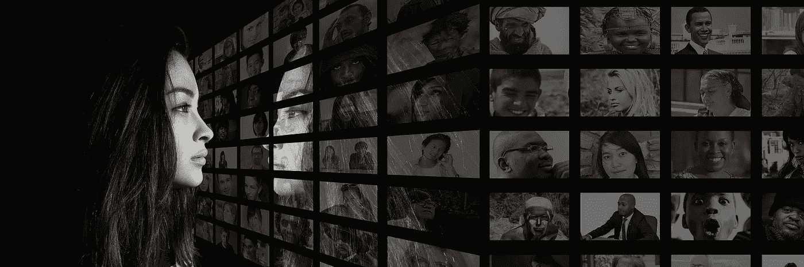

# 这些科学发现将打破你对人类的假设

> 原文：<https://medium.com/swlh/these-scientific-findings-will-blow-away-your-assumptions-about-humans-a436af30e167>

## 我们没有你想的那么分裂。

我们两极分化的时代让我们觉得有很深的鸿沟把我们分开。

所有的种族、文化、宗教和社会在表面上看起来都是如此的不同。

他们不是。我们对他们的看法完全是**编造的。**

关于 T4 对人类来说意味着什么，我们有很多假设。

> "你的假设和事实是完全不同的."迈克尔·斯特拉琴斯基

科学是这样说的:

# 人类天生并不暴力。

人类必须**适应**才能杀戮。他们必须被灌输暴力。

科学案例是暴力的反义词。我们天生就有同理心。

我们大脑中有一种叫做镜像神经元的细胞。无论是我们自己在做某个特定的行为，还是我们在观察另一个人做这件事，他们都会开火。

这将我们与他人联系在一起，创造社会纽带。这让我们能够产生共鸣。

> 神经科学家维托里奥·加勒塞说:“我们似乎天生就认为其他人和我们相似，而不是不同。”

# 女人在生理上比男人更有弹性。

它存在于染色体中。

把一个 X 和一个 X 配对，结果是一个雌性。把一个 X 和一个 Y 配对，结果是一个男性。

男性组合在生物学上更脆弱。这使得男性更容易患上遗传疾病和畸形。

大约每 100 名女性怀上 160 名男性。

由于染色体组合不太稳定，男性的自然流产率较高，因此每 100 名女性中大约有 105 名男性出生。

随着时间的推移，女性的数量最终超过了男性，逆转了最初的比例。

这些统计数据挑战了我们对性别的社会化认知。

女性脆弱或软弱的观念被用作允许不平等待遇的借口。

# 种族是人造的，没有生物学的支持。

肤色是有生物根源的。我们所有关于那意味着什么的信念都是编造的。

肤色是**勉强**皮深。产生我们皮肤色素的细胞大约有半毫米深。

除此之外，我们都是同样的颜色。

我们出生在一个文化和社会中。我们被教导我们的文化信仰。

类似于我们对成为一个男人或女人的定义，我们对成为黑人或白人的定义产生了信念。

然后我们允许这些信念成为区别对待他人的理由。

> “没有人生来就因为肤色、背景或宗教信仰而讨厌另一个人。人们学会恨，如果他们能学会恨，他们就能学会爱，因为爱比它的对立面更自然地进入人心。”纳尔逊·曼德拉

# 你的身体可以自我康复和自我调节。

美国人对药物、药品和复杂的程序有一种爱。

这些都不能治愈创伤。只有**的身体**才能痊愈。

医生不会治愈你。你手指上的绷带并不能治愈你。

你的身体在其中枢神经系统(大脑和脊髓神经)和身体系统之间有一条错综复杂的**通信**线。

当这个交流系统自由工作时，身体会自我治疗和调节。

这个**治疗**系统适用于所有年龄、所有种族、所有性别、所有国家和所有阶层。

> "你身体的每一个器官都与你帽子下的器官相连."—BJ·帕尔默

所以你走吧。一些随机的科学事实让我们明白，我们的相似之处比不同之处多得多。

我们都进入并最终离开这个物质世界。从开始到结束的一切都是虚构的。

 [## 你的生活是一个故事，让它精彩吧

### 哪个故事最能描述你的生活？

medium.com](/@christinebradstreet/your-life-is-a-story-make-it-a-good-one-ae06792d911e) 

你应该得到真正的、终身的幸福，这种幸福是无论世界上发生什么样的疯狂都无法夺走的。 [***看过我的书，开心过***](https://happyeverafter.info/) ***。我们现在都可以利用这一点。***

***拜访我在***[***www.christinebradstreet.com***](http://www.christinebradstreet.com/)

所有图片均来自 pixabay.com 开源网站

## 这个故事发表在 [The Startup](https://medium.com/swlh) 上，这是 Medium 最大的企业家出版物，拥有 355，974+人。

## 在这里订阅接收[我们的头条新闻](http://growthsupply.com/the-startup-newsletter/)。

