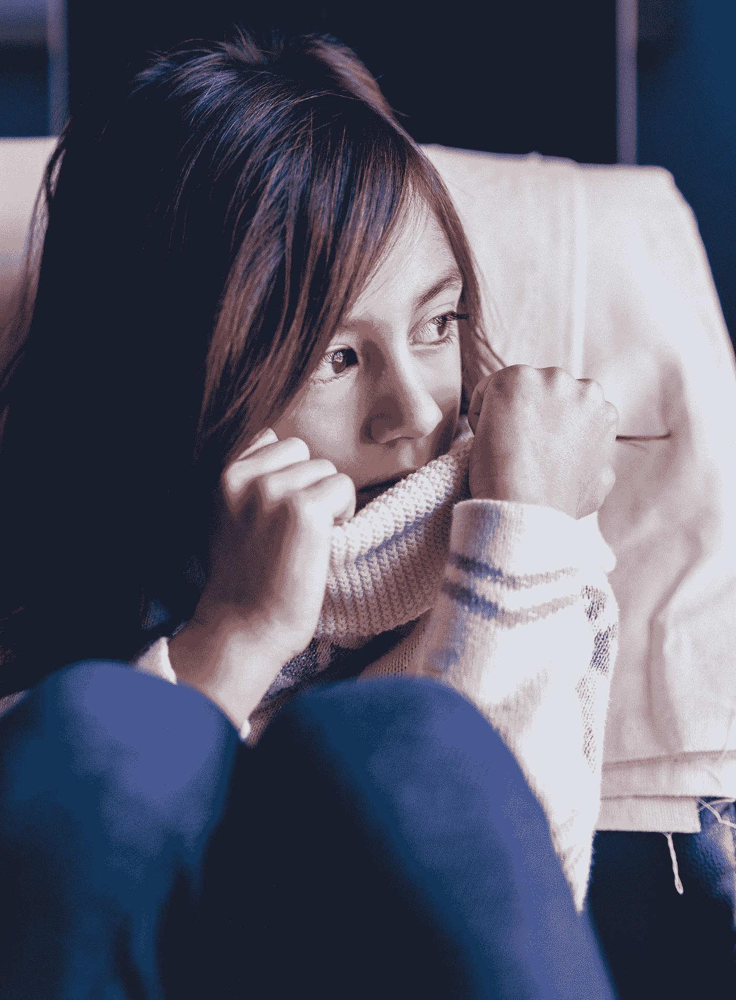

# 父母说的会影响他们孩子成年的话

> 原文：<https://medium.com/swlh/things-parents-say-that-will-affect-their-children-in-adulthood-1cef2e5e7df>

Photo by [Joseph Gonzalez](https://unsplash.com/@miracletwentyone?utm_source=medium&utm_medium=referral) on [Unsplash](https://unsplash.com?utm_source=medium&utm_medium=referral)

有一天，我真的听到一位女士在沃尔玛对着她的小孩大喊大叫。

“我会让你哭的！”。

孩子显然是因为没有得到玩具而心烦意乱，或者他被推在手推车的座位上感到不舒服，或者他可能是饿了，或者其他任何幼儿哭泣的原因。