# Things You Think You Know About China: Myth or Reality?

> 原文：<https://medium.com/swlh/things-you-think-you-know-about-china-myth-or-reality-9f5f12da651d>

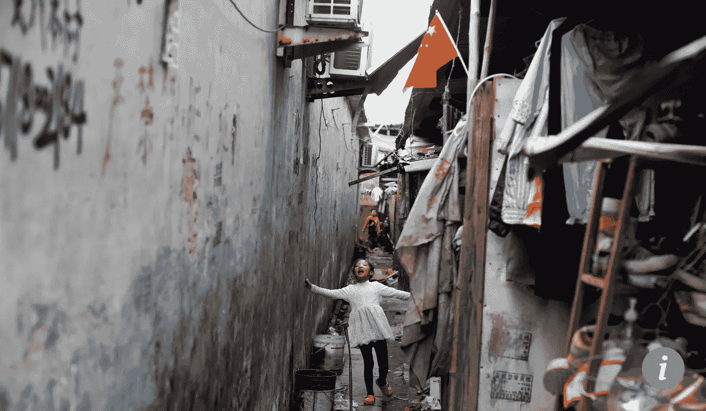

Credit: [SCMP](http://www.scmp.com/news/china/policies-politics/article/2118119/chinas-list-poorest-counties-shrinks-first-time-30)

China seems to be a hot topic at all times, across boundaries and industries. But do we get all our facts straight? What do we really know about China? And how do we know what we know is true? This is no empty rhetoric: China has made striking progress in many areas and we need to bust the myths and misconceptions we have about this giant country which cautiously but continually expands its influence, under an authoritarian yet effective leadership of Jinping Xi.

Here is a reality check based on publicly available data.

# **So you say: “China is and will continue to be the most populous country in the world.”**

## Reality check: TRUE for 2018, FALSE for 2024 and beyond.

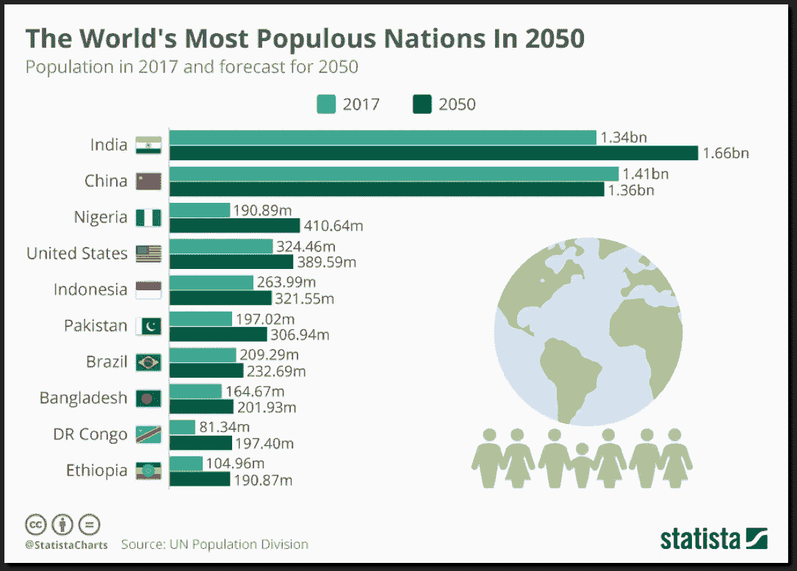

[Click for reference](https://www.forbes.com/sites/niallmccarthy/2017/06/22/the-worlds-most-populous-nations-in-2050-infographic/#1ca466f039f6)

[The World Population Prospects: The 2017 Revision](https://esa.un.org/unpd/wpp/publications/Files/WPP2017_KeyFindings.pdf), published by the UN Department of Economic and Social Affairs, said that currently China with 1.41 billion inhabitants and India with 1.34 billion remain the two most populous countries, comprising 19 and 18 per cent of the total global population. ***Around 2024, the population of India is expected to surpass that of China.***

# So you say: “China is still a poor country.”

## Reality check: PARTIALLY TRUE.

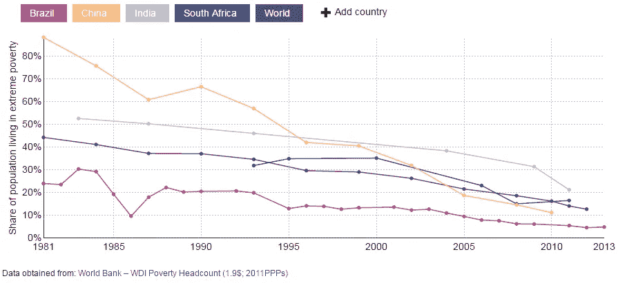

[Click for reference](https://data.worldbank.org/indicator/SI.POV.DDAY?end=2016&locations=CN-1W&start=1979)

Since China began its market reforms in the late 1970s, it has lifted more than 800 million people out of poverty, slashing the rate from nearly 90% in 1981 to under 2% (see the orange line above), as measured by the World Bank’s [latest spending benchmark](http://www.worldbank.org/en/topic/poverty/brief/global-poverty-line-faq). ***China accounted for about half the drop of world wide extreme poverty between 1990 and 2005.***

***Yet China remains a developing country because its per capita income is still a fraction of that in advanced countries*** (compare the blue line representing World’s advanced economies and green line representing China) and its market reforms are incomplete.

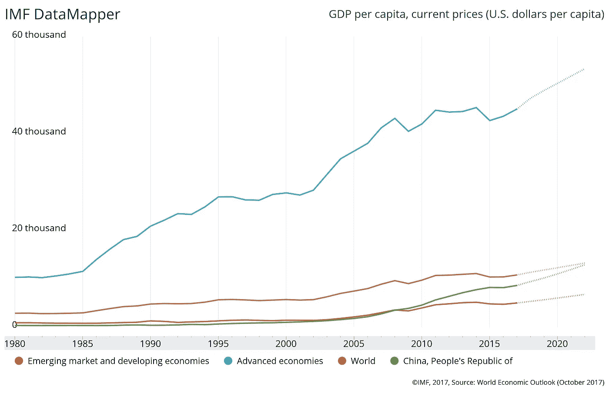

[Click for reference](https://www.imf.org/external/datamapper/NGDPDPC@WEO/OEMDC/ADVEC/WEOWORLD/CHN)

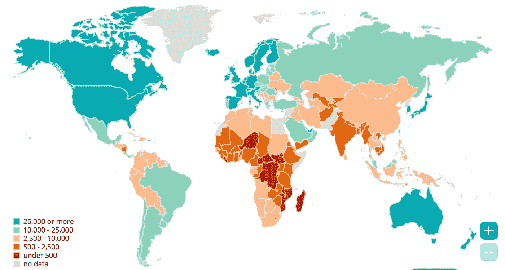

[Click for reference](https://www.imf.org/external/datamapper/NGDPDPC@WEO/OEMDC/ADVEC/WEOWORLD/CHN)

End of 2017, during a [speech marking](https://news.cgtn.com/news/30516a4d32597a6333566d54/share_p.html) the beginning of his second five-year term as party leader, Mr. Xi described eradicating poverty by 2020 as one of his chief priorities, vowing to “leave no one behind in the march toward common prosperity.” [According to New York Times,](https://www.nytimes.com/2017/10/31/world/asia/xi-jinping-poverty-china.html) this doesn’t really sound realistic and “Xi Jinping is now a prisoner of expectations, his problem is not the fears of Chinese people but the hopes of Chinese people.”

[一句话:](https://www.forbes.com/sites/panosmourdoukoutas/2017/09/02/china-is-still-a-poor-country/#1fee99004eef)中国已经从一个不发达的经济体成长为一个新兴经济体，击败日本成为世界第二大经济体。但是，在跃进成为世界上最富有的国家之一之前，中国还有很长的路要走——无论是在生活的数量还是质量方面。中国适度的人均收入意味着这个国家有很大的增长空间。

# 所以你说:“美国是世界上最大的经济体。”

## 现实检验:如果用购买力平价来衡量的话，错误的。

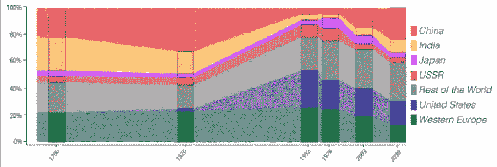

[Click for reference,](https://www.weforum.org/agenda/2016/06/8-facts-about-chinas-economy/) Share of world GDP (% of world total), 1700–2030

按市场汇率计算，美国是世界上国内生产总值(GDP)最大的经济体，而中国现在是世界上 GDP 第二大经济体，自 19 世纪末以来，由于西方世界的几次工业革命，中国一直落后于美国。但中国在 1978 年开始了前所未有的经济赶超。根据彭博的说法，[从大多数指标来看，中国已经超过了美国，并且正在拉开距离。它是世界上增长最快的经济体之一，截至 2017 年，实际年 GDP 增长率平均为 9.5%，这一速度被世界银行描述为“历史上主要经济体最快的持续扩张”。](https://www.bloomberg.com/view/articles/2017-10-18/who-has-the-world-s-no-1-economy-not-the-u-s) [**中国已经成为全球最大的经济体**](https://fas.org/sgp/crs/row/RL33534.pdf) **(按购买力平价计算)，制造商，商品贸易商，外汇储备持有者。**

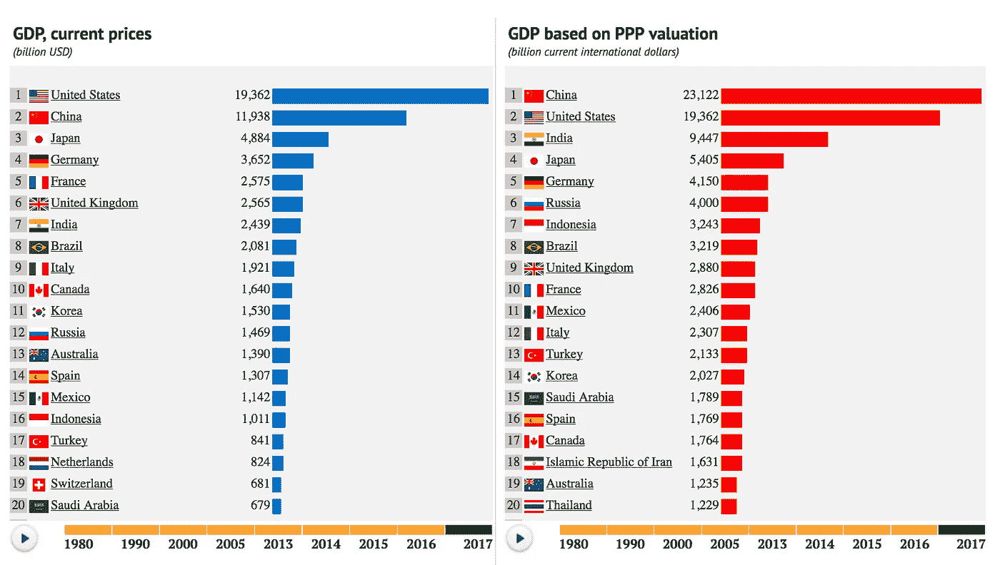

[Click for reference.](https://knoema.com/nwnfkne/world-gdp-ranking-2017-gdp-by-country-data-and-charts) Why measure in PPP? Looking at GDP solely is misleading, because things cost different amounts in different countries and economists try to correct for this with an adjustment called purchasing power parity (PPP), which controls for relative prices.

如上所述，这并不意味着中国人口是世界上最富有的——远非如此。根据 2018 年 1 月发表的 FP 中的一个论点，中国的扶贫战争对穷人的伤害最大。

# 所以你说:“社交媒体在中国完全被屏蔽了。”

## 现实检查:错误，他们有自己的本地社交媒体。

中国是全球最大的社交网络市场。由于中国的防火长城，中国政府的互联网审查项目通常被称为(或“[网络威权主义](https://muse.jhu.edu/article/427159)”)，脸书、Twitter 和 Youtube 这些领先的国际社交媒体在中国都被屏蔽了，取而代之的是政府可以监控的其他网站。

那么中国人能够使用哪些社交媒体平台呢？

> **微信代替脸书，Instagram 和 Whatsapp**

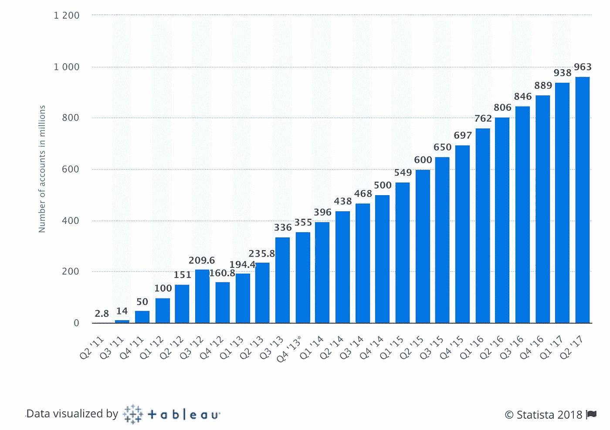

[Click for reference.](https://www.statista.com/statistics/255778/number-of-active-wechat-messenger-accounts/) Number of monthly active WeChat users

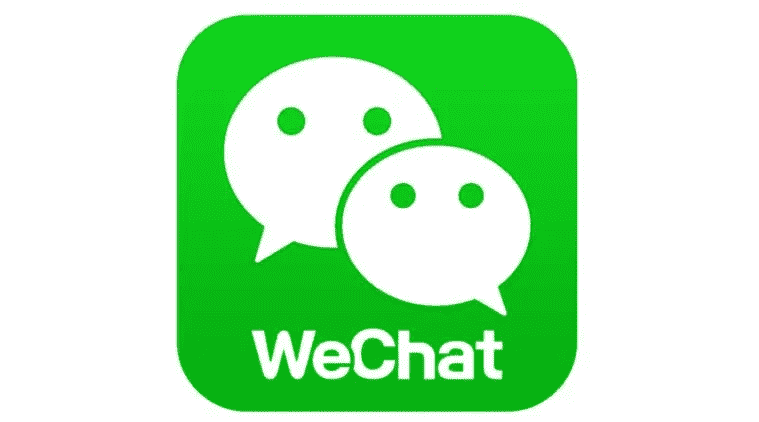

WeChat

中国以外的人可能很难理解微信在中国的影响力有多大。博客 Stratechery 的分析师和创始人 Ben Thompson 写道:“实际上，微信*就是你的手机，在中国，手机比其他任何地方都更重要。“任何其他国家都没有类似的东西:WhatsApp 没有，脸书也没有。”*

据新华社 12 月 15 日报道，现在微信正准备成为中国的电子身份证系统。微信将发行虚拟身份证，个人可以用它来代替国家发行的实体身份证。由于微信根据政府政策要求用户实名注册[，不难想象有一天，微信可能会完全取代身份证。哈佛商学院(Harvard Business School)管理学教授 Willy Shih 与人合著了一份关于微信的案例研究，他将向电子身份系统的过渡称为“可预测的演变”。](https://www.theverge.com/2017/8/28/16217602/china-censorship-real-identities-weibo-blogging-all-content)

> **微博代替推特**

Weibo

自从被指责参与组织了 2009 年的抗议活动后，推特在中国被屏蔽。那是微博成立的时候，它基本上做同样的工作——你有 140 个字符来表达你的想法。出于对审查和文化的担忧，人们通常不谈政治，而是发布个人话题。

> **百度而不是谷歌**

百度是中国的谷歌。

中国政府确保百度在未来几年将在互联网搜索领域拥有近乎垄断的地位。

随着越来越多的人开始在中国使用互联网，百度正在迅速发展，而且应该会继续发展。

百度也有 Reddit 风格的论坛百度贴吧和维基百科风格的在线百科全书。和谷歌一样，它也在人工智能和无人驾驶汽车上投入了大量资金。

> **腾讯视频，爱奇艺和优酷代替 YOUTUBE**

这些平台已经被大陆用户认为是视频流提供商的首选组合。

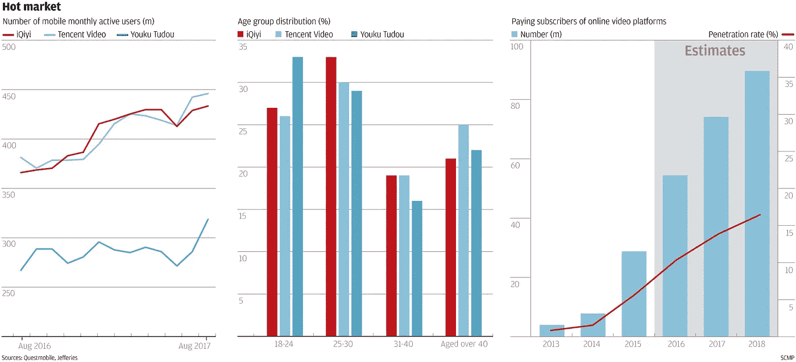

[Click for reference](http://www.scmp.com/tech/china-tech/article/2113720/tencent-video-iqiyi-race-lead-chinas-online-video-market)

# 所以你说:“中国有独生子女政策。”

## 现实核查:自 2015 年末以来一直是假的

你可以持续增长你的 GDP，但是如果你国家的人口增长更快，你就不能保证一个更富裕的普通公民。中国政府在 1979 年引入了 T4 的独生子女政策，在接下来的 20 年里，生育率从每位妇女 2.7 胎下降到 1.4 胎。这导致中国人口在 1980 年至 2013 年间增长了 38%。(相比之下，同期印度的这一比例为 84%)。从 1979 年到 2015 年，在中国实行独生子女政策的同时，政府强迫许多妇女堕胎或接受其他侵入性的节育手术。

然后，在 2015 年末，中国放松了政策，转向更大的生育自由，以应对人口老龄化和劳动力萎缩，这可能会破坏多年两位数增长率的成果，并威胁执政的中国共产党的政治合法性。大多数已婚夫妇被鼓励生两个孩子。中国计划生育委员会希望这项新政策能在 2020 年前每年为 T2 带来 300 万新生儿，并在 2050 年前为 T4 增加 3000 万劳动力。 [**但是一直没有持续的婴儿潮。**](https://www.nytimes.com/2018/02/20/opinion/china-women-birthrate-rights.html) [根据中国国家卫生和计划生育委员会的数据，2016 年出生人口增长了 7.9%](http://www.china.org.cn/china/2017-01/23/content_40158434.htm) 。一月份发布的数据显示，与前一年相比，2017 年该国的出生率下降了 3.5%。根据官方统计，2017 年已经有一个孩子的父母生育的孩子数量确实上升了，但是第一胎出生的数量下降了。

人口学家将 2015 年做出的允许所有家庭生育两个孩子的决定描述为“太少，太晚了”，以应对快速老龄化的人口。

© 2017 Reuters

The one-child policy exacerbated a [preference for boys](http://www.economist.com/node/15636231) over girls that led to baby girls being discarded, and a dramatic modern-day gender imbalance. [Moreover, according to University of British Columbia](https://www.sciencedaily.com/releases/2018/02/180223131904.htm), China’s two-child policy may exacerbate gender inequality, a claim that was also supported by [a recent article on Feminist Webforum on Chinese social media](https://www.whatsonweibo.com/one-child-policy-improved-womens-status-china/) arguing that the one-child policy has greatly benefited the status of women in Chinese society, and that the shift to a so-called two-child policy is a setback for women’s rights in China.

# So you say: “China is not a leader in tech”

## Reality check: FALSE in many key areas (quoting Forbes)

[Chinese President Xi Jinping has made developing his country’s technological capabilities a key priority](https://www.forbes.com/sites/stratfor/2018/02/07/the-coming-tech-war-with-china/#665f3ce01cd4), not only to wean China from its dependence on foreign technology but also to turn it into a leader in innovation. And sure enough, China is gaining ground on its rivals in the tech realm. The country has chalked up an array of impressive achievements over the past few years, including its developments in [hypersonic missiles](https://admin.stratfor.com/node/269439), human [gene editing](https://admin.stratfor.com/node/284835) trials and [quantum satellites](http://www.sciencemag.org/news/2017/06/china-s-quantum-satellite-achieves-spooky-action-record-distance). [China aims to become a global leader](https://www.forbes.com/sites/michaeldunne/2016/12/14/chinas-automotive-2030-blueprint-no-1-globally-in-evs-autonomous-cars/#28a292f01c6e) in electric and driverless cars within 10 years. [It is also on track to become a leading **Artificial Intelligence** developer.](https://www.technologyreview.com/s/609038/chinas-ai-awakening/)

中国工业和信息化部发布了一项为期三年的人工智能发展计划，这是 2017 年 7 月启动的一项更大计划的一部分，该计划包括人工神经网络处理芯片、智能机器人、自动驾驶汽车、智能医疗诊断、智能无人机和机器翻译等技术的具体目标。

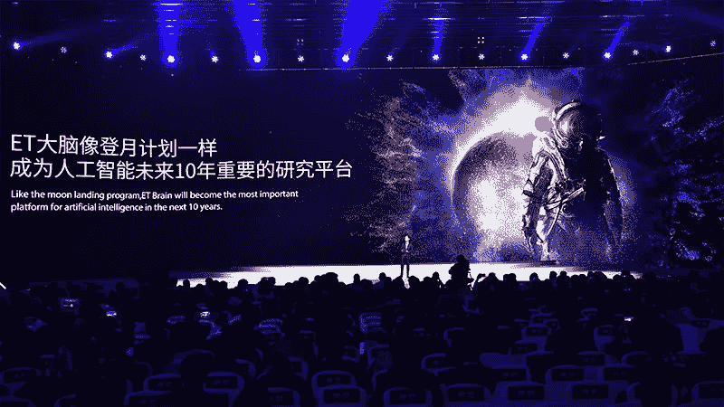

Zhang Yong, head of Chinese tech giant Alibaba, introduces the company’s artificial intelligence ET Brain at a conference in December 2017.Credit: Li Xin/Xinhua via ZUMA

在 2017 年全球人工智能创业公司的 152 亿美元投资中，48%流向了中国，只有 38%流向了美国。来自 [CB Insights](https://www.cbinsights.com/research/report/artificial-intelligence-trends-2018/) 的一份关于人工智能现状的新报告如是说。今年早些时候，中国政府宣布将投资 138 亿元(21 亿美元)建设一个人工智能产业园——这是其到 2030 年成为该领域世界领导者计划的第一笔重大投资。

经济学家[称，鉴于中国的技术积累，硅谷可能不会保持其全球优势太久。](https://www.economist.com/news/business/21737075-silicon-valley-may-not-hold-its-global-superiority-much-longer-how-does-chinese-tech)

[中国也在全球竞赛中领先完善**基因疗法**](http://fortune.com/2018/04/13/goldman-sachs-china-gene-editing-race/) **。**华尔街日报[报道](https://www.wsj.com/articles/china-unhampered-by-rules-races-ahead-in-gene-editing-trials-1516562360)自 2015 年以来，科学家利用 Crispr-Cas9 技术(首次用于人类)对该国至少 86 名癌症和艾滋病患者的细胞进行了基因工程改造。尽管没有关于这些实验的正式科学论文，但截至 2018 年 2 月底，中国有九项注册的临床研究测试了 CRISPR 编辑的细胞，以治疗各种癌症和艾滋病毒感染，而美国只有一项研究，[高盛分析师 Salveen Richter 和她的团队在一份研究报告中写道](http://fortune.com/2018/04/13/goldman-sachs-china-gene-editing-race/)。所有这些研究都是由中国顶级公立医院发起/赞助的，据报道有 80 名患者接受了这些研究用基因组药物的治疗。(让我们也记住，在三个独立小组试图复制一个中国小组的研究成果[失败](https://www.nature.com/nbt/journal/v35/n1/full/nbt.3753.html)后，自然生物技术[于 2016 年发表了其编辑关注的说明](http://www.nature.com/nbt/journal/v34/n7/full/nbt.3547.html)。)

中国在过去几十年的快速增长推动其成为一个工业强国，但这也导致了危险的污染水平。该国仍然依赖煤炭来满足其巨大的能源需求，但他们的能源组合正在迅速扩展，超越化石燃料，因为他们包括各种可再生资源，如水电，风能，太阳能，生物能和其他可再生能源。[中国现在是可再生能源领域不可阻挡的力量。](https://futurism.com/china-new-world-leader-renewable-energy/)能源经济和金融分析研究所[发布的一份新报告](http://ieefa.org/ieefa-report-china-continues-position-global-clean-energy-dominance-2017/) (IEEFA)深入研究了中国在为可再生能源发电奠定国际基础方面引领世界的努力。该报告指出，2017 年，中国在清洁能源项目上的总投资超过 440 亿美元，比 2016 年的 320 亿美元有了显著增长。

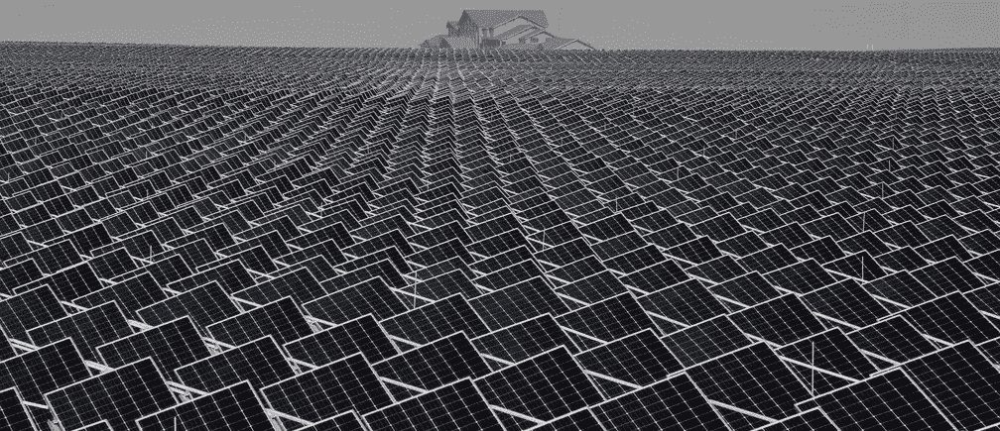

[Image: REUTERS/Stringer](https://www.weforum.org/agenda/2017/06/how-china-and-us-compare-on-climate-action/)

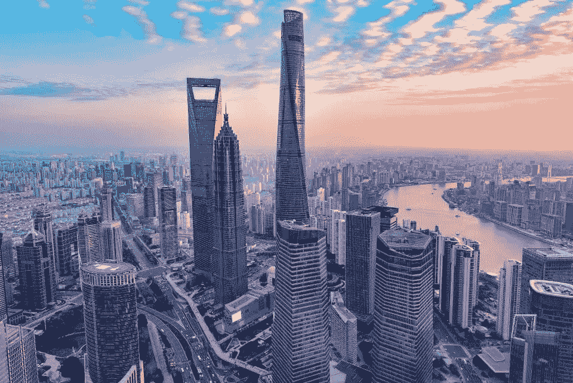

[Shanghai: not done rising. (Shutterstock)](https://www.forbes.com/sites/kenrapoza/2017/03/26/the-future-chinas-rise-americas-decline/#5b1bf8143b2f)

**—————**

*Ezgi Tasdemir 博士是诺华肿瘤公司的员工。本文由 Ezgi Tasdemir 创作。所有观点、分析和观点完全独立，仅属于作者，不代表诺华或任何其他公司或组织的观点或意见。作者没有从诺华或任何其他制药/非制药公司获得任何资助或支持。*

## 这个故事发表在 [The Startup](https://medium.com/swlh) 上，这是 Medium 最大的创业刊物，拥有 317，238+人关注。

## 在此订阅接收[我们的头条新闻](http://growthsupply.com/the-startup-newsletter/)。

