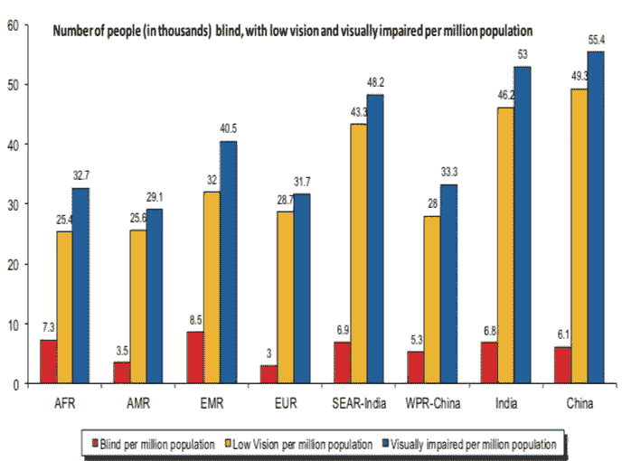
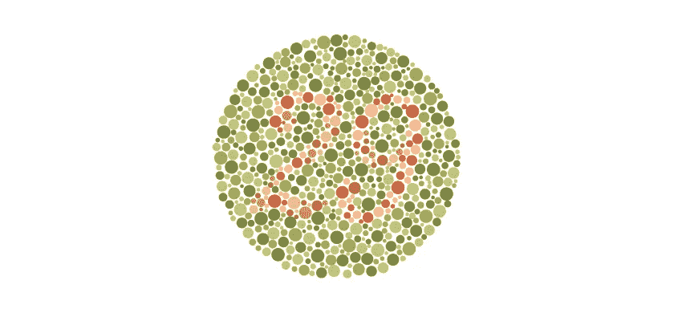
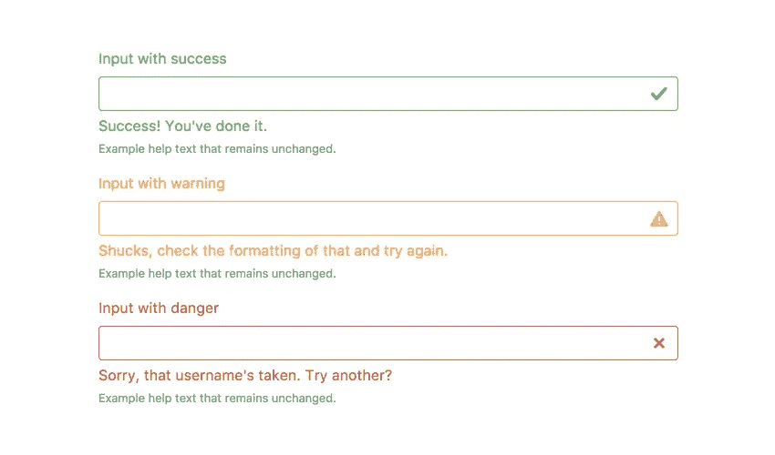
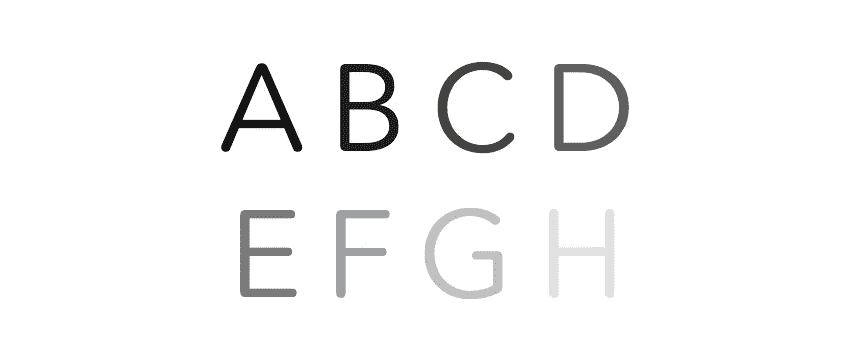
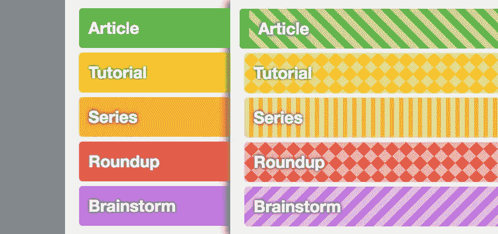
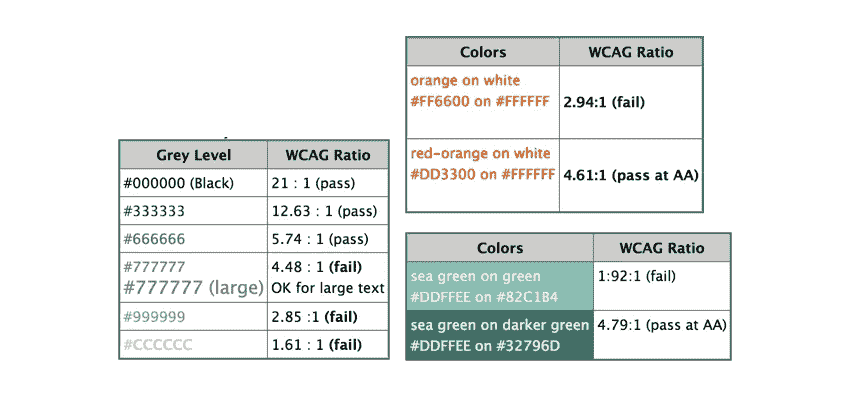

# UX 设计中的钉子无障碍

> 原文：<https://medium.com/swlh/think-broad-nail-accessibility-in-ux-design-f8dac8233f66>

在设计的所有优先方面，所有人都可以使用的视觉设计往往处于次要地位。技术已经达到了这样一个程度，用户期望产品能够针对各种需求进行优化。

**世卫组织**的一项研究显示，全球人口中 **4%** 视力受损， **4%** 视力低下， **0.6%** 失明。从数字上看，有超过 5 亿人因为不可访问性问题而无法使用你的服务/产品。

《华尔街日报&付费墙》显示，美国有超过 200 家企业因网站无障碍问题被起诉。所有这些失败使得公司必须拥有多样性和包容性，以确保尽可能广泛的受众得到服务。

视觉界面是优化可访问性的起点！让我们讨论一些常见的视觉障碍，重点是色盲和如何调整你的界面，使其对更多的人更友好。称之为同理心，或者称之为改进的服务，让我们把接口放在重点上！

**一个人的可访问性&全部！**

好的设计就是好的设计，不管有没有视力障碍，它对所有人都有好处。经过漫长的一天，当我们很累，或者当我们同时处理多项任务，或者当我们很匆忙时，解释接口的困难会导致很多挫折，因为每个人都有自己的限制；身体上还是精神上。我们可以通过在设计时更加深思熟虑来尽自己的一份力量。

**不要过度使用颜色工具**

是的，颜色当然是决定界面外观的关键因素；它不仅服务于系统化内容的目的，还定义了层次结构和界面流。正如他们所说的，权力带来责任，这种强大的工具有其局限性，必须负责任地承认并遵循更高的效率。

**以下是如何着手做这件事的建议:**

选择和实现调色板时，请记住色盲。

任何重要的功能都不要只依赖颜色；相反，把它作为给用户的一个提示。如果你仍然这样做，借助图标或文本来阐明颜色信息。这确保了即使是色盲的人也能获得可访问性，同时也有利于视力正常的人群，因为当很多彩色功能被使用时，特别是在以产品为中心的网站中，他们不需要记忆彩色功能来操作。

为了最大限度地减少彩色功能无法识别的可能性，更多地依赖于亮度对比，这很容易与周围的内容区分开来。

使用纹理和图案来强调对比，尽可能嵌入文字

为了测试你的界面的功能，你可以剥去它的颜色并检查可访问性结果。

记住所有这些，重要的是要明白迎合可访问性会对你的创造力增加一些限制，但最终是值得的，因为每个人都会从中受益。

**那么你如何解决可用性问题呢？我们想知道。**

*可以关注我们* [*脸书*](https://www.facebook.com/monsoonfish) */* [*领英*](https://www.linkedin.com/company/13404751/) */* [*推特*](https://twitter.com/monsoonfishy)*/*[*Dribbble*](https://dribbble.com/monsoonfish)

*原载于*[*monsoonfish.com*](http://monsoonfish.com)*。*

## 这篇文章发表在 [The Startup](https://medium.com/swlh) 上，这是 Medium 最大的创业刊物，拥有 281，454+人关注。

## 在这里订阅接收[我们的头条新闻](http://growthsupply.com/the-startup-newsletter/)。

