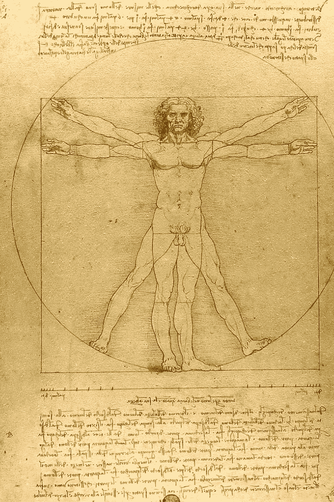

# 像达芬奇一样思考…如果…

> 原文：<https://medium.com/swlh/think-like-da-vinci-if-only-bf2570e13ea8>

[https://en.wikipedia.org/wiki/Science_and_inventions_of_Leonardo_da_Vinci#/media/File:Da_Vinci_Vitruve_Luc_Viatour.jpg](https://en.wikipedia.org/wiki/Science_and_inventions_of_Leonardo_da_Vinci#/media/File:Da_Vinci_Vitruve_Luc_Viatour.jpg)

如果我们希望在课堂上恢复批判性思维的实践，我们需要有一个开始的地方，一个我们希望在学生身上发展的基础。当你细读现有的关于批判性思维教学的材料时，你会发现许多练习册/工作表页的手册……正是我们不需要的。

自从《不让一个孩子掉队》通过以来，我注意到的一个结果是…