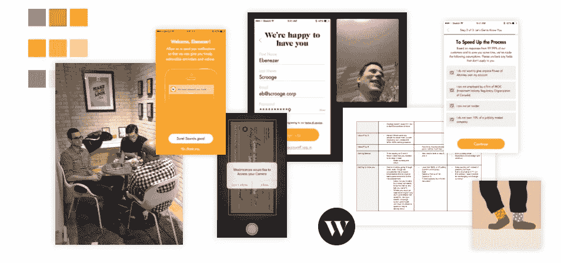
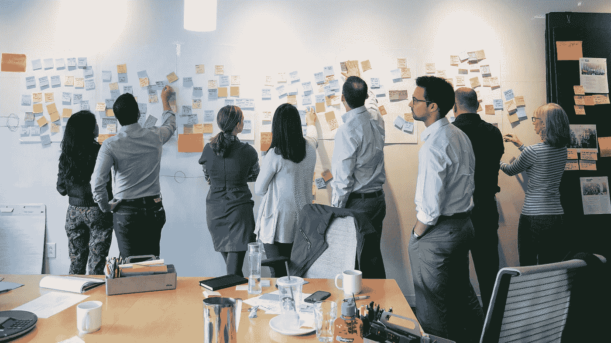

# 用手思考

> 原文：<https://medium.com/swlh/think-with-your-hands-36d703f60164>

## 设计框架的初学者指南

*We run design sprints with all of the companies we work with, including the Wealthsimple team*

我总是觉得整天坐在学校的课桌前，或者靠课本学习很无聊。正如你所猜测的，我不是那种会回到学校的人，但是如果让我回去，我会选择 [d .学校](http://dschool.stanford.edu/)(如果他们要我的话！).

看，我一直对[边做边学](/busy-building-things/start-something-the-power-of-side-projects-648223f673af)很感兴趣。这都是关于建设，冲刺和原型。这种类型的思维最近被称为设计思维，但它实际上已经存在了几个世纪。设计思维不仅仅是一个框架或清单，而是一种灌输不同工作方式的方式。

以莱特兄弟为例，他们花了*年制造原型机，才最终弄清楚如何飞行。同样，想想 IDEO [做苹果鼠标](https://www.ideo.com/work/mouse-for-apple/)。苹果[创造了多个版本的 iPhone 7](http://www.cultofmac.com/400015/apple-is-testing-at-least-five-radically-different-iphone-7-prototypes/) 。*

**

*许多伟大的发明都来自原型设计，这绝非巧合。这些都是最近的例子，但是建筑师已经起草蓝图和建造模型好几个世纪了。这种低保真度的原型制作是必要的——想象一下，如果没有原型制作，构建一个东西会多么昂贵和浪费。*

*这些高昂的固定成本，以及随之而来的高风险，迫使从事硬件工作的人去制作原型。从技术上讲，软件没有固定的硬成本。尽管如此，原型设计同样重要。没有标准化的方法来制造一个数字产品。但如果有，移情、学习和原型制作将是它的核心。*

*原型设计听起来可能会令人困惑，尤其是现在到处都是设计术语和框架。这就是我想写这篇文章的原因——让人们应该如何原型化、使用哪些框架以及何时使用变得非常明显。我将深入探讨谷歌的设计冲刺、精益 UX 和设计思维:*

# ****1。设计思维(IDEO 和 d. school)****

**

****什么是设计思维？*** IDEO 经过多年的解释，总结得很好:“设计思维是一种实际的、创造性地解决问题和创造解决方案的正式方法，旨在改善未来的结果。”[这也是](https://www.gsb.stanford.edu/exed/landing/innovation.html)“一个以人为中心、原型驱动的创新过程，可以应用于产品、服务和商业设计。”*

*下面是我真正欣赏它的部分:“它基于一个基本的信念，即一个未被执行的想法，一个从未被实现的想法，是一个没有价值的命题，并且做和想一样有价值。”*

*它在几个方面与其他的不同:*

*   *价值观跨学科:“设计思维让客户成为任何解决方案设计的主要焦点。此外，它始终如一地应用这种方法所包含的价值观，如同理心、多样性和模糊性，以及认识到多学科团队的重要性。”*
*   *[优先化速度](http://www.forbes.com/sites/sap/2015/05/10/what-is-design-thinking/#705e56ed3c18):“推广‘早失败、常失败’的理念是利用快速原型的力量和交付概念证明的关键，这些概念证明会引起实际用户和客户的共鸣并鼓励他们的反馈。”*
*   *团队执行:“通过将多学科团队聚集在一起，我们利用了集体专业知识的力量。”*

**

*当专注于霍斯特·里特所说的棘手问题时，设计思维变得特别有用。定义不清或棘手的棘手问题(不像“邪恶”或“邪恶”)。在练习开始时，问题和解决方案都不清楚。*

*[5 个为什么](https://www.fastcodesign.com/1669738/to-get-to-the-root-of-a-hard-problem-just-ask-why-five-times)、思维导图和[换位思考访谈](http://dschool.stanford.edu/wp-content/themes/dschool/method-cards/interview-for-empathy.pdf)都是设计思维练习的工具。*

# ***2。精益 UX(即精益启动)***

**

*用交互设计基金会的 Nick Kellingley 的话说:“精益 UX 专注于设计中的体验，而不是传统的 UX。它需要整个团队更高层次的协作。核心目标是专注于尽早获得反馈，以便能够用于快速决策。敏捷开发的本质是在快速的迭代周期中工作，精益 UX 模仿这些周期，以确保生成的数据可以在每次迭代中使用。”*

*正如 [Smashing 杂志强调的](https://www.smashingmagazine.com/2011/03/lean-ux-getting-out-of-the-deliverables-business/)，精益 UX 在三个方面不同于其他框架:*

*   *集中的信息:“传统的文档被丢弃，或者至少被剥离到它们最基本的部分，提供开始实现所必需的最少量的信息。”*
*   *基于执行:“避免长时间的详细设计周期，而采用非常短的、迭代的、低保真度的周期，并且尽早地、经常地从实施团队的所有成员那里得到反馈。”(听着耳熟？)*
*   *优先反馈:“与整个团队的合作对产品的成功至关重要。团队范围内反馈的频繁收集实际上最大限度地减少了在错误的道路上花费的时间。设计师继续推动设计，但随着每次迭代和评审，护栏(即约束)变得更加明显。”*

*对于内部软件或设计团队来说，向精益 UX 的过渡可能很简单。这在内部并不困难:你会要求更多的合作，更多的对话，以及更早的交付给利益相关者或客户。*

# ****3。谷歌设计冲刺****

**

**The sprint gives teams a shortcut to learning without building and launching**

*正如他们在自己的网站上写的那样:“sprint 是 Google Ventures 开发的一个为期五天的过程，通过设计、原型制作和测试客户的想法来回答关键的商业问题。”*

*通过 sprint，Google Ventures 将几个月的辩论和讨论压缩到一周内。他们与公司合作，创建一个原型来验证想法和假设，而不是等待推出一个最小的产品。自 2010 年以来，谷歌风险投资公司(Google Ventures)的设计合伙人杰克·纳普(Jake Knapp)使用 sprints 来帮助 Chrome、谷歌搜索和谷歌 X 背后的团队，以及他们的投资组合公司，如 Slack。*

*设计冲刺[的三个关键概念](http://www.gv.com/sprint/)值得注意:*

*   *以故事为中心的设计:“一种非常规的方法，专注于客户的旅程，而不是个别的功能或技术。”*
*   *加速客户研究:“想出一种方法，只需一天就能获得清晰的结果。”*
*   *以结果为导向:“从最后开始，专注于用每个业务的关键指标来衡量结果。”*

*设计冲刺法使用类似于[我们怎么可能注意到](https://hbr.org/2012/09/the-secret-phrase-top-innovato)、[故事板](http://www.fastcodesign.com/1672917/the-8-steps-to-creating-a-great-storyboard)和 [5 幕面试的练习来测试和验证想法](http://gv.com/researchsprint)。这是它的样子。*

# ****进一步思考设计…****

*在许多方面，设计思维是“用手思考”的总括伞它适用于所有行业。相比之下，精益 UX 将这些概念应用到软件设计中，并与精益创业方法相结合。设计冲刺和设计思维一样，可以应用于任何行业或问题，但对具体问题更有用。*

**

*一个组织可以将设计思维作为其创造价值的宏观哲学，使用精益方法来执行运营并推出产品，并针对出现的具体挑战和问题设计冲刺。*

*实际上，这些框架不必单独使用——一个组织可以在所有层次上吃、呼吸和活设计。也就是说，他们也可以被认为是单独的，特定的，不同类型的练习。*

*作为一名企业家，我会用设计思维来发现最大的机会在哪里，一旦我有了一个团队，需要流程到位，就精益流程，每当曲线球或挑战出现时，就设计冲刺。*

*在[小心脏](http://tinyhearts.com/work/)，我们的工具包包含所有这三个过程。它们使我们能够[制造正确的产品，并制造正确的产品](http://radar.oreilly.com/2014/02/building-the-right-thing-vs-building-the-thing-right.html)。我们根据不同公司的问题有多明确(或者没有)，为它们量身定制了一套练习。当我们与公司合作开发他们的产品时，设计冲刺使我们不仅仅是验证一个 MVP。除此之外，我们还可以评估合意性和可行性，以找到设计创新的最佳时机。*

**

****未来属于我们几个还愿意把手弄脏的人。****

****

# *如果你喜欢这篇文章，你可能也会喜欢:*

* [## 这是官方消息:我们开始营业了

### 是的，我们做客户工作

medium.com](/p/5db9bffdfa88)  [## Medium.com 主办的新闻资料袋:如何使博客的生活更容易

### 过去，新闻资料袋是存放在 Dropbox 中或附加的概况介绍、文本文件、图像或 pdf 的文件夹…

medium.com](/p/10962dc3f04e) 

## Robleh Jama 是获奖产品工作室 [Tiny Hearts](http://www.tinyhearts.com/) 的创始人。他们生产自己的产品，如 [Next Keyboard](http://www.nextkeyboard.co) 、 [Wake Alarm](http://www.tinyhearts.com/wake) 和[Quick Fit](http://www.tinyhearts.com/quickfit)——也为 Plantronics 和 Philips 等客户生产产品。

## [查看我们的博客](http://blog.tinyhearts.com)和[加入我们的时事通讯](http://bit.ly/1kp6lTN)，了解诸如“如何在 App Store 上被发现”和“如何制造人们喜爱的产品”之类的事情。

**如果你喜欢这篇文章，请推荐，帮助别人找到！**

*