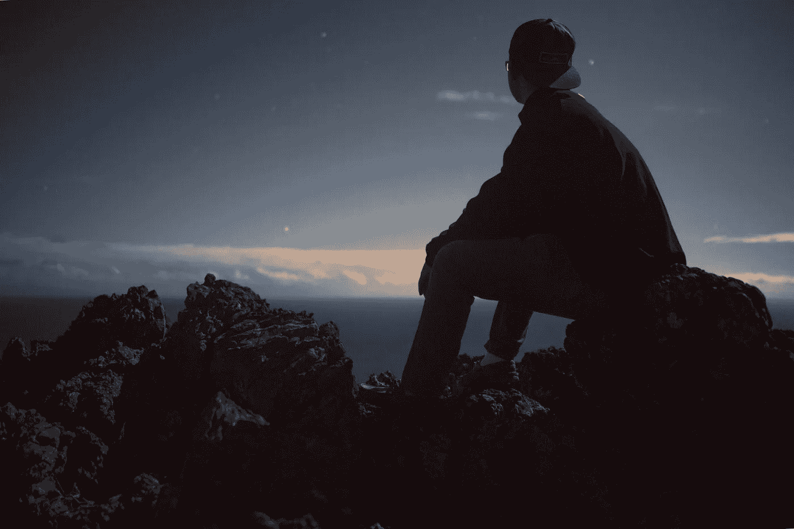

# 想多了。做得太少。

> 原文：<https://medium.com/swlh/thinking-too-much-doing-too-little-f7de3791230e>

AnPhoto by [Jon Asato](https://unsplash.com/photos/dHew2uLp95c?utm_source=unsplash&utm_medium=referral&utm_content=creditCopyText) on [Unsplash](https://unsplash.com/search/photos/thinking?utm_source=unsplash&utm_medium=referral&utm_content=creditCopyText)

## 你活在自己的脑袋里吗？

> 我的一个主要问题是，我是一个思想家。我最喜欢呆在家里，想各种各样的事情。当我思考各种想法，试图找到解决问题的方法时，我感觉最有效率。

但是我真的做了很多事情吗？

在我生命的大部分时间里，答案可能是一个大大的**不**。

事情有了一点改变，在我父亲去世后的 7 个月里(自从我开始了一段认真的感情)。至少，我在生产大量的内容。我写了很多。

我自己也不太清楚我是否会认为写作是一种充分的活动形式。但至少，这比想了很多，却什么都不做要好。

> 写作是我在公众面前分享我的想法的一种方式，因此，也许有一天，这些想法会产生某种影响。

在过去的 7 个月里，这种方法非常有效。我一直在分享我过去 7 年的经历，以及我从中学到的东西。

但是现在，我到了一个点，我觉得我正在接近将这些经历转化为对人们有用的想法的极限。

再说一次，我做得还不够。

我没有获得足够的经验。

我没有过着值得分享的生活。

思想本身是没有意义的。只有将它们转化为行动，它们才会变得强大。

# 理论与实践

> 理论上，理论和实践没有区别。实际上是有的。—约吉·贝拉

只是因为你对某个话题有很深的理论知识，并不代表你能把那种知识转化为行动。这是一个教训，我必须通过许多失败的项目来学习。

我开始了一些事情。

但是我的知识对我没有任何帮助。

事实上，过多的知识通常会阻碍项目的进展。它让我们过度思考一切。它让我们从错误的假设开始。它把我们的自我推到了阻碍我们前进的地步。

我们不会以一个学习者和实验者的心态来对待这个项目。相反，我们以一个知道自己在做什么的人的心态来对待它。

但是说实话，当我们开始一个项目时，我们从来不知道我们在做什么。

对于每一个新项目，我们都要从头开始学习各种东西。

我们通过实验来学习这些东西。我们通过尝试某事是否可行来学习这些东西。真正学习的唯一途径是通过尝试和错误。

这就是罗尔夫·波茨的意思，他说:

> "从长远来看，即兴创作的意愿比研究更重要."

即兴创作是我们学习的最佳工具。这是迫使我们犯错的一件事。我们做事，而不是想太多。简而言之，就是即兴创作，让我们进入行动模式。

# 正确的平衡

我认为我们每个人都需要在理论和实践之间找到正确的平衡，因为它适合我们自己。

例如，加里·维纳查克似乎是纯粹的行动。他不看书。他看起来一点安静的时间都没有。他似乎总是在行动，在做事的时候。

这对他来说似乎很好。

但并不是每个人都如此。有些人更倾向于思考或研究模式。这也完全没问题。只要他们不过度。只要他们不被自己的自然倾向所麻痹。

不过，在这个问题上，我确实有自己的理论:

> 行动是学习的主要工具。思考和研究是补充知识的一种方式，而知识是我们通过行动学到的。

换句话说，我相信 80/20 原则适用于学习。

我们百分之八十(或更多)的学习应该来自行动。我们学习的 20 %(或更少)应该来自理论——不管是思考还是研究。

换句话说，我们经常需要做一些事情。

我们不断需要有一个项目来工作。

在很大程度上，我们需要专注于采取必要的行动，将该项目变成现实。只有当我们陷入困境，或者当我们需要额外的信息时，我们才应该回到思考模式。

动作模式第一。

理论在需要的时候出现。

# 你怎么知道自己活得太多了？

Photo by [Lili Kovac](https://unsplash.com/photos/IMpmnH2IC98?utm_source=unsplash&utm_medium=referral&utm_content=creditCopyText) on [Unsplash](https://unsplash.com/search/photos/thinking?utm_source=unsplash&utm_medium=referral&utm_content=creditCopyText)

这个问题我没有很明确的答案。我所能做的就是在这里反思我多年来的一些个人倾向。我猜你会在自己的生活中认出其中的一些:

1.  有很多想法，但没有付诸行动:在我的一生中，我有很多看似不错的想法。但它们将永远只是一个想法，留在我的某个笔记本里。我不会真的对他们采取行动。
2.  **开始很多项目，但没有完成:**在我的一生中，我有很多关于项目的想法。我会研究它们。计划他们。开始研究它们。然后我会很快厌倦，并停止工作。
3.  **花大量时间在研究上:**每当我想开始一个项目时，我首先会花大量时间研究这个主题。最终，我将永远无法将这些知识转化为行动。
4.  **避免获得任何反馈:**有时，我没有与他人分享我的想法。我告诉自己，我“害怕”他们窃取我的想法。在内心深处，我一直知道这根本不是原因。反正我知道没人会偷我的想法。我可能只是害怕把自己放在那里，得到负面的反馈。
5.  不断屈服于干扰:我过去最大的问题之一是，我不能投入任何项目。我只会不断被其他“闪亮”的机会分散注意力。我告诉自己，我会利用这些机会为我的主要项目融资。事实是，他们几乎让我完全放弃了我的主要项目。

如果你在自己的生活中看到这些倾向，那么我认为很有可能，你在自己的头脑中生活得太多了。

即使你在自己的生活中看不到这些症状，但你实际上在自己的头脑中生活了太多，那么我确信你可能已经在内心深处知道了真相。

如果是这样，那么你真的需要采取行动了。

这是一个问题，你不能离开不固定。因为如果你让它不固定，那么你实际上永远不会**做**任何实质性的事情。

# **结论:**

在这篇文章中，我在某种程度上交替使用了“思考”和“做研究”。我知道这不太合适。但是我相信这两件事是同一个大问题的一部分。

> 问题是，我们对自己的想法感到舒服，却害怕将它们付诸行动。

如果我们只是思考，继续做我们的研究，那么我们就不会犯任何错误。我们不能真的失败。

我们真的看不到，我们实际上“知道”的比我们自己认为的要少得多。我们无法将知识转化为行动。

做一个活在自己脑袋里的人，是完全没有风险的。

它不会强迫我们把自己暴露给其他人。它不会强迫我们走出舒适区。它不会强迫我们接受现实，我们完全不知道自己在做什么。

虽然它让我们现在感到舒适，但它会在未来导致许多负面后果。

毕竟，我们没有做任何实质性的事情。我们在生活中没有取得任何实质性的进步。我们不是在建造有潜力产生真正影响的东西。

简而言之，我们活在自己的头脑中，是在浪费生命。

> “一开始就知道太多是致命的。对知道路线的旅行者和对自己的情节没有把握的小说家来说，无聊来得一样快。”—保罗·塞洛克斯

**如果你觉得这篇文章有用，请👏并与你的朋友分享。记住，你最多可以鼓掌 50 次——这对我真的很重要。**

**您也可以通过** [**点击这里**](https://mailchi.mp/b0d1e1fba452/struggle-first-thrive-later) **订阅我的免费简讯。**

## 这个故事发表在 [The Startup](https://medium.com/swlh) 上，这是 Medium 最大的创业刊物，拥有 326，962+人关注。

## 在这里订阅接收[我们的头条新闻](http://growthsupply.com/the-startup-newsletter/)。

