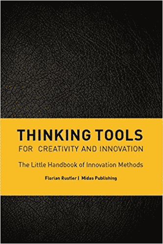
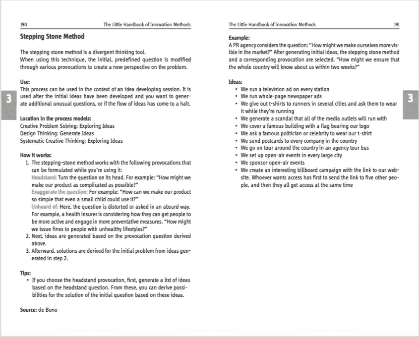
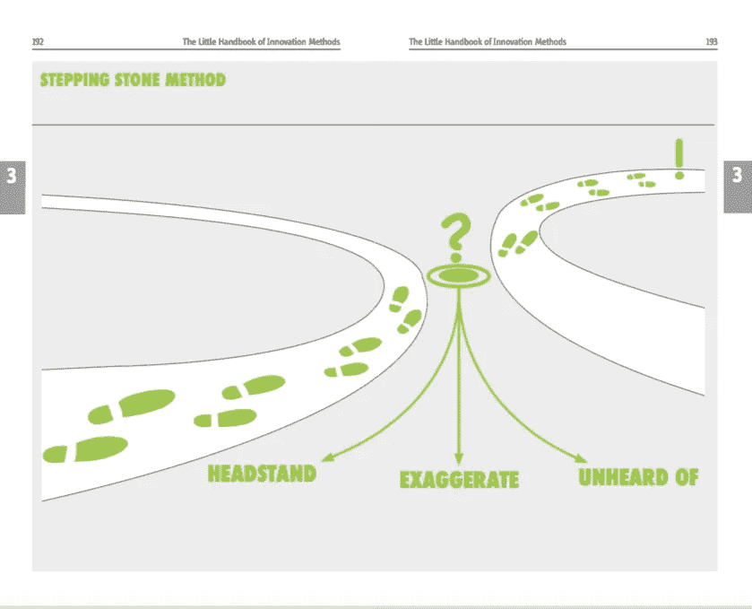

# 创造和创新的思维工具——现在是英文版

> 原文：<https://medium.com/swlh/thinking-tools-for-creativity-and-innovation-now-in-english-d6181af9511e>

2015 年，我用德语出版了我的书《Denkwerkzeuge》。这本书是一本关于创造力和创新思维工具的实用指南和参考书。

我的目标是为其他从业者写一本从业者的书。它有许多思考工具和创意技巧，每一个都在两页的文字上介绍，然后是一两页的视觉效果。

对于书籍来说，这有点像赌博:你希望，但你永远无法确定。即使伟大的内容也不能保证一本书会成功。

Thinking Tools

然而，我很幸运:这本书成为畅销书，两年内在德语国家售出了近 25000 册。现在，在第一次出版三年后，它比以往任何时候都卖得好。第八版马上就要出货了。人们欣赏它的原因我希望他们会:

*   《思考工具》非常实用，编写的目的是让读者应用这些工具。
*   每件工具都附有使用示例。
*   非常直观。
*   这是为数不多的几本为理解何时使用每种工具提供框架的书之一。这是许多其他类似书籍的一个主要问题。你有工具，但不知道何时使用。
*   它的格式和大小让人想起 moleskine (R)笔记本，可以放在口袋里

a two page overview over one tool

visual for the thinking tool

我非常高兴地宣布，现在终于有了 [**的英文版**](https://www.amazon.de/Thinking-Tools-Florian-Rustler/dp/3038765066/ref=sr_1_9?ie=UTF8&qid=1516951041&sr=8-9&keywords=florian+rustler) 。我希望这本书能像这样对更多的人有价值。

法文版正在制作中，中文版也即将推出！

在这里下载目录。

## 这篇文章发表在 [The Startup](https://medium.com/swlh) 上，这是 Medium 最大的创业刊物，有 290，182+人关注。

## 订阅接收[我们的头条新闻](http://growthsupply.com/the-startup-newsletter/)。

