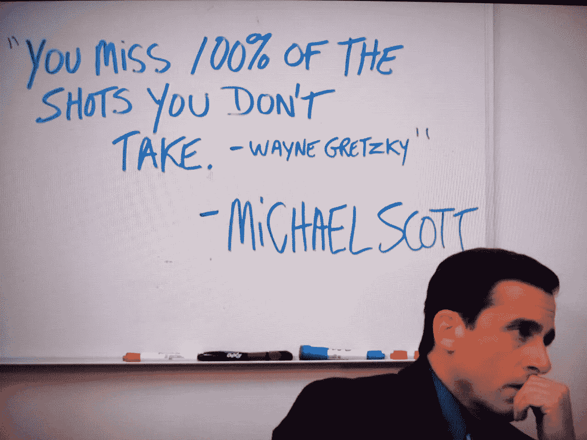

# 这简单的一招将会让你的工作效率提高 10 倍

> 原文：<https://medium.com/swlh/this-1-simple-hack-will-10x-your-productivity-593b0c417f5>

猜猜这是什么？

它不是人工智能，不是机器人，也不是获得数百万美元的风险投资。

这是每日 **的**运动，以中低强度持续 20 分钟。****

这并不是什么新鲜事，但大多数**的亿万富翁都信誓旦旦地说这一招是有原因的，包括理查德·布兰森、蒂姆·库克和** [**杰克·多西**](https://www.telegraph.co.uk/news/2016/07/14/want-to-be-rich-billionaires-on-their-morning-routine-secrets-to/)

# 它能减轻压力

做生意压力很大。

当你有压力时，你会做出错误的决定，抨击别人，变得没有效率。

如果你没有效率，你就没有聪明地工作，你最终会像一只**轮子里的仓鼠。**拼命奔跑，看不到尽头。

锻炼 [**降低压力**](https://adaa.org/understanding-anxiety/related-illnesses/other-related-conditions/stress/physical-activity-reduces-st) **。**

# 它让你更平静

我不知道你怎么样，但是我冷静的时候会做出更好的决定。

当我们压力非常大时，我们会在肾上腺素分泌到全身的“战斗或逃跑”状态下做出决定。

这可能对我们的生存很有帮助，但对区分知识工作的优先顺序却没什么帮助。

# 这会让你更开心

锻炼被无数次证明能让你更快乐。

日常锻炼有助于 [**对抗焦虑和抑郁**](https://www.mayoclinic.org/diseases-conditions/depression/in-depth/depression-and-exercise/art-20046495) **。**

作为一个已经经营企业 7 年的人，我已经拥有了我的**和**的公平份额。

没有什么比大汗淋漓更能驱散阴暗的想法和焦虑。如果你感觉情绪低落或者压力很大，那么很难强迫自己去锻炼，但是这通常是最好的方式。

虽然我不认为抑郁症有“快速解决”或“治愈”的方法，但锻炼肯定能缓解大多数症状，但这需要时间。

# 它给你更多的能量

能源=生产力

谁会做得更多？积极、快乐、精力充沛的人能够坐下来，在 8-9 个小时内完成一天的工作。

还是疲惫不堪、压力重重、效率低下的人试图强迫自己一天 12 个小时坐在办公桌前，漫不经心地敷衍了事？

听说过**巅峰性能吗？**

# 这将大大提高你的销售技巧

快乐和平静会增强你的销售能力。

成为一名优秀的销售人员是关于**摆脱困境。**

没有什么比拥有一个**好的、积极的和乐观的心情**更能让你克服异议，或者展现你的热情。为什么你认为最好的销售人员很会与人相处？是他们的人生观。

刚刚花了 2 个小时进行推介，潜在客户现在想做完全相反的事情？没问题，让我马上为你完成。当其他人可能沮丧地离开球场时，你把这看作是一个机会来完善你的球场并获得第二次机会。你离潜在客户真正想要的东西又近了一步。

在一笔小交易上被折腾了几个星期，现在他们不感兴趣了？**哦，算了吧**，还有很多在等着呢。让门开着，继续前进。

成功孕育成功。摆脱消极并发扬积极的能力会帮助你比世界上任何东西都卖得好。

# 你不需要做很多

佐治亚大学进行了一项研究，并得出结论说**轻度锻炼与适度锻炼相比，两者的健康益处没有显著差异。**

**作为一个已经试验了 7 年自己的锻炼时间表的人，我不得不说我同意。**

**你所需要的只是 20 分钟的轻度心血管锻炼，这足以让你出汗。诀窍是做足够多的运动让你流汗，但是不要让你的身体疲劳。因为这样你就陷入了恢复期长的坏习惯，每天都无法收获运动的回报。**

**这让我们回到了**部落时代**，并让我们的**部落大脑快乐**，它基本上是在告诉我们的身体，我们要么**为我们的食物而跑，要么成功地逃离了捕食者或攻击。****

# **但是，借口**

**没有理由不进行 20 分钟的锻炼。**

**这里有一些简单、便宜的解决方案，你可以看看:**

*   **游泳**
*   **运转**
*   **拳击**
*   **暂时把货物腾空**
*   **交叉拟合**

**如果你时间或金钱紧张，买一台便宜的 T42 跑步机或健身车。**

**我喜欢每周至少游泳一次。但是因为我现在不住在游泳池附近，所以我发现这很耗费时间，导致我锻炼得不多。**

**于是，我在网上买了一辆**便宜的健身车**，每天骑车 25 分钟。穿上短裤和 t 恤去锻炼是如此的容易，以至于我很容易在坚持这个习惯上失败。**

# **习惯需要时间**

**当我决定每天锻炼 20 分钟时，我失败了**很多次，以至于我都记不清是怎么坚持下来的了。****

**我不会骗你假装我是一夜之间捡到的。**我没有**。**

**我很沮丧，因为我不能坚持下去，**尝试了不同的东西**，放弃了它，又回来做了几十次。**

**我花了几年时间才真正坚持下来。在那段时间里，我尝试游泳、跑步、拳击。我每天都尝试，如果失败了，我会一周做 2-3 或 4 次。**

**如果你想开始每天锻炼，我的建议是，尽可能让它变得简单。消除所有可能的摩擦。**

**如果你正在努力坚持下去，看看你的过程。**

**你一定要坐进你的车去某个地方吗？这可能是阻碍你的原因。说真的，**摩擦会在我们的头脑中产生阻力，从而产生“嗯，我不想被打扰，我明天再做”的感觉。****

**从小事做起，衡量你的进步。**

# **尝试，尝试，再尝试**

**我的最后一点建议是，**继续尝试**。**

**如果你不能坚持下去，不要责备自己。如果你失败时不消极，而是把它看作积极的一面，你会很快养成习惯。**

**“啊好吧，明天再试一次”比“我不敢相信我又失败了，我真没用”更有可能成功。**

## **如果您喜欢这个故事，请点击👏按钮并分享，帮助其他人找到它！欢迎在下方留言评论。**

## **关注我，了解更多类似的故事和免费建议，帮助你建立、发展和扩大你的在线业务。**

****

## **这个故事发表在 [The Startup](https://medium.com/swlh) 上，这是 Medium 最大的创业刊物，拥有 318，120 多名读者。**

## **在这里订阅接收[我们的头条新闻](http://growthsupply.com/the-startup-newsletter/)。**

****