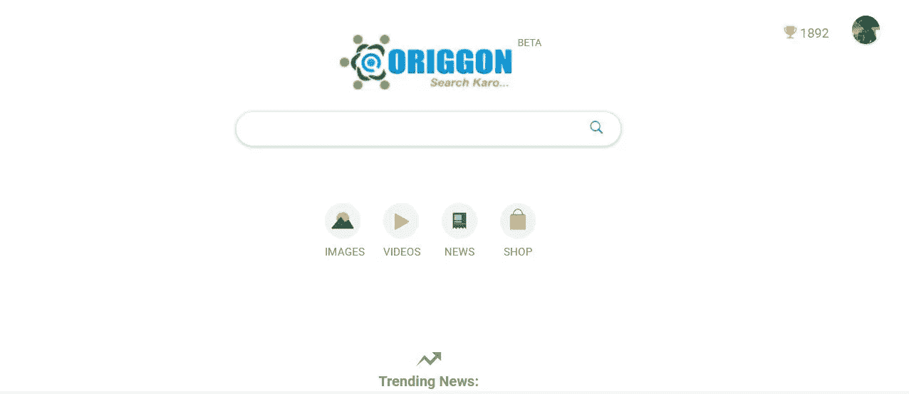

# 这个 15 岁的孩子已经开发了 8 个应用程序和印度第一个社交搜索引擎

> 原文：<https://medium.com/swlh/this-15-year-old-has-built-8-apps-and-indias-first-social-search-engine-aa36100589a5>

Abhik Saha 的表演超越了他的年龄，是一个活生生的例子，证明了一句话——年龄不过是一个数字。15 岁时，作为一名成熟的企业家，他的行动仍然脚踏实地，同时他的倡议有助于养活饥饿的人。

不走找借口或拖延的路线，不在艰难时刻放弃，使 15 岁的阿比克在同龄人中鹤立鸡群。他来自西孟加拉邦 Jalpaiguri 区的一个不起眼的小镇 Chalsa，是 Oodlabari 的 Don Bosco 英语中等学校的一名普通学生，直到 2011 年，他得到了他的第一台电脑，彻底改变了他的生活。

人们普遍认为，只有属于大都市的人才能成就大事，与之相反，Abhik 从他在一个小镇的房间里开始了开发应用程序和创建自己的搜索引擎的旅程。

# 早期对技术的热爱

Abhik 是一名学校教师 Shefali Saha 和胶合板贸易商 Alok Saha 的儿子，他是一名技术奇才，当他还是一个 11 岁的孩子时就对编程感兴趣。在他的第一堂网页设计原理课后不久，他就进入了编码的世界。

尽管他对这门新学科非常感兴趣，但他是那年全班唯一一个计算机科学考试不及格的学生。尽管意志消沉，他仍然拒绝放弃这门学科，并决定努力学习。“我在接下来的计算机科学考试中表现出色，这是一个重大的进步，”他感叹道。

Abhik 很快就喜欢上了网页设计，而不是编程。“我的老师很欣赏我在网页设计上所付出的努力，但也坚持让我继续学习编程。对我来说，C++和其他编程语言非常无聊。但随后发生的事情对我来说仍然是一个惊喜。”

由于他对编程的理解很差，Abhik 几乎放弃了学习这门学科。他说，他唯一的可取之处是偶然遇到了一位软件开发人员，他向他解释了编程的重要性及其可能性，并让他尝试 Visual Studio，这是一种用于构建软件的编程集成开发环境。

“我开始认真学习编程，提高了我的编码技能，解决了逻辑问题。我知道这是我想要的人生方向。”

2014 年 4 月，Abhik 在同一个地方的朋友的帮助下，成立了网站建设公司 Arnabhik Corp。他那时只有 13 岁。虽然该公司从未正式注册，但它产生了良好的收入，来自国际客户的项目给了 Abhik 创建 30 多个网站的机会。“随着公司的成功，我决定继续前进，”他说。

# 下一步

Abhik 在 2014 年用他的网站建设公司赚的钱帮助他买了两台电脑用于编码。他还买了第一台服务器和宽带连接。这标志着 Abhik 开始释放他的技能。

他从构建基本的软件实用程序开始，观看在线教程，探索并找到问题的解决方案。他还建立了一个安全系统和一个他命名为 Seren 的杀毒软件来保护他学校的电脑免受病毒的侵害。他的下一个里程碑是他父亲在 2015 年生日时送给他的智能手机。“有了智能手机，我明白了应用是未来，并开始学习 Android 应用开发。”

经过彻底的自我训练、数小时的研究和认真寻找新想法，阿布希克在 2015 年 11 月 2 日创建了他的第一个 2D 游戏应用程序“Birdingo”。紧随其后的是其他五个应用:两个教育应用，Math++和 Abcd planet 一款学习类 app，i-Learn，免费提供计算机编程或开发语言的视频教程；一款 3D 游戏 app，3D Task 24 以及 Arnabhik Website Builder，一款帮助人们轻松获得免费托管网站的应用。

2016 年继续是成功的一年。2016 年 4 月 5 日，Abhik 推出了绿色文化(GreenCulture)，这是一款农业应用程序，向农民通知有关作物、土地和更好的耕作技术的最新消息，提供与专家实时聊天的机会。最后，提醒上帝，一个帮助人们记住未来计划的提醒应用程序于 2016 年 4 月 30 日上线。

# 印度自己的社交搜索引擎

Abhik 在 2016 年 4 月推出应用程序后，开始致力于创建自己的编程语言 Lino。“我认为没有必要依赖多种语言来创造技术，所以我开始了一个项目，发明一种统一的语言。当我致力于理解支撑互联网的框架时，我的研究一次又一次地遇到了许多障碍。”

问题不在于浏览网站时缺乏高质量的内容，而是垃圾邮件、虚假网站、恶意软件、无关内容和侵入性弹出广告的数量减缓了他的研究。当关键字搜索导致没有相关信息的网站被搜索引擎排在第一页时，他感到非常失望。

Abhik 意识到，在他能够改变开发者为互联网构建的东西之前，他必须改变用户对互联网的期望。这引发了搜索引擎 orig gon T1 的推出，它的搜索引擎优化不会向你显示根据广告选择的顶级网站，而是由世界各地的人们选择的顶级搜索。

Origgon Current Desktop View

官方网站是:https://origgon.com

“在我成功创建了 Lino 之后，我萌生了推出搜索引擎的想法。我开始着手这项任务，但需要资金。大约在 2017 年 2 月中旬，我通过脸书遇到了一位天使投资人，他投资了 210 万卢比，并帮助我将这个项目变成了一项实际业务，”Abhik 说。

“我的目标是逐个建立网站的索引和数据库。我想做一个搜索引擎，从其他搜索引擎中提取结果，用算法排序最好的，删除垃圾邮件和恶意网站。我们的主要特点是，我们不跟踪你或你的 IP，你在使用我们的服务器时是完全匿名的，”他补充道。凭借这一点，Abhik 在通过董事会考试后于 2017 年 4 月转移到孟买，并于 8 月推出了 Origgon，既是印度第一个社交引擎，也是一家注册公司。

# 为饥饿的人提供食物

Origgon 分析诸如喜欢、评论、分享等小事，使用真实的人类信号对网站进行排名。这些被忽视的信息给网络带来了更多的价值，真实和真实的内容，并在这个过程中帮助我们发现了许多经常迷失在混乱中的好网站，还获得了个人评论，从而帮助我们做出更容易的决定。

另外，Origgon 建立的信任因素是最重要的。Abhik 解释说:“我们帮助人们信任他们查看的内容，因为它已经被另一个观众喜欢或分享。在必应和社交媒体的支持下，我们完全透明。您可以清楚地看到每个结果在全球和您的社交媒体圈子内的喜欢、分享和评论。你可以进一步喜欢和评论，在搜索引擎上创造一个类似社交媒体的环境。”

Origgon 的好处不止于此。使用该引擎不仅会给你用户友好的结果，但你也将有助于 Abhik 的事业养活饥饿。该倡议始于 10 月 3 日，声明称每获得 5000 次搜索，该公司将向支持午餐的非政府组织捐赠 10 公斤小麦粉。所以每搜索 50 次，你就会有一个可怜的肚子饱了。

今天，奥利冈的团队只有三名成员。他们计划筹集资金聘请专家来构建下一级的搜索引擎。Abhik 结束时说，“我的目标是改变网站的建设和消费方式。我希望这是一次涉及像你我这样的真实人物的真实评论的经历。为了实现这一点，我们的目标是通过扩大我们的业务范围、扩展我们的服务器以及改善我们的营销和研发来升级 Origgon。这将需要大约 700 万美元的资金，我们正在寻找天使投资者来帮助印度搜索引擎成为世界上最好的搜索引擎。”

首先，Origgon 上至少有 100 万次搜索，通过不仅仅浏览每个屏幕上出现的 10 个蓝色链接，这位充满激情的年轻企业家希望成为印度的比尔·盖茨，并通过他的创业公司回馈他的国家。

*任何有兴趣资助创业公司的人都可以联系哈什特·贾恩:harshit@origgon.com*

目前 Origgon 正在积极改进用户界面/UX 和移动应用程序，所以它要求如果你能对产品提供一些反馈，这将有助于进一步改善产品。

## 这篇文章发表在[《创业](https://medium.com/swlh)》上，这是 Medium 最大的创业刊物，有 284，454+人关注。

## 订阅接收[我们的头条新闻](http://growthsupply.com/the-startup-newsletter/)。

