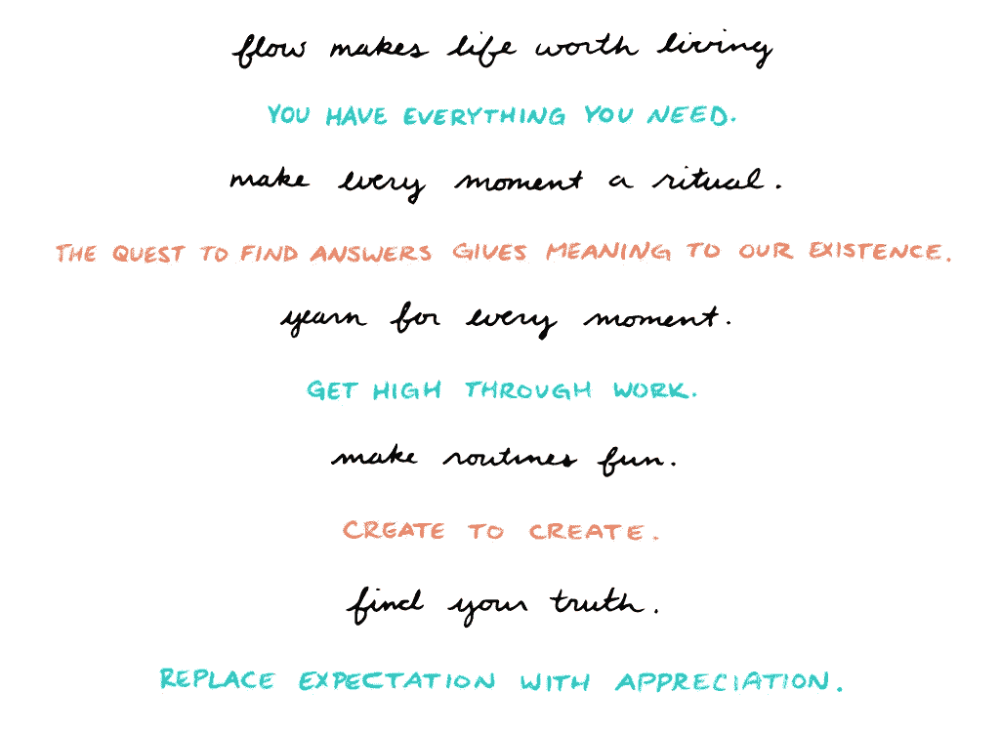

# 这个习惯阻止了无意识的信念，这些信念会导致你生活中不断的挣扎

> 原文：<https://medium.com/swlh/this-habit-stops-unconscious-beliefs-that-cause-constant-struggle-in-your-life-8f950cc36292>

Photo by [Caju Gomes](https://unsplash.com/photos/wU6_rna_if4?utm_source=unsplash&utm_medium=referral&utm_content=creditCopyText) on [Unsplash](https://unsplash.com/search/photos/struggle?utm_source=unsplash&utm_medium=referral&utm_content=creditCopyText)

## "你的信仰不是你所说的那样，你的选择告诉你你相信什么."——马克·格罗夫，*关系顾问*

不要听有意识的声音说你渴望这个或那个，或者相信一件事胜过另一件事。

相反，看看你做出的选择和结果，你会发现你的信念实际上是什么。

这种思维方式深深打动了我。

"我一直在和混蛋约会"——马克·格罗夫的一位客户感叹道。

“你喜欢和混蛋约会吗？”“当然不，”她回答道。

“是的，你有。”他说

“不，我不知道。”她回应道。

“是的，你有。”他推了回去。

马克继续说，如果你相信你不想和混蛋约会，你就不会和混蛋约会。

这种微妙的认识深深打动了我。

# **这种习惯可以让阻碍你的无意识信念短路，并确认新的信念**

> "你的潜意识需要相信你的意识告诉它的东西."萨姆·库雷希博士

## 问问自己:“什么结果或行动会让我相信这是我应得的？”。

从选择开始，看看你的结果，发现你相信什么。

对于马克的客户来说，选择不与卑鄙自私的混蛋约会——这在理论上是显而易见的，但在实践中比你想象的要难。

我们都有一个内在的指导系统，它被设定为给我们关于自己的信念——一种看不见的力量，它超越了我们常说的我们想要的。

**获得所有权，通过反其道而行之来“超越”这一点。**

写下你现在所处的位置和你发现旧信仰的结果。

写下新的结果或你需要采取的行动或要达到的目标，以打破旧的信念并改变它。

问问自己:“什么结果会让我相信这是我应得的？”。

通常那东西是不舒服的，需要克服恐惧。

那是当你知道你正面临一个试图阻止你前进的潜意识信念。

做那件事。

反复做那件事，直到它成为新的无形力量。

另一方面，这是一种进化，要求你去获得、去做、去赢得你认为你应得的结果。

Art by Emily May Rose

请为我的作品鼓掌 50。当你这样做的时候，它走得很远。谢了。

## [每周一次点击接收我保证是一篇你在互联网其他地方找不到的改变游戏规则的文章。你还会收到我的指导，告诉你如何在你所做的事情上成为世界上最好的。你不会后悔的。](https://betreatedhowyouwanttobetreated.com/optin-main)

## 这个故事发表在 [The Startup](https://medium.com/swlh) 上，这是 Medium 最大的创业刊物，拥有 339，876+人关注。

## 在这里订阅接收[我们的头条新闻](http://growthsupply.com/the-startup-newsletter/)。

