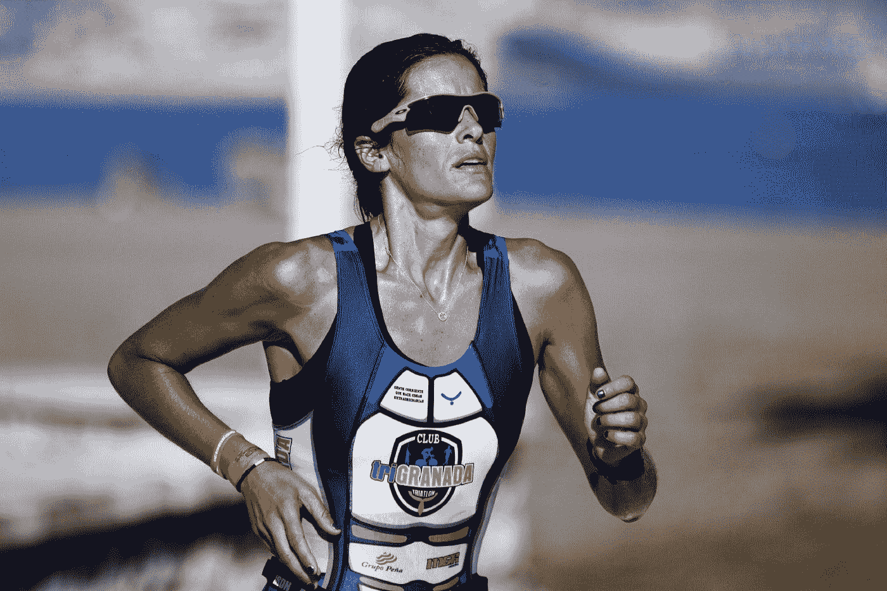

# 这就是成功人士做出明智(并避免糟糕)决定的方式

> 原文：<https://medium.com/swlh/this-is-how-high-achievers-make-smart-and-avoid-bad-decisions-5d842ce4f78>

Photo by [Olu Eletu](https://unsplash.com/photos/DXYyKCCvWiM?utm_source=unsplash&utm_medium=referral&utm_content=creditCopyText) on [Unsplash](https://unsplash.com/search/photos/smart?utm_source=unsplash&utm_medium=referral&utm_content=creditCopyText)

# 你知道你每天要做多少决定吗？

各种互联网来源估计，一个成年人每天大约*做出 35，000 个*远程意识决定。

这可能看起来很荒谬，但是根据康乃尔大学研究人员进行的研究，我们每天做出 226.7 个关于食物的决定***只有****。这项研究表明，我们在吃什么、吃多少、和谁一起吃、去哪家餐馆吃饭等等事情上花费的决定比需要的多得多。*

*听起来是不是很累？*

*就像身体疲劳一样，有一个概念 ***决定疲劳*** 。*

*事实是 ***决定疲劳可以引导我们去分析——麻痹情境*** 。虽然我们喜欢在生活中有许多选择，因为它给我们选择最好的来提高我们的生活质量的可能性。但是太多选择的负面影响是，当我们每天需要做出很多选择，比如吃什么、穿什么或者是否现在回复这封邮件时，它通常会变得令人不知所措。*

*2011 年进行了一项研究[,旨在调查在特定类型的罪犯假释案件中影响以色列法官决定的因素。](http://www.pnas.org/content/early/2011/03/29/1018033108)*

*人们注意到，在上午，法官倾向于作出积极的裁决，这导致几乎 65%的情况下批准罪犯的假释。但是随着上午时间的流逝，做出有利裁决的机会降到了零。午休后，几乎 65%的情况下，法官会立即做出有利的裁决。但是从下午晚些时候开始，这个百分比又变成了零。*

> *研究发现，法官的决策能力因做出更多决定而下降，因此他们开始避免做出决定，从而拒绝假释申请。*

> *这种决策疲劳的负面影响是双重的:当我们厌倦做决策时，我们要么(1)开始避免做决策，要么(2)更糟糕的是，我们没有做出正确的决策。*

*但是高成就者选择性地选择逃避决策，这不值得他们付出宝贵的时间。*

## *前总统巴拉克·奥巴马曾被问及他是如何做决定的。他说，“你会看到，我只穿灰色或蓝色的西装。我正试图减少决策。我不想决定吃什么或穿什么，因为我有太多其他的决定要做。”*

*此外，看看史蒂夫·乔布斯和马克·扎克伯格——他们每天都穿几乎一样的衣服，让自己少考虑一个决定。*

## *这里有一些方法，可以让你开始避免决策疲劳，做出更好的决策:*

1.  *早上做出你最好的决定。你的头脑更加清晰，一天的活动也不会让你疲惫不堪。你也可以*将决策纳入你最重要的任务(麻省理工学院的)中，并承诺先完成它们*。这就是布雷恩·特蕾西所说的吃掉那只青蛙。*
2.  ***限制你的选择**:如果你有太多的选择，把它缩小到有限的几个。如果给你十个选择，你不可能做出更好的选择。 ***最好的做法是根据你的决策参数*** 开始一个一个的剔除选项。只有当你有三个选择时，再做决定。*
3.  *前一天晚上决定你要做什么决定。如果你在前一天晚上就已经有了预先计划好的日程，那么你就不会倾向于沉溺于与你一天的预先计划不一致的事情。*
4.  ***饿的时候不要做大额决策**。一项研究表明，如果你的血液因饥饿而缺乏葡萄糖(身体的燃料)，你就无法做出有益于长期的决定。*葡萄糖缺乏会对你的意志力产生不利影响，你会倾向于选择较小但短期的奖励*。当你的大脑有更多的葡萄糖作为能量时，做重要的决定。*
5.  *让自己远离那些只会分散注意力的场合或地方。例如，为了避免陷入社交媒体的陷阱，你需要建立自律，只在特定的时间段观看它。同样，如果你在任何会议上都没什么可贡献的，尽量避免这样的会议。*

*高水平的执行者知道如何发展他们的自律 和避免决策疲劳的情况，这使他们能够做出明智的决策。*

## *感谢阅读。如果你喜欢这篇文章，请随意点击那个按钮👏帮助其他人找到它。*

# *如果你喜欢上面的，你也会想看看我下面的其他文章:*

*[**决定一个人能够达到的成功水平的 4 个特质**](/swlh/4-traits-that-determine-the-level-of-success-one-can-achieve-3aa95556c41c)*

*[**足智多谋最重要的生活技能**](/multiplier-magazine/one-most-important-life-skill-to-lead-a-resourceful-life-c5c03dc376f4)*

# *你想彻底提升你的决策技能吗？*

## *看看我的书 [***做出明智的选择***](https://www.amazon.com/Make-Smart-Choices-Information-Decision-ebook/dp/B07VWVQCLJ/)*

*这本书将帮助你了解你的**决策原型**，了解导致错误选择的隐藏陷阱，学习有效的技术来**做出更明智的决策** &让你的生活更上一层楼！*

**

*如果你刚到 audible.com，你可以免费听这本书的有声读物版本(试用期间)。*

*[**在这里获取有声书**](https://www.audible.com/pd/B07WNY3HDD/?source_code=AUDFPWS0223189MWT-BK-ACX0-161874&ref=acx_bty_BK_ACX0_161874_rh_us)*

# *想提高你的表现(和结果)吗？*

# *[点击此处下载免费报告，了解 5 种心态转变，在短短 30 天内提升你的表现](https://sombathla.com/mentalshifts/)*

**

*Photo by [Quino Al](https://unsplash.com/@quinoal?utm_source=medium&utm_medium=referral) on [Unsplash](https://unsplash.com/?utm_source=medium&utm_medium=referral)*

# *[Master 5 心态转变，在短短 30 天内提升你的表现——下载你的免费报告](https://sombathla.com/mentalshifts/)*

**

## *这篇文章发表在 [The Startup](https://medium.com/swlh) 上，这是 Medium 最大的创业刊物，拥有 335，210 多名读者。*

## *在这里订阅接收[我们的头条新闻](http://growthsupply.com/the-startup-newsletter/)。*

**