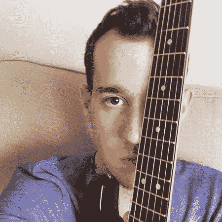
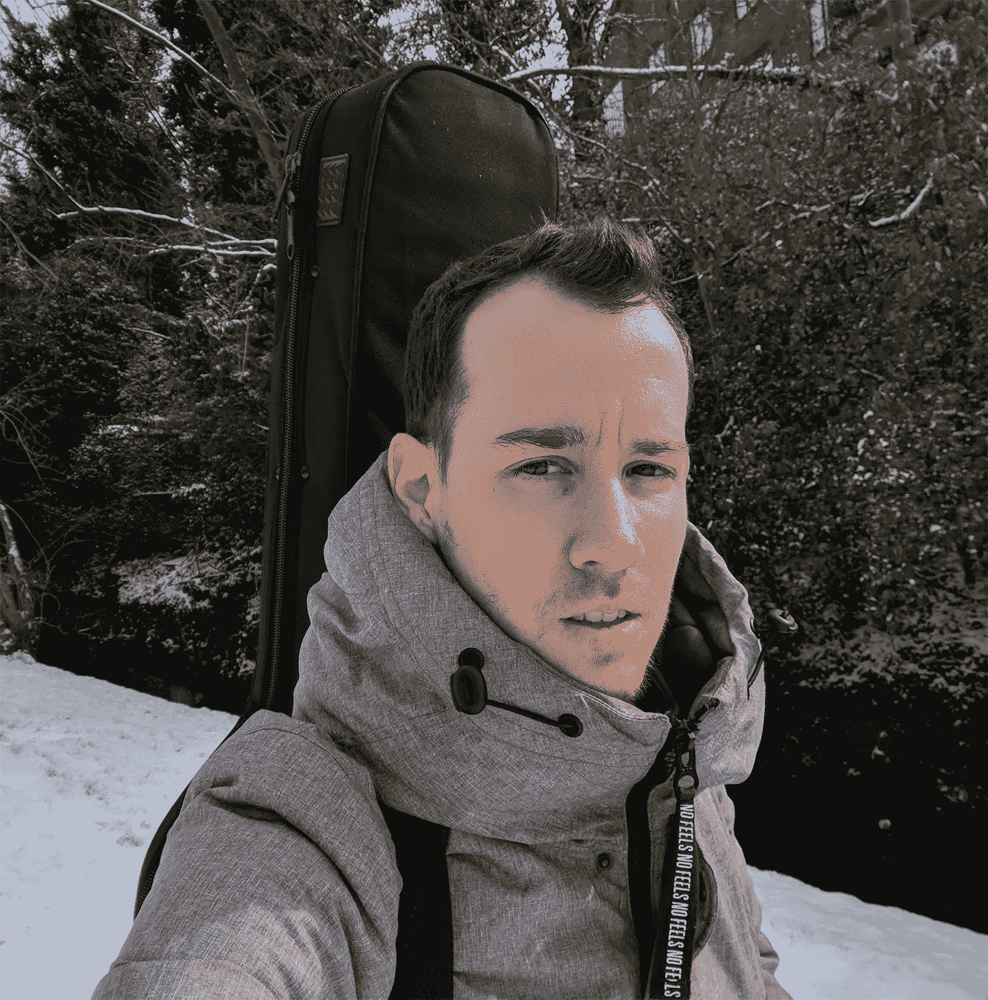
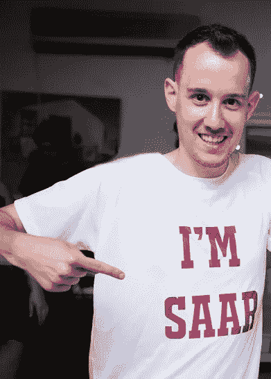

# 这就是我如何发现我的超能力的

> 原文：<https://medium.com/swlh/this-is-how-i-discovered-my-superpower-b2f1a67fb100>

## 以及如何找到你自己的！

多年来，我一直认为陌生人在和我交谈，因为我是一个带着吉他到处走的年轻人。这是一种简单的对话方式——*“那是吉他吗？”*或者*“年前我也玩过！”但事实是——即使我没有带乐器，陌生人也会和我聊天。他们找到了另一种参与方式。*

# 为什么陌生人会接近我？

当人们需要建议时，我总是他们求助的人。不仅仅是我的朋友们欣赏我的话，还有学校里随便找来的孩子，甚至成年人。他们对我要说的话非常尊重，因为我对他们经历的事情非常感兴趣。

随着年龄的增长，我记得我是如何和穆斯塔法成为朋友的，穆斯塔法是我小学的看门人。他比我大 30 岁，但我设法找到了共同的兴趣，并和一个大多数人忽视的人在一起。事实上，从小到大，我一直和人们联系在一起，尤其是那些通常被忽视的人。我在火车上和飞机上与人交谈，在公共汽车站等车时与人交流故事，与当地商店的收银员分享人生经验。最近，当我来租车时，我发现自己和一位在租车行工作的女士分享了一条建议。有趣的是，她想辞掉工作，想办法开一家自己的画廊。我们谈了一个小时。

多年来，我不明白为什么人们会向我寻求建议。我猜这是因为我努力做一个积极的人，做好事。但是为什么一个陌生人会接近我？他们明明不知道我是一个积极向上的人还是一个有毒的人。

# 这是我的超能力

我似乎是我大多数对话中的主导者。即使在小组讨论中，我也注意到说话的人倾向于直视我，几乎忽略其他人。但是为什么呢？是因为我倾听和回应，无论是口头上还是身体上？是因为我说话还是点头？动我的眉毛，嘴巴，甚至手？然而，我们都这样做。我唯一不同的地方是我不断练习我的觉知。我专注于其他人在说什么。我关注他们怎么说。我找到我可以分享的东西，以一种有益于对话的方式。仅仅这样是不够的。在与人交谈时，我会观察他们的肢体语言，也观察我的肢体语言。我尽量让他们觉得，他们可以谈论任何事情。这样，我们可以在更深的层次上建立联系。我可以控制局面，引导对话，并把它变成一次成功。

我花了很多年才明白，这不是一项普通的技能，而是一种与生俱来的天赋。当然，这是我擅长的。我记得那些和我亲近的人曾经是多么的敬畏。他们会看着我和陌生人交流，有时会嘲笑我或者告诉我我话太多。他们说:“*你怎么就跟这个男的做朋友了？”* 但他们其实想说的是:****怎么*** *你刚和这个人交朋友？”**

*现在我知道为什么别人总是和我联系在一起了—
**人是并且一直是我的主要激情。我的态度，我的肢体语言，我的表情，我的话语，我的语气——它们都表现出来了。我们都很容易感受到别人的热情。我对人的热情帮助我与每个人建立联系。这很可能是我的超能力。***

# *我发现帮助别人让我充实*

**

*这些年来，我已经成为一名职业音乐家。我写了几十首歌，并录制和发行。我在舞台、广播和电视节目中现场表演。多年来，我没有把我作为音乐家的生活和帮助别人联系起来。我认为我的音乐主要是个人的东西，是我用来表达自己感情的东西。有一天，一个朋友打电话给我，问我的新单曲是不是写他的。事实是——事实并非如此。但知道他与这首歌联系如此之深，以至于他认为我的歌词是关于他的，让我看到了我的音乐的力量。影响和帮助他人的力量。*

*两年前，这种帮助他人的使命让我开了一个博客。除了我的音乐之外，我想找到另一种接触人们的方式。我花了数小时研究、写作和编辑我的帖子。尽管人们
回复并阅读了我的文章，但还是有东西在拖我的后腿。我知道只要一句话，我就能帮助别人踏上情感之旅。帮助他们远航去发现一个新的岛屿。关于他们生活的新发现。
**但我被一种大的恐惧征服了。我太害怕暴露自己。** 露出真面目。告诉我的读者我到底是谁。我甚至没有在帖子上署上自己的名字。相反，我用了一个假名。*

*当我在帮助和指导别人的时候，我不能指导自己。和我一起工作的朋友、亲戚和音乐人——我告诉他们以诚实和纯粹的方式做自己喜欢的事情的重要性。尽可能透明，不要有所保留。事实是——帮助别人比帮助自己容易得多。*

*我并不像对所有向我咨询的人那样真诚。在我们生活的这个没有隐私的时代，这听起来可能很傻，但这是我拒绝跨越的一条线。我害怕人们会对我有什么看法。一个 20 多岁的音乐家谈论自我实现？这孩子到底知道什么？
我担心我的沟通技巧会被数字媒体过滤掉。毕竟，我的读者看不到我的肢体语言或表情。他们看不到我是谁。*

# *至少我是这么认为的*

**

*Here I am. and yes, it is a guitar on my back! :)*

*在我们的生活中，有时我们会觉得自己无所事事。
但是总有事情在后台发生。有时候我们的想法还是半生不熟。他们只是需要更多的时间。当我们允许自己有这样的时间时，我们会变得自信。相信事情会在正确的时间发生。**我们只需要等待那个“*丁！***定时器到时。然后，我们的想法就可以变成行动了。*

*就这样，几个月前我听到“叮！”在我脑海中回响。我终于确切地知道我在寻找什么了。我想找一个活跃的社区，在那里我可以表达自己并学习。一个我可以帮助他人开始或继续自我实现之旅的地方。我想通过写自我意识、自我控制和自我提高来做到这一点。
最重要的是——**我想尽可能的诚实和透明**。如果有人因为我的身份而不能接受我的建议，那就这样吧。*

*我以为我寻找的这个地方只不过是一个乌托邦。
然后，经过广泛的搜索——**我找到了媒介**。我开始写作和阅读。我付了年费。我回复别人的帖子并建立新的联系。我投资了。尽管人们还没有见过我本人，但他们还是和我联系在一起，我很敬畏！我害怕的那些障碍并不存在。我必须给自己足够的时间来发展，战胜阻碍我前进的恐惧。*

# *你的超能力是什么？*

**

*我们都有天生的技能。我们做得特别好的事情。天生的才能。有趣的是，我们从不分析它。我们只是做好它。它是我们的超级大国。直到最近几年，我才开始运用我天生的沟通技巧。那你呢。*

*你发现你的超能力了吗？你对此有多了解和自豪？
你每天都用吗？*

*如果你还没有找到，让我向你保证。就在那里。
你的顿悟就在眼前。与此同时，不断练习你的意识，并始终以提高为目标。在你当地的媒体和户外与陌生人交谈。分享你的经历，最重要的是——**做真实的自己**。透明而诚实。相信自己，保持自信。
你的*“叮！”*即将*T10 即将到来。**

> *如果你觉得那是你想做的，就一起鼓掌👏*

# *感谢阅读！欢迎[关注我](/@saaroron)。*

* [## 为什么拥有 0 美元比拥有 1 美元好得多

### (或 5 美元，或 100 美元)

medium.com](/swlh/why-having-0-is-much-better-than-having-1-15729410c2d1)* **

## *这个故事发表在 [The Startup](https://medium.com/swlh) 上，这是 Medium 最大的创业刊物，拥有 316，638+人关注。*

## *在这里订阅接收[我们的头条新闻](http://growthsupply.com/the-startup-newsletter/)。*

**