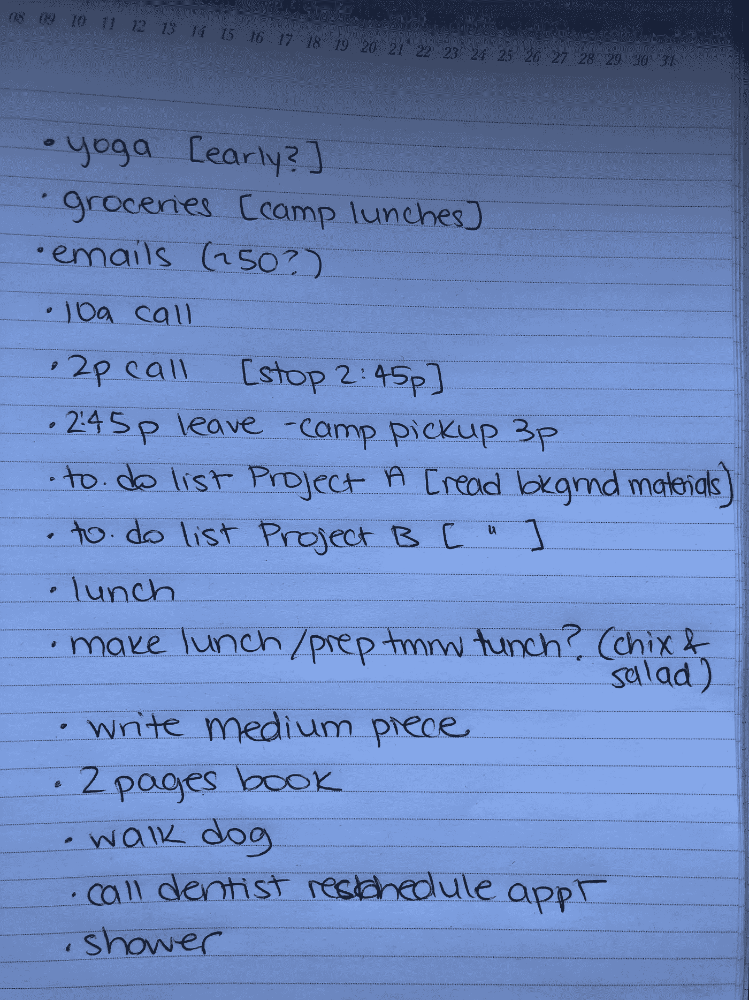

# 这就是如何排列每日待办事项的优先顺序。

> 原文：<https://medium.com/swlh/this-is-how-to-prioritize-a-daily-to-do-list-463aaacedec9>

## 当太多的事情让你不知所措的时候

Photo by [Freddy Castro](https://unsplash.com/photos/u3ajSXhZM_U?utm_source=unsplash&utm_medium=referral&utm_content=creditCopyText) on [Unsplash](https://unsplash.com/search/photos/list?utm_source=unsplash&utm_medium=referral&utm_content=creditCopyText)

两周前，我发表了一篇关于安排忙碌一天的故事。看这里:

 [## 这就是如何计划一天。

### 在忙碌的日子里消除焦虑和压力

medium.com](/swlh/this-is-how-to-plan-a-day-94dc24135e1f) 

在那篇文章中，我谈到了我用来计划一天的三个步骤:

1.  列一个待办事项清单，
2.  计算出*每个待办事项需要多长时间*,以及
3.  算出*什么时候*我会做每一件事。

我还谈到了我醒来后喜欢如何计划每一天。

今天有点不同。我已经结束了为期两周的旅行。太神奇了。但是现在我的脑袋被我需要做的事情弄得晕头转向。两个星期来，我周围到处都是未了结的事情。

我需要在周一做好计划。这样我就不会整个周末都提心吊胆了。让我充满了恐惧，担心在我休假的两个星期里，我落后了多少。

此外，我不太可能在一天之内完成所有的待办事项。事情太多了。*我需要分清主次。*

这次我也筋疲力尽了。时差和两个星期的长时间工作，熬夜和缺乏规律让我想在周一把孩子们送到营地，然后回去睡觉。

但如果我周一不优化时间，就永远赶不上了。那么压倒性的力量将真正地超过我。所以我需要制定一个计划。然后，我周一要做的就是按照我制定的时间表去做。我不必浪费额外的大脑空间在重要的事情上，或者在必须做的时候。

我可以直接执行。

## 从不可协商的开始。

星期一，我下午 3 点要去接我的孩子。我上午 10 点和一个客户有电话会议，下午 2 点和另一个客户有电话会议。下午 2 点应该很快了，但是我提醒自己在下午 2:45 有一个“硬停”去营地接孩子。

所以我的一天已经有了某种形式。在上午 10 点的电话之前我有 2 个小时，之后有 3 个小时。另外，我知道周一会是一个忙碌的赶工日，所以我有一个保姆从下午 4-6 点过来。这实际上给了我很多时间——7 个小时。

唷。

## 写下我脑海中的一切，任意顺序。

我不能对名单要求完美。我需要写出来的任何东西。

瑜伽，写作，杂货店。通读至少 30 封邮件，这些邮件是我在度假时预览的，但我认为并不重要。我不在的时候有两个新的工作项目。我需要通读他们每个人的背景，并确定需要做什么。我意识到这些的最后期限至少不是一两个星期。所以今天的目标是花时间了解这些项目。我今天要做的每一件事就是为项目的完成列出一个清单。

我需要吃午饭。而在意大利的光荣放纵之后，我需要腾出时间来做一顿健康的午餐。我需要在那天把它包括进去。我写下——做沙拉和鸡肉。那需要在杂货店之后。但是一次只能做一件事。

总的来说，我的清单是这样的:

Photo By Me.

## 清单需要非常具体。

我没有写下“开始工作项目”，因为那是什么意思？我如何确定这需要多长时间？相反，我写道，我会为一个给定的项目创建一个待办事项列表，或者确切地说，我午餐想做什么。

这也不是一个目标清单。是的，我确实想写一本书。但是写一本书在每天的工作清单上没有位置。今天，我想写这本书的两页。

我今天想做的每件事都列在单子上。甚至洗澡。因为那也需要时间。但这必须发生。

此外，当我第一次创建列表时，我不会强迫自己把所有东西都按顺序排列或分组。接孩子和工作项目接踵而至。关键是要全部记下来。弄清楚事情的顺序在后面。

然后，**我记下每件事要花多长时间**。在名单上。每个任务旁边。当我计算我的清单时，看起来我的清单上有大约 12 个小时的任务。但是在工作日只有 7 个小时来完成。

**我意识到，事实上，我今天需要做的事情比我有时间做的事情还要多。**

## 如果你一天有太多事情，优先处理。

什么事情可以等？

我看着我的材料，意识到项目 A 的截止日期比项目 b 晚，所以，项目 A 可以再等一天。

我会早起，在一天开始前的早上 6 点做瑜伽。我怀疑我无论如何都会这样做。但是由于时差的影响，我希望能多睡一天。

我会让我的保姆提前一个小时来遛狗。她在过去已经这样做了，所以我怀疑这不会是一个问题。

但是，我仍然在一天 7 小时的工作中只工作了 9 小时。

所以，我一直走下去。

用于杂货配送的 Instacart。我不喜欢这样做——这样更贵，而且他们也不能一直给我我想要的东西。但是，我在区分轻重缓急。对我来说，买杂货比自己动手更重要。

最后，在晚上 8 点以后，当孩子们睡觉的时候，完成我的中篇。考虑到我的时差情况，这也不太理想，但我应该用不了一个小时，我仍然可以早点睡觉。

所以最后，我的列表看起来像这样:

Photo by Me.

从这里开始，我精确地安排一天中我做任何事情的时间。

如果有兴趣，这将是我下一篇文章的主题— **如何安排日常任务。**

很有趣。即使是写一篇关于我的待办事项清单的报道，而不做日程安排，也让我有点紧张。日程安排对我来说很神奇。但是把所有的事情都记下来，分清轻重缓急——知道我可以在周一完成足够多的重要事情——也是一种巨大的焦虑缓解剂。我在周二的待办清单上也有了一个开端。

一旦我安排好周一的所有任务，我就可以专注于周末了。洗衣服和陪孩子的时间。整理邮件。补觉。所有回归生活的活动。这样当星期一来临时，我就知道该做什么，什么时候做。

## 这篇文章发表在《初创企业》杂志上，这是 Medium 最大的创业刊物，拥有 348，974 名读者。

## 订阅接收[我们的头条](http://growthsupply.com/the-startup-newsletter/)。

