# 这就是我们如何走到这一步的——我们新嗜好的历史

> 原文：<https://medium.com/swlh/this-is-how-we-got-here-history-of-our-new-addiction-cb6f518431c3>

那么，我们的整个社会是如何沉迷于我们的智能手机和其他设备，甚至没有注意到发生了什么？当然，在这个过程中也有一些重大的闪光点，比如 iPhone、脸书和 YouTube 的推出。但我相信，我们是通过微小的、不显眼的变化走到这一步的，这些变化在当时似乎是无害的，但综合起来，已经让我们完全迷上了我们所有口袋里的小设备。

# 1992 年:发短信

当诺基亚和沃达丰推出通过手机发送短信的功能时，我们上瘾之旅的第一步开始了。事实上，这项功能花了好几年才实现——还记得使用拨号盘打出几个字有多难吗？——但是一种新的交流方式诞生了:无需实际看到或与他人交谈的情感努力，就能与其他人即时互动的能力。

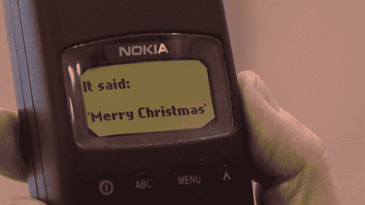

# **1996 年:第一个迷因**

是一个[跳舞的婴儿](https://www.youtube.com/watch?v=-5x5OXfe9KY)让世界疯狂，第一次，每个人都想与他们认识的每个人分享视频或动画 GIF。病毒式传播由此诞生。“病毒式传播”一词后来成为席卷互联网的最新迷因或趋势的简称。

# 1997 年:群聊

有什么比和朋友交换信息更好的呢？和一大群人交换信息！ICQ 和 AOL 使之成为可能。所以我们朝着减少身体接触的方向又迈进了一步，因为群发短信比在现实生活中和朋友出去玩要有效得多！

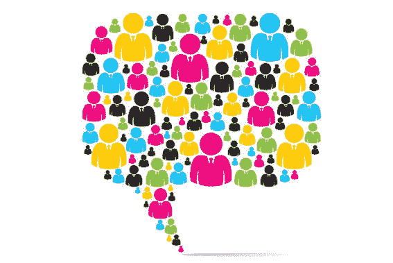

# **2003:自拍**

自从摄影术发明以来，人们就一直在给自己拍照，但索尼在爱立信 Z1010 中发布了第一款带有前置摄像头的手机，从而帮助推广了“自拍”。然后 2010 年 iPhone 4 的发布让用户比以往任何时候都更容易制作自拍。MySpace、Flickr 以及后来的脸书、Instagram 和 Snapchat 推动了我们今天所知的自拍分享狂潮。对于新一代的我来说，分享你的鸭脸是最棒的。

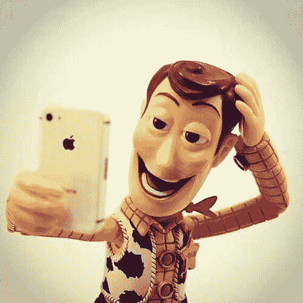

# **2005 年:第一部猫咪视频**

尽管第一个猫咪视频并不令人印象深刻，但它随后获得了超过 200 万个猫咪视频和 250 亿次观看。猫咪视频成了网上浪费时间的代名词。出于某种原因，我还是不明白，猫视频[让人开心](http://www.huffingtonpost.com/entry/the-surprising-reason-humans-love-cat-videos_us_55df58f9e4b029b3f1b1f693)。这也让我们离沉迷于屏幕更近了一步。等等，我的朋友刚刚发短信给我…哦…他太可爱了…

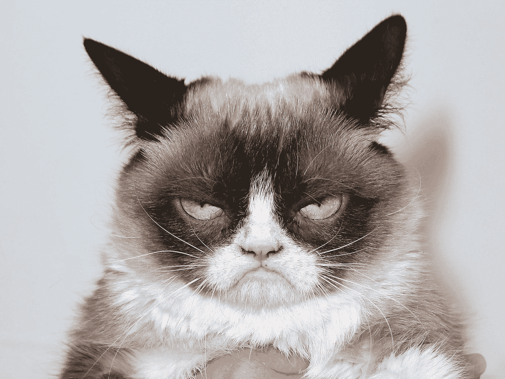

# **2006:无限滚动**

到目前为止，你需要主动点击一个按钮或一个链接才能进入网站的下一页。但是脸书改变了一切。

2006 年，当社交网络发布无限滚动功能时，人类想知道下一步会发生什么的基本冲动被脸书产品化了——或者我应该说“武器化”了。无需采取任何行动来查看页面上的下一步内容；你只是不停地滚动。因为看不到尽头，我们花了越来越多的时间试图完成一个无法完成的目标。当我看完我的脸书新闻后，我会停止阅读…

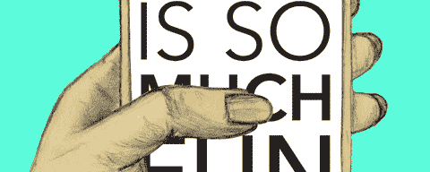

# 2007 年:苹果手机

这可能是我们上瘾旅程中最大的里程碑。苹果智能手机让在一个小型手持设备上上网、发短信和发电子邮件变得如此容易和愉快，引发了移动网络的一场革命。这也引发了另一场革命:社交媒体的兴起。毫无疑问，iPhone 是一个神奇而重要的设备，它帮助我们听音乐、书籍和播客，阅读新闻，帮助我们开车去参加下一个会议，找到吃饭的地方，等等。然而，这也是你的青少年无法摆脱 Snapchat 或 Instagram 的原因(2017 年对 5000 名青少年的调查发现，4 分之 3 的人拥有 iPhones)。把它想象成通向我们科技上瘾的大门药。

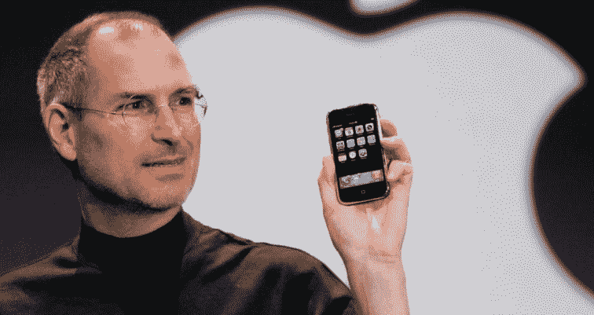

# **2009 年:推送通知**

直到今年，我们收到的唯一通知是短信，因为这些仅限于我们认识的人，这是可控的。当苹果允许任何应用程序向我们发送推送通知时，我们的注意力被无数应用程序劫持，所有应用程序都渴望抓住我们的注意力，并要求我们查看新图片(可能是自拍)、视频(当然是一只傻猫)、推文(可能来自我们的总统)、新闻文章、聊天、游戏邀请、新的播客剧集、信用卡更新等。等等。

它实际上允许任何应用程序来定义你今天的待办事项。

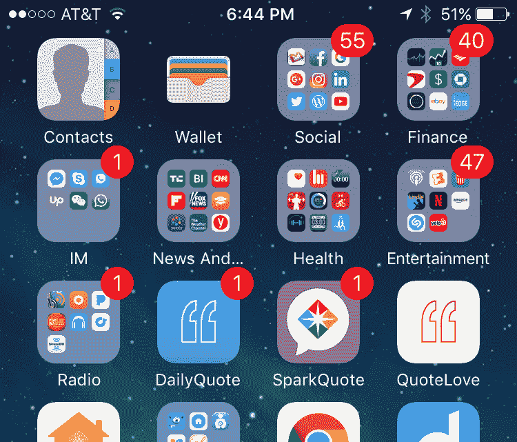

# **2009:喜欢**

脸书今年推出了“喜欢”按钮，从而让数千万用户又有了一个不断在脸书签到的理由。大量研究表明，获得脸书喜欢会产生多巴胺，从而激活大脑的快乐中心——科学家称这一过程就像吸毒者吸食可卡因后大脑发生的变化。这是一个恶性上瘾的循环:在脸书上发布一个更新，随着每个赞通知获得短暂的多巴胺爆发，再一次更新，获得更多的赞和更多的多巴胺点击，再一次更新…恭喜你，你上瘾了。

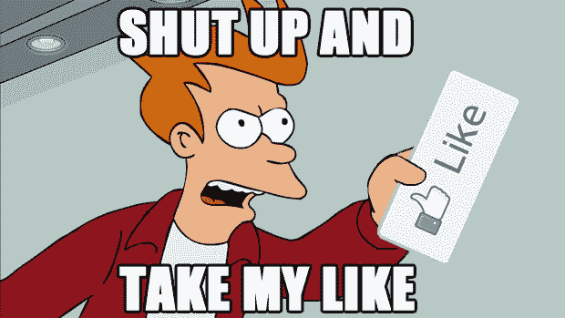

# **2011 年:下一次视频自动播放**

现在你甚至不需要动一根手指就能继续看下去。您的下一个视频将在您有机会停止之前自动开始播放。“狂看”这个术语是在网飞做了一件非常简单的事情后产生的:几秒钟后自动开始你正在看的节目的下一集。试着在 YouTube 上看一个视频或者网飞的一集。我谅你也不敢。不会发生的。

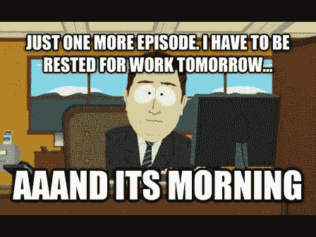

# **2016 : VR/AR**

我们正处于物理现实和数字现实融合的时刻。技术不会让我们*从*现实中分心，它只会*成为*我们的现实。虽然谷歌眼镜失败了，Snapchat 眼镜也没有真正流行起来，但在不太遥远的未来，我们将找到一种方法，将技术无缝地融入我们的日常生活，增强现实和虚拟现实将看起来像是过时的术语。当这种情况发生时，如果这只是这个世界的运行方式，你还能称之为上瘾吗？

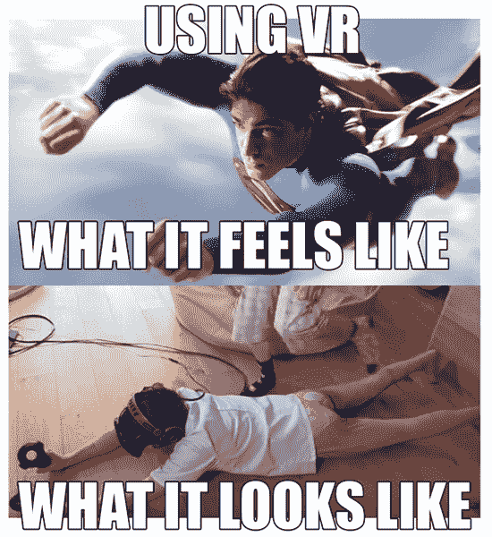

技术是不断变化的。但你可以打赌一件事:科技公司将不断推出越来越多的功能，这些功能的核心动机只有一个:让你着迷。这是因为他们的商业模式依赖于你不断地访问他们的网站，打开他们的应用程序，发布更新和消费内容。记住，如果产品可以免费使用，那就意味着*你*就是“产品”下次苹果、Instagram 或脸书发布闪亮的新功能时，注意它是如何让你上瘾的。

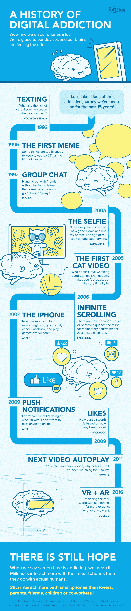

The history of Digital Addiction — by unGlue

**阿龙·施瓦兹，
首席执行官&unGlue 的联合创始人，三个孩子的父亲** [http://www.unGlue.com](http://www.unGlue.com)
unGlue 是世界上第一项协作技术，让人们能够管理自己的数字注意力，屏蔽“沉迷”。

## 这篇文章发表在 [The Startup](https://medium.com/swlh) 上，这是 Medium 最大的创业刊物，拥有 335，210 多名读者。

## 在这里订阅接收[我们的头条新闻](http://growthsupply.com/the-startup-newsletter/)。

