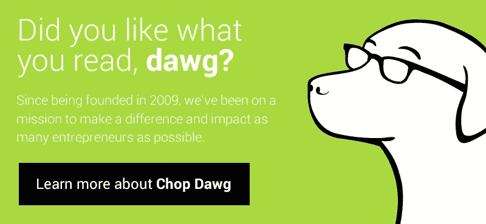

# 这就是我们过去八年的经营方式

> 原文：<https://medium.com/swlh/this-is-how-weve-stayed-in-business-for-the-last-eight-years-e60e4b5f8122>

回到 2009 年的夏天，我每天都挨家挨户地向当地的小企业推销为什么他们需要一个网站，更重要的是，为什么我是那个让他们实现梦想的人。

我花了两个月的时间这样做，每天从早上 9 点到下午 5 点。这是在我有驾照之前，我只能走路。

再说一次，这是夏天，在新泽西。现在是 90 年代。天气潮湿。

这没关系；我决心找到我的第一个顾客。

那个夏天的最后一天，我不仅找到了我的第一个客户；我找到了我的前两个。

这些客户将是我的全新公司理念的遗留客户，有一天，这个理念将成为**。**

**让我们快进两年；现在是 2011 年。**

**我们仍然需要客户。我们还不是一个家喻户晓的名字，但任何想象力的延伸。**

**我们做了什么？**

**简单？**

**我们在网上调查了每一个网站乏善可陈的小企业和公司(*不像 2009 年，那时大多数企业还没有上线…* )。**

**如果他们符合需要新网站的标准，我们会尽一切努力找到他们的电子邮件地址。从那里，我们发电子邮件。我们发了邮件。我们又发了一些邮件。**

**我们会为每一个企业主写定制信息，解释为什么他们的在线状态没有发挥出它的潜力，以及为什么我们会是修复它的人。**

**我们日复一日地这样做。**

**我们会在与现有的少数客户合作的间隙做这件事。**

**好吧，我们再往前一年。现在是 2012 年。没有更多的学校，专注于 [**剁 Dawg**](http://www.chopdawg.com/) 全职与我们的小团队。**

**我们并不富有，也没有滚滚财源，但我们只有一盎司的收入可以分配给市场营销。这就是我们所做的。**

**我们会像以前一样进行研究:任何在线业务很糟糕或者根本没有的业务。然而，这一次，我们将找出所有者的姓名，以及他们的个人邮件地址。**

**我们组织了一个大型的邮件活动，通过我们认为最适合他们的方法，针对那些觉得网站设计和开发对他们的运营没有必要的人。老派，有点可靠的蜗牛邮件。**

**快进到 2015 年。**

**我们继续利用相同的理念。我们会在 Twitter 上研究每一家寻找网站设计、网站开发或应用程序开发公司的公司、企业家和初创公司。我们会努力工作，建立关系，引发对话，再一次像我们一直做的那样，说服他们为什么我们要帮助他们到达希望之乡。**

# **你注意到这里有一个重复的模式，不是吗？**

**一方面，以上所述需要的不仅仅是持续的努力，而是决心、纪律和职业道德。**

**更重要的是，把你自己放在那里并找到你的顾客的艺术。不要害怕把你的脚放在踏板上，努力让餐桌上有食物。**

**这一特性是我们在过去八年中发展壮大的最大原因。事实上，我个人认为，没有这一点，我们就不会有今天。**

**为什么这很重要？**

**因为很多公司都认为让客户来找他们是理所当然的。更糟糕的是，越来越多的公司只是希望顾客来找他们**

**这不是商业运作的方式。更不用说新业务、新产品、新品牌了。**

**你需要投入工作。**

**如果你要发布一个全新的移动应用，不要指望只在 ProductHunt 或 Reddit 上列出一些东西就能帮你度过难关。**

**你应该找到你的个人受众在当今世界的位置，并与他们交流。在 2017 年，这可能是具体的子街道。脸书集团。渠道不畅。时事通讯。地狱，它仍然可能是挨家挨户的拉客，冷邮件，冷电话，邮寄者。**

**不管是什么，你付出了努力。你走向观众。你展示了为什么你是最好的。为什么你要解决他们的问题。尽你所能让他们相信，你是最好的人，最好的公司，最适合这份工作的解决方案。**

**我们的生死取决于我们的顾客。如果我们没有足够的客户；这意味着收入损失。这意味着没有足够的资金支付团队成员。让灯一直亮着。继续做生意。产生我们想要的影响。**

# **这还不够激励你吗？**

**你需要更多吗？**

**更多的客户意味着更多的增长。更多的影响。你的团队就越大。你能帮助的顾客越多。**

**我们现在说的是常识，但许多高管和企业家都需要提醒自己这些。**

**所以走出你的舒适区。打破你的外壳。不要自满。投入工作，找到你的顾客，你的客户，你的用户。他们就在那里，他们就等着你向他们展示你的实力。**

****

**[www.ChopDawg.com](http://www.ChopDawg.com)**

****关于约书亚·戴维森:**我是一个对创业充满热情的学生。我还开发应用程序，帮助公司发展。ChopDawg.com[创始人兼 CEO。iTunes 上](http://chopdawg.com/)[# the powdcast](http://chopdawg.com/podcast/)的联合主持人。我在福克斯、MSNBC、哥伦比亚广播公司、技术上、StartupGrind、StartupGrind、StartupDigest、AOL、EliteDaily、Mashable 和更多的网站上出现过。主旨发言人。即将成为作者(2017 年年中)。**

**您或您的公司是否正在寻找一个有才华的开发/设计团队来帮助构建+扩展您的应用程序？在 Joshua@ChopDawg.com亲自给我*(和直接)*发邮件免费咨询！我很乐意帮助你。**