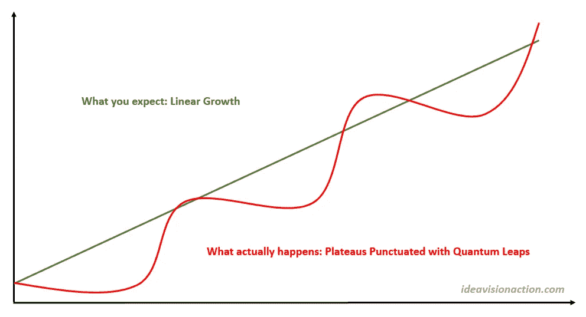

# 这就是你的期望如何破坏你的成功

> 原文：<https://medium.com/swlh/this-is-how-your-expectations-sabotage-your-success-8508eaf64862>

这就是如何更新它们。

Linear Growth vs. Quantum Leaps

这是我最近才明白的事情。我在生活中经历过多次，但直到我在一篇博文中读到这件事，我才吸取了教训。这是非常违反直觉的，当我审视我的生活经历时，这是有道理的。

**线性增长预期**

我说的是线性增长和量子飞跃。在我学会这个概念之前，我习惯于期待结果的线性增长。这是我的逻辑。如果我没有看到那种线性的增长，我就气馁，放弃了。

**投资**

这里有一个例子。假设我以 100 美元买了一只股票，我预计它一年后会涨到 120 美元。在过去，我预计它的价格会每周上涨 0.40 美元，并在年底达到 120 美元大关。在股市和生活中不是这样。

股票大部分时间在 100 美元上下波动。甚至还略有下降，这就更让人泄气了。几个季度后，一些积极的意外消息冲击了市场，价格在一两周内飙升至 120 美元。这正是我卖掉加密货币 [Ripple](https://ideavisionaction.com/investment/i-sold-ripple-then-its-price-quadrupled/) 之后发生的事情。

**博客**

我在我的博客上也观察到了同样的现象。在开始的几个月里，人们对我的博客几乎没有兴趣。然后有人联系我，让我在他们的媒体出版物上发表我的文章。我接受并意识到可以将我的文章提交给出版物。

从那时起，我开始向媒体刊物投稿，这是我博客的一次飞跃。有一段时间，我一直在小型刊物上发表文章。然后[初创公司](https://medium.com/swlh)联系我，让我在他们的出版物上发表我的文章，有 20 多万人关注。我欣然接受，这是另一个飞跃。

**职业**

我的职业生涯也是如此。我在同一个职位上呆了几年。突然，一个机会出现了，我找到了一份新工作。在我的职业生涯中，这种情况发生过多次。

**关系**

量子跳跃的概念适用于生活的任何领域。如果你是单身，你可能会和很多人约会，但很长一段时间都无法和他们联系。有一天，你遇到了一个你喜欢的人，你们开始了一段关系。

**军规**

不过，有个问题。

> ***为了从量子飞跃中获益，即使长时间看不到任何成果，你也要坚持自己的枪。***

在投资的情况下，它坚持你的投资。就你的生意而言，就是坚持你的生意，每天采取稳定的行动，即使你看不到任何回报。换句话说，你每天都要增值，但不要期待任何与你的努力成正比的结果。

坚持你的投资、业务或任何其他努力，长时间看不到任何结果，会令人非常沮丧。你可能很想放弃，但是你可能离金子只有几英寸了，所以继续挖吧。

> 更令人沮丧的是辞职，然后在你辞职后几个月就看到别人用同样的投资或类似的业务取得了成功。

**免责声明**

本帖仅供参考，并非商业或投资建议。

*阅读下一篇:* [*我的成功秘方*](https://ideavisionaction.com/personal-development/my-secret-recipe-for-success/) *或者报名参加* [*每周简讯*](https://ideavisionaction.com/email-newsletter/) *。*

## 这个故事发表在 [The Startup](https://medium.com/swlh) 上，这是 Medium 最大的企业家出版物，拥有 296，127+人。

## 在这里订阅接收[我们的头条新闻](http://growthsupply.com/the-startup-newsletter/)。

