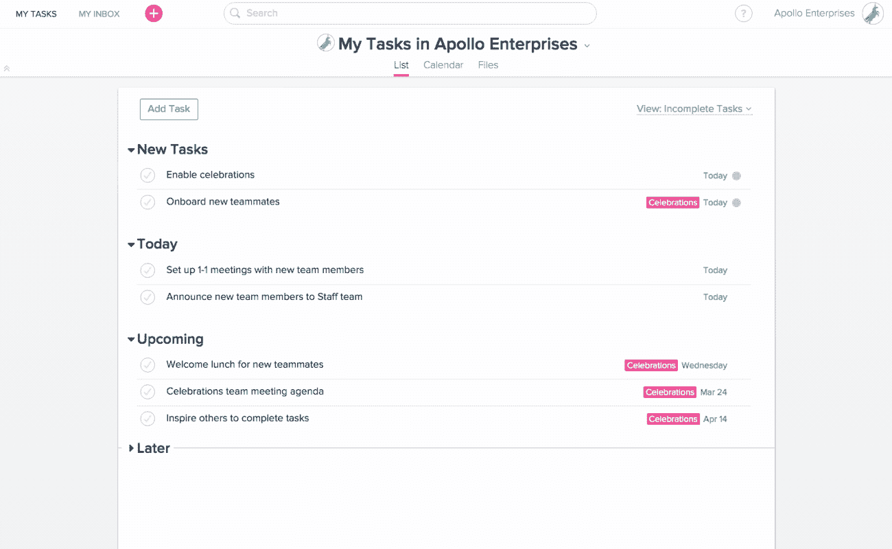

# 这不是一个赞助的帖子，但我只是想写关于体式的伟大力量

> 原文：<https://medium.com/swlh/this-is-not-a-sponsored-post-but-i-just-want-to-write-about-the-great-power-of-asana-68be3f0ddf3c>

Asana。3 个音节和 5 个字母，这个词一开始听起来有点奇怪，你并不完全明白它的意思，也不明白为什么任何初创公司都会用这个名字。

然而，这个体式，不管听起来有多奇怪，多书呆子气，改变了我的生活，或者至少改变了我在创业冒险中处理工作量的方式。

对于那些还没有迷上 Asana 的人，请现在就开始——->网址是[这里](https://app.asana.com/)。

如果不是现在，你应该想在读完这篇文章后去看一看——如果你决定一直读到最后的话。

***任务管理带到下一级***

Asana 是一个任务管理工具，基本上是一个在线“待办事项”。这里没有什么革命性的东西，没有沉重的人工智能或神秘的深度技术:我们只是在谈论一个虚拟的等价物，相当于你一直用来跟踪你在工作中需要完成的所有任务的笔记本和笔。

它不仅仅是一个等价物，它正在将它带入下一个阶段，成为一种管理工具:作为一名经理，你基本上建立了一个带有子主题的项目文件夹，然后你可以列出需要完成的任务并将其分配给你的队友，以及确定这些任务的时间表。您可以在方便的时候设置通知，提醒您相对于之前为任务设置的截止日期，完成任务是否要迟到了。

每个任务都可以分成子任务，你可以对它们进行评论，这样你就可以选择在一个空间里完全处理关于任务的所有讨论，而不是 10 英寸长的电子邮件线程，涉及 15 个人，随着电子邮件的堆积，会越来越混乱。

***在你的团队中培养透明度***

这不仅是管理您的团队和您自己的工作量的一个很好的工具，也是促进团队透明度的一个很好的工具——每个人都知道每个人在做什么，这样在团队内部就有更好的沟通，两个人不会在同一时间做同一件事，或者一个人在做一件可能需要另一个任务输入的任务时知道他应该和谁说话。

再次声明，这不是一个赞助的帖子，但是我是一个永远的体式迷，所以我不得不写这个。如果有人觉得酷(免费！)体式招数，请在评论中分享！

You can set up a unicorn notification to celebrate each task completed on Asana

## 这篇文章发表在 [The Startup](https://medium.com/swlh) 上，这是 Medium 最大的创业刊物，拥有 289，682+人关注。

## 在此订阅接收[我们的头条新闻](http://growthsupply.com/the-startup-newsletter/)。

