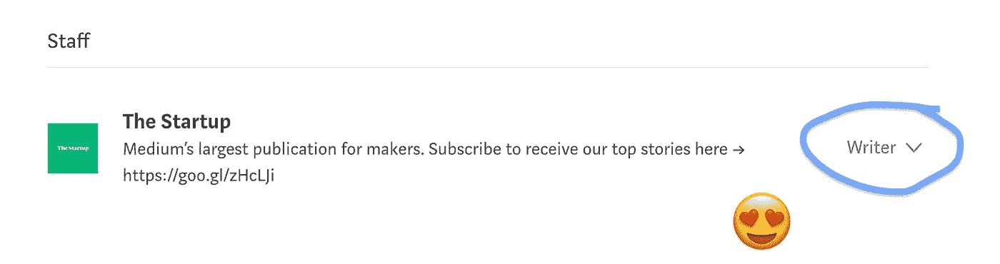

# 这是为了感谢你

> 原文：<https://medium.com/swlh/this-is-to-thank-you-7243de73c412>

## 在过去的六个月里，我的生活发生了变化。这是为了让你知道我最近在忙什么。

> 每一场火都是由火花开始的。

有一次，我在 YouTube 上看了一个视频，视频里那个人在感谢他的粉丝们的承诺。他在庆祝一个巨大的里程碑。他非常真诚地说，当他拥有第一批 100 名订户时，这对他来说意义相同，因为他只是想制作视频。

我想:我要*那个*。无论如何，我想做我喜欢的事情。一些我可以努力的事情。我可以沉浸其中。一个我可以做真实自我的地方。

他的名字是[菲利克斯](https://www.youtube.com/user/PewDiePie)，他正在庆祝他的**5000 万**订户。

有生以来第一次，我知道自己在做什么。

我知道我要去哪里。

我很清楚自己的目标。

今天是我写早间日志的第 157 天。写作给我的思考带来了精确，一个减压的地方，一个计划的地方，一个反思的地方。

写日记是我一生中最伟大的教育经历。

不仅如此，我还在放下自己的想法中找到了激情和满足感。我在向人们展示它们和接受反馈中找到了满足感。每天，我通过阅读和写作来发现和改进我的叙述。我遇到了一些很棒的人，他们愿意在这个旅程中帮助我。

> 当你清楚自己想要什么的时候，这个世界是一个伟大的地方。

上个月，我试着在每个工作日发表文章，看看我是否能够应对一致性的挑战。我坚持了三周的每日发布。我有一个月没有达到每天出版的目标，但我意识到我想在主题上更深入，在我的风格上更努力。较短的截止日期证明效果不错，但是长格式的帖子需要更多的时间。我开始寻找它。

虽然我睡眠充足，但白天我一直在努力保持精力充沛。有时，我早上 6 点起床，有时早上 6:30。我偶然发现了一个视频，里面有关于如何在早上 5 点起床的提示。我决定去争取。我没有从 7:30 到 6:30，而是追求 10 倍的提升。

我加入了 5 AM 俱乐部。已经两周了，我很喜欢。如果你了解我，你会惊讶地发现我是这样的。感谢罗宾的提醒。我在早上获得的时间让我的一天变得完全不同。我有时间阅读、写作和思考。我有时间做我的事情，变得更好。

你们，灵媒界的人们，已经经历了所有这些变化。这是给你的。

谢谢你。

感谢所有阅读和反应的人。感谢那些按下*跟随*的人。这给了我希望。

感谢[、初创公司](https://medium.com/u/1ecc355a806?source=post_page-----7243de73c412--------------------------------)将我加入你们的*作家*名单。

并且感谢[中](https://medium.com/u/504c7870fdb6?source=post_page-----7243de73c412--------------------------------)给*那个*优雅的称号。我从来不知道这是我想要的。

谢谢你为有意义的故事创造了这个地方。你正在改变世界。

> *“世界上最有力量的人是讲故事的人。”*
> 
> —史蒂夫·乔布斯

阅读[我如何学会保持好奇](/swlh/how-i-learned-to-stay-curious-ec07254c342) ❤️

## 这个故事发表在 [The Startup](https://medium.com/swlh) 上，这是 Medium 最大的创业刊物，拥有 303，461+人关注。

## 在这里订阅接收[我们的头条新闻](http://growthsupply.com/the-startup-newsletter/)。

