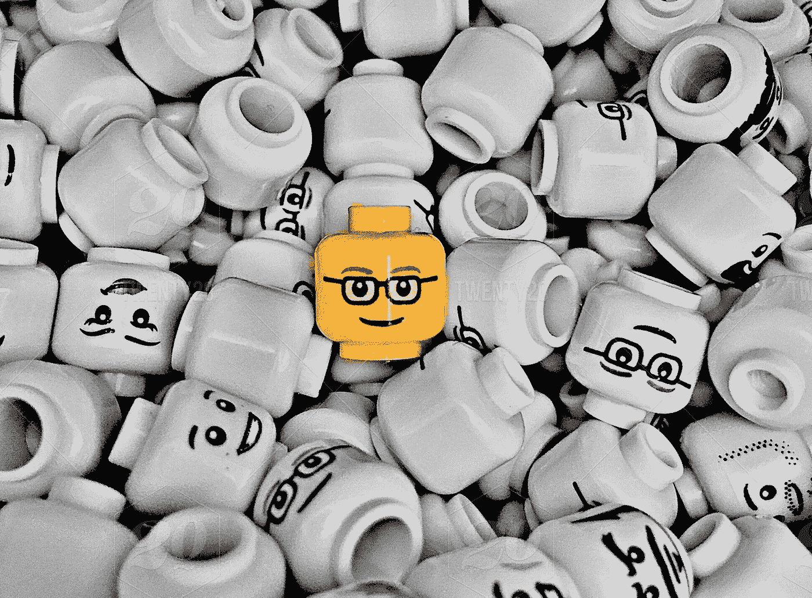
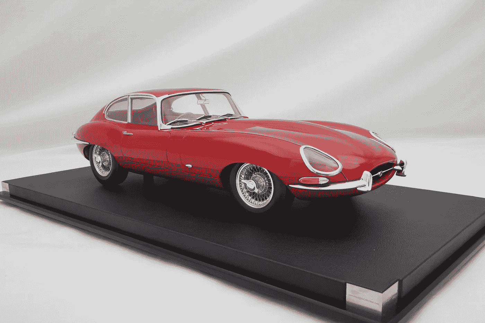
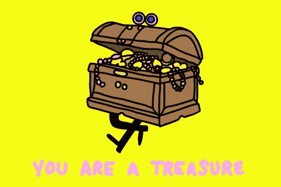
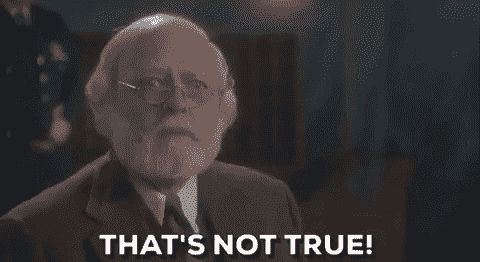

# 这就是企业家与大多数人的不同之处

> 原文：<https://medium.com/swlh/this-is-what-differs-entrepreneurs-from-most-people-7303ad592d9f>

## 对创业的误解

photo: [carlosd.rengel](https://www.twenty20.com/carlosd.rengel?t20p=photo.index)

企业家，尤其是艺术家，都有创造的欲望。继续学习和发展他们的技能。
作为一个从年轻时就开始创业的人，我对这一点有切身体会。

# 我的第一辆(也是最后一辆)红色美洲豹

我六岁的时候，我姐姐和我决定开一家商店，卖掉所有我们不再用的玩具。我们花了一个小时整理东西，准备了一份产品和价格清单。
我们带着存货、一张小桌子和两把椅子，把它们放在当地的操场边。由于我们住在一个只有 500 人的小村庄里，我们商店的谣言就传开了。我们真的很喜欢当店主。这项工作自然由我们两人分担。因为[人总是我的主要激情](/swlh/this-is-how-i-discovered-my-superpower-b2f1a67fb100)，我是那个与顾客(邻居和朋友)互动并协商价格的人。我的姐姐是一名设计师，她把我们的玩具布置得很吸引人，吸引了更多的人来参观我们的小店。这是一个巨大的成功。但是几个小时之内，我们就觉得累了。我们想回家，但又不想关门，因为顾客源源不断。
**然后我们看到了一个机会。我的一个最要好的朋友(到目前为止)想买我们的一辆玩具汽车模型。那是一辆闪亮的红色美洲虎。但是他没有钱付给我们。我们提出了一项交易。他将作为销售人员为我们工作几个小时，作为回报，他将免费得到他想要的红色捷豹模型。我们握了握手，然后回家休息和吃饭。那天结束的时候，我们卖完了，按照承诺，把他的红色捷豹交给了我的朋友。几天后，全村的孩子都开了自己的商店，而我们已经退休了。回想起来，这是我创业历程中最重要的一天。**

# 创造，创造，创造(和激情)

依我看，创业就是创造。作为一名企业家，拥有一家企业是真正企业家精神的副产品，而真正的企业家精神是你实际创造的。它可以是一个帮助人们睡得更好的应用程序，也可以是一首摇滚歌曲或一个旅游博客。这是你的创造。
这是所有企业家的真正核心——他们的激情。这也是企业家不同于大多数人的地方。他们做了两件别人没有做的事:

## 1.企业家向内看

企业家是那些向内寻找自己真正激情的人。他们从未停止寻找。他们找到新的，甚至在适当的时候时不时地和旧的说再见。他们设计、塑造，然后重塑他们的激情。能够深入挖掘自己需要很大的勇气。

## 2.企业家实践他们的激情

虽然找到激情肯定是第一步，但这还不够。在一天结束的时候，当你花大部分时间写代码的时候，想要写一些关于政治的东西对你没有多大帮助。事实上，它会导致压力和抑郁。
**创业就是实践你拥有的激情**。这是关于发展、学习，最重要的是——行动。
对我来说，作为一个音乐人，这些行为就是我的写歌、作曲、制作甚至录音。最重要的是奉献。

# 找到藏宝图

阿文说过，我不认为企业家是最有才华的人。事实上，我认识几十个非常有才华的人，但我不认为他们是企业家。有些人画出令人惊叹的卡通，有些人唱得很美，有些人设计和缝制衣服。然而，并非所有这些人都是企业家。虽然他们可能知道自己的激情是什么，但他们不会付诸实践。
**他们有创意但不实践创造。** 你大概能想到那样的人。一个充满激情的人，他从未停下来塑造它，改进它，最重要的是实践它。 **跟一个人的心态有很大关系。当你有足够的勇气钻研自己时，你会发现一张藏宝图。起初，它看起来很吓人，很混乱。有如此多的细节和数百种可能的方法去得到宝藏。但是当你深呼吸并开始计划你的路时，你会觉得已经准备好出发了。一旦你到达这个宏伟的宝藏，你会发现另一张藏宝图，只是这一次你有更多的旅行工具。**

# 对创业的误解

> “金钱是每个企业家成功的衡量标准，这是一个普遍的误解。它不是，也不应该是。”~理查德·布兰森

说到企业家，这里有一个巨大的误解。
这种误解经常在媒体上听到。当一些人谈论企业家精神时，他们把它当作没有老板的同义词。做自己的老板。过着自由的美好生活。
**如果这是你对创业的看法，那就再想想。事实是，如果你成为一名雇员和企业家的原因是为了能穿着睡衣工作，那么这两者之间并没有太大的区别。
**创业是发现和跟随藏宝图，而不是宝藏本身。还记得我之前说过的话吗？****

> 作为一名企业家，拥有一家企业是真正企业家精神的副产品，而真正的企业家精神是你实际创造的

我读过许多关于企业家精神的文章，其中作者只关注金钱。*“当我成为一名企业家时，我在一周内赚的钱相当于我以前当员工时一个月赚的钱！”* 嗯，对你有好处。但是创业不是为了钱。完全没有。如果你大部分时间都在想钱，那么无论你是雇员还是企业家都没什么区别。一个把事业放在第一位而把激情放在第二位的企业家，基本上是一个有着丰厚薪水和一点自由的雇员。只有当你设法摆脱了对企业家精神的误解，你才能成为一名企业家。

# 创业选择你

> "一旦对某件事产生了热情，动力就在那里."~迈克尔·舒马赫

想成为企业家并不能让你成为企业家。
通常，那些想成为企业家的人是那些认为这是自由的理想生活的人。
这里有一个我最近和某人分享的类比:
假设你是一名想要拥有更多自由的公交车司机，你的梦想是成为一名 f1 车手。你决定辞职，结果却开着一辆优步。你所做的只是在工作条款上做了一点小小的改变，其他什么都没有。创业不是为了改善你的财务/工作条件。

我哥哥从三岁起就喜欢电脑。当他还是个孩子的时候，他就对电子游戏产生了热情，到了青春期的早期，他开始编写代码。后来，他设计、塑造和重构了他的激情，并实践了他的编码。他一心想开发游戏来娱乐全世界的人们。事实上，在他 18 岁之前，我哥哥已经出版了一打游戏。
他找到了与人合作改进游戏的方法。设计师为他的游戏设计，一家公关公司帮助他推广他的游戏，测试人员测试他的游戏是否有漏洞。
**不知不觉中，他 20 岁就成了一名经验丰富的企业家。**

如果你爱上了一个标签，不管是“企业家”还是“数字游牧者”，那么你就是没有抓住重点。
时至今日，我哥哥没有花一分钟的时间把自己当成一名企业家，或者给自己贴上企业家的标签。这正是他的特点。如果你选择成为一名企业家，那么你可能只是爱上了企业家的理想，而不是你的实际工作。你的热情。

我想说创业选择你，但那也不对。如果你继续追求你的激情，你可以心甘情愿地成为一名企业家。这是必然会发生的。

> 如果你觉得那是你想做的，就一起鼓掌👏

# 感谢阅读！欢迎[关注我](/@saaroron):

 [## 萨尔·oron⁦⁦👈—中等

### 我是萨尔。大多对音乐和人充满热情。在寻求…

medium.com](/@saaroron) 

**阅读更多:**

 [## 3000 英里的飞行教会了我什么是期望

### 简、达娜和飞机厕所

medium.com](/@saaroron/what-a-3-000-miles-flight-taught-me-about-expectations-a96016d81b4c)  [## 为什么$0 永远不会真正“免费”

### 免费的价格太贵了

medium.com](/swlh/why-0-is-never-really-free-250ba824f65f) 

## 这个故事发表在 [The Startup](https://medium.com/swlh) 上，这是 Medium 最大的企业家出版物，拥有 328，729+人。

## 在这里订阅接收[我们的头条新闻](http://growthsupply.com/the-startup-newsletter/)。

