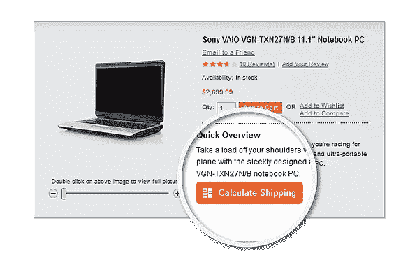
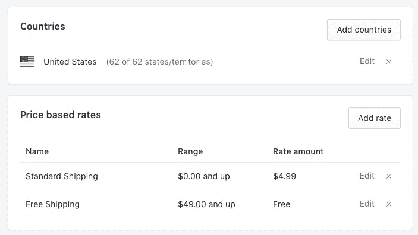
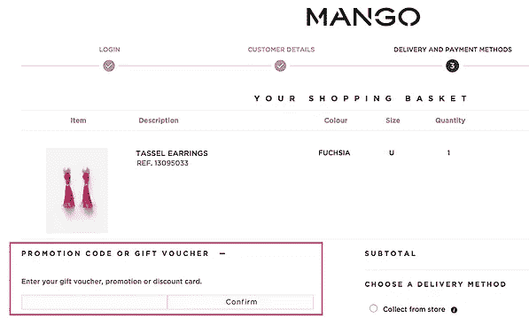
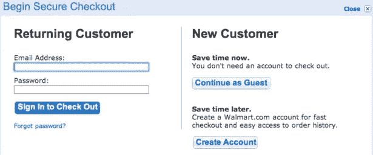
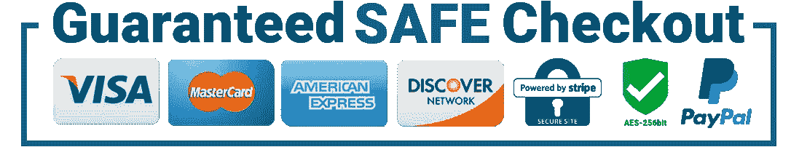
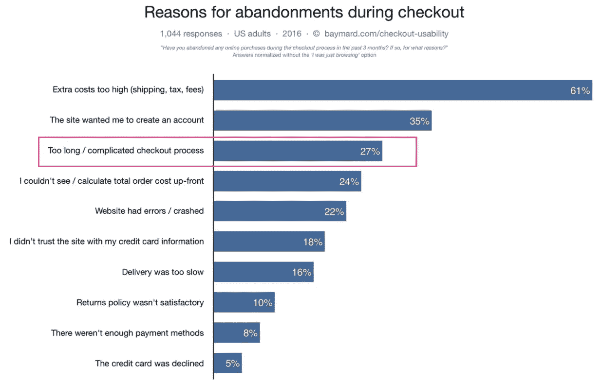

# 这是驱使你的顾客离开收银台的原因

> 原文：<https://medium.com/swlh/this-is-what-drives-your-customers-away-at-checkout-2add3a4ece2f>

从商家的角度来看，结账阶段是顾客旅程中最重要的部分，因为这是金钱易手的阶段。数据表明 70%的手推车被废弃。剩下的 30%中，有一半是在结账阶段被抛弃的。这意味着，大多数可能对你的产品感兴趣的用户，没有花一分钱就离开了。

假设你经营一家实体店。每天你都会看到人们拿起你的产品，放进他们的购物袋，走向收银台，然后他们就离开了。你会怎么做？

事实是，如果你不能有效地将流量转化为收入，你的营销资金就浪费了。

在下一节中，我们将列出一些电子商务企业最常犯的错误，这些错误会直接影响他们网站的转化率。检查你的东西，确保你远离像这样的破坏性因素。

# 成本惊喜

顾客喜欢惊喜，但不喜欢那些让他们不得不为订单支付更多钱的惊喜——他们要求透明度。一个真正恼人的因素是在结账时用意想不到的费用让顾客大吃一惊。意外的运输成本是一个反复出现的问题。

你可以在潜在买家结账前告知他们运费，这样可以避免让他们失望。

1.提供一个功能，允许用户在所有产品页面上输入他们的邮政编码，然后显示该产品的运费。

2.避免让用户在没有输入邮政编码的情况下进入购物车和付款台。在产品页面上输入邮政编码后，他们应该会看到预先填充到购物车页面中的信息。

3.为任何地方的任何人提供免费运输。如果不可行，为任何地方的任何人提供统一运费。你的重点应该是让运输对所有用户来说尽可能的简单和便宜。由 Baymard Institute 汇编的数据表明，如果不向用户提供免费送货，他们有 60%的可能放弃购买。

大多数电子商务平台都有这个选项，正如你在 Magento 看到的:

运输成本对电子商务中的任何人来说都很重要，但它们不需要成为企业的负担。将运输作为一种营销工具。一旦购物车达到一定数量，或在特殊促销期间，提供免费送货。

如果您使用的是 Shopify，您会在运输菜单中看到一个非常方便的功能:

Find this option in Settings -> Shipping -> Shipping zones

基本上，你所能做的任何事情，只要能确保用户在结账前准确知道他们需要支付多少钱，就会减少摩擦，增加透明度，改善用户体验，减少挫折感，并导致转化率的整体提高。

# 折扣代码

在结账阶段，折扣代码可能会分散顾客的注意力。想想吧。客户已经准备好完成交易的资金。那么，我们该怎么办？我们在他们面前立了一个牌子，上面写着“如果你有代码，你可以更便宜地买到它”。自然，用户现在会花一些时间研究如何获得这些优惠券代码。在最好的情况下，他们以较低的利润完成交易，但在最坏的情况下，他们会分心并完全放弃交易。

当然，我们希望拥有代码的用户能够使用它们，所以我们必须找到一个平衡点，既不能让那些客户感到沮丧，同时又不能让其他用户知道这些代码可能存在。

实现这一点的一些方法是:

1.结帐时不要有折扣代码字段。在购物车阶段限制字段。

2.减小字段的大小。

3.以一种用户可以很容易找到的方式放置字段，而没有字段的用户不会被它的存在淹没。

4.这个职位还应该实现一个不会让客户对现有代码感到困惑或沮丧的结果。

5.隐藏链接下的字段，这需要额外的步骤让用户参与。

由于显而易见的原因，这里有一条我们都必须走的细线，但是在这种情况下，肯定有办法为两组用户实现良好的结果。

# 没有客人退房

强迫用户注册一个账户增加了过程中的摩擦，最终导致一些用户放弃。第一次使用的用户可能会对注册账户感到不舒服。消费者在网上交易时重视他们的个人信息和电子邮件地址。

最终用户想要的是选择权。事实证明，为客人结账提供选项可以提高转换率，因此我们看到这一功能已经嵌入到今天的大多数结账服务中。但是，您可以询问他们的电子邮件地址，以便让他们了解订单情况，这样您就可以开展弃车活动，因为您有他们的电子邮件地址。请看这个例子，在[沃尔玛](https://www.walmart.com/):

Allow users to choose on the first step of the checkout

# 没有信任符号

一般来说，用户在交钱之前会考虑是否愿意与你的网站进行交易。在这个过程的这一点上，用户开始围绕“我信任这家公司吗？”。在这一点上，我们应该为用户提供回答这个问题的信息。实现这一点的一些方法包括:

1.如果你在你销售的国家拥有和经营，那么就说出来。消费者希望支持当地企业，但他们也愿意从那些他们可以拿起电话与之交谈，或者跳上车去拜访的人那里购买。

2.社会证明很重要。如果你使用一个独立的第三方来评论你的产品和公司，然后提供这些评论的链接。如果以前的客户已经通过一个值得信赖的第三方，如谷歌，审查了你的业务，那么潜在客户希望看到这一点。社交证明是我们作为商人所拥有的最强有力的转换工具之一，如果你有一个良好的历史，那么你应该宣传它。

3.安全套接字层证书(SSL)显示。SSL 证书向用户发出信号，表明您的站点利用标准安全技术在 web 服务器和浏览器之间建立加密链接。该链接确保在这两点之间传递的数据保持私密。

4.关于您的支付网关的信息。用户希望看到他们输入网站的所有数据都是安全的。让用户相信他们的支付信息是安全可靠的，这一点至关重要。

5.返回信息。如果你提供免费的回报，那么这样说。这给用户增加了一层信心，这样如果出了问题，他们就有了追索权。

# 漫长的结账过程

对提供尽可能无缝的结账体验的追求永无止境。亚马逊多年前就开创了这一概念，为他们的“一次点击”结账选项申请了专利，该选项基本上使登录用户只需一次点击即可结账。这种用户体验是我们都应该努力争取的。以下是我们可以做的一些事情，以减少摩擦，提高结账速度:

1.不要询问你不需要的信息。例如，如果你不打算给用户送生日礼物，或者通过强大的 CRM 策略进行客户细分，那么你为什么要问生日呢？你真的需要知道他们的爱好是什么吗？自然，数据是重要的，但是在我们要求的和我们需要的之间需要有一个平衡。

2.考虑一个单页结帐解决方案。关于单页结帐是否比多步结帐转换得更好，数据是不确定的，但是如果你是一个小企业，没有资源来广泛测试你的结帐的每个方面，那么转到单页结帐可以是一种尽可能消除摩擦的快速简单的方法。

3.让用户尽可能容易地检索他们在您的网站上的登录信息，目的是使用他们保存的信息来预填充结帐字段，并让他们尽快通过。

4.提供社交登录选项。允许用户使用贝宝、谷歌或脸书登录大大减少了结账过程，因为大多数字段都是预先填充的。

可能最全面的报告是由贝玛研究所完成的。一份摘录显示，漫长而复杂的结账过程导致了 27%的废弃——这是第三大重要原因，不容忽视。

source: Baymard Institute: [https://baymard.com/checkout-usability](https://baymard.com/checkout-usability)

# 摘要

我们都是消费者，所以最终做出提高转化率的改进应该是一个常识性的练习。下次你在网上买东西的时候，写下你在网站上遇到的挫折，然后回到你自己的网站，看看你是否也在做同样的事情。最终，我们在这里寻求的结果是:

减少摩擦

减少挫败感

提高用户体验

增加透明度

任何工作，完成上述成果的想法，将导致更高的转化率和最终更多的收入。如果您想让其他人帮您处理此事，您可以联系我们进行免费、无义务的页面评估，以了解我们如何帮助您实现业务目标。

只需发送电子邮件至 andra@ontrack.agency 或点击我们的[主页](https://www.ontrack.agency/)上的免费评估按钮，我们将在 24 小时内回复您。

## 这个故事发表在[的《创业](https://medium.com/swlh)上，259，700 多人聚集在一起阅读 Medium 关于创业的主要故事。

## 在这里订阅接收[我们的头条新闻](http://growthsupply.com/the-startup-newsletter/)。

