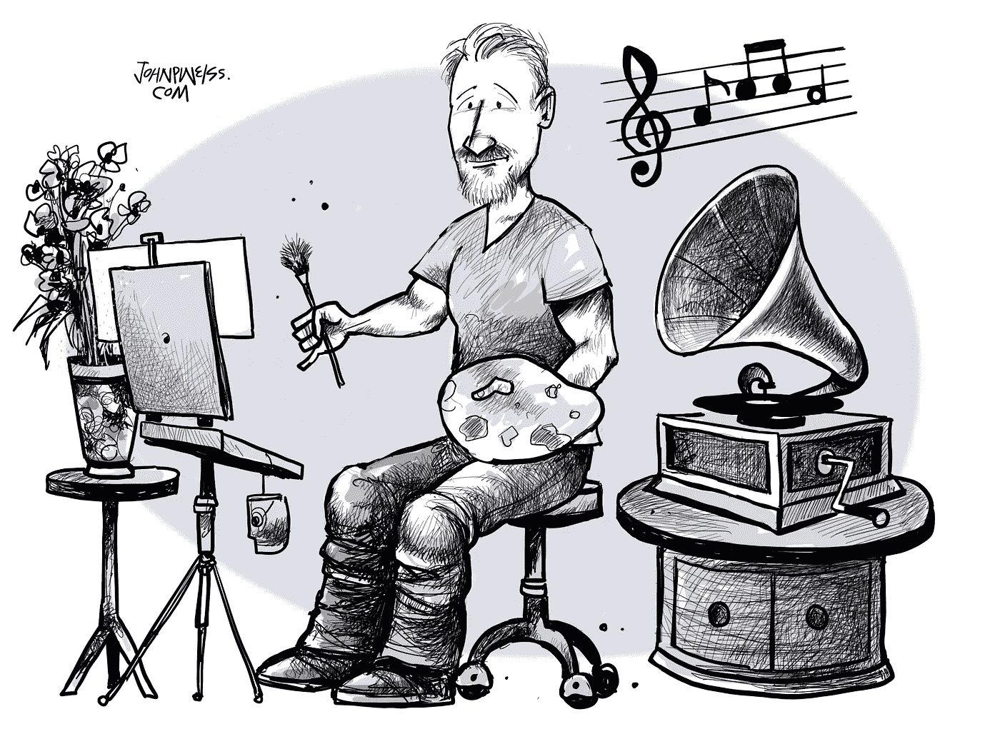
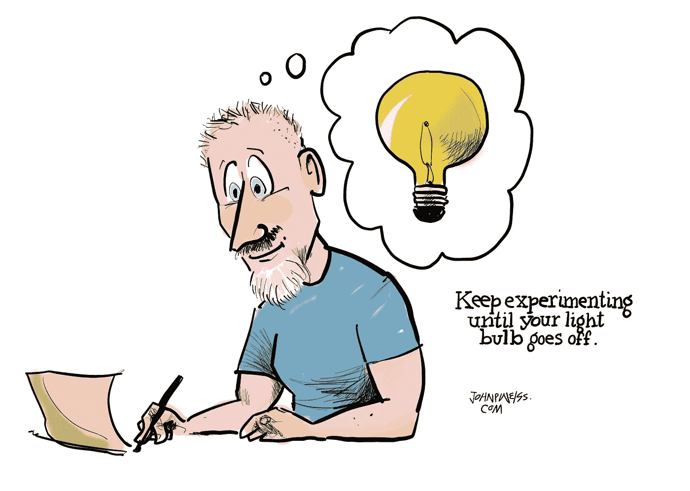

# 这是发明家可以教给我们的关于成功的知识

> 原文：<https://medium.com/swlh/this-is-what-inventors-can-teach-us-about-success-cb28132299fe>

Artwork by [John P. Weiss](https://johnpweiss.com/email-newsletter)

做你一直做的，得到你一直得到的。我们大多数人都知道自我提升包括改变。

你不能指望通过一厢情愿来减肥。你也不能继续消耗同样的卡路里，或者坚持同样的锻炼习惯。当我们改变行不通的东西时，结果就会出现。

不幸的是，通往积极变化的道路并不总是显而易见的。无论你是试图建立一个成功的企业，还是在你的创造性工作中取得突破，通往成功的道路都是难以捉摸的。

面临这种十字路口的人通常会求助于研究。他们在互联网上搜寻别人的建议、技巧和智慧。

有时候这很管用。其他时候，结果就更混乱了。谢天谢地，答案往往可以在我称之为“发明家的秘密”的东西中找到

# 一万种行不通的方法

托马斯·阿尔瓦·爱迪生出生于 1847 年 2 月 11 日，于 1931 年 10 月 18 日离开了这个世界。他生前是一位多产的发明家。

在爱迪生发明的众多设备中，有留声机、电影摄影机，以及可能是他最著名的发明——长明灯。

I don’t really have a phongraph in my studio, but it would be cool if I did.

根据维基百科，爱迪生在美国拥有大约 1093 项专利，在海外也有许多专利。

> "如果我们做了所有我们能做的事情，我们会让自己大吃一惊."托马斯·爱迪生

许多人认为托马斯·爱迪生不是灯泡的发明者。还有其他人创造了更早的灯泡，但爱迪生完善了耐用的白炽灯泡。

在发现他的碳化竹丝之前，他试验了各种不同的金属丝。他为什么如此成功？因为他展示了发明者秘密的力量。而发明者的秘密就是**实验**。

> “我没有失败。我刚刚发现了一万种行不通的方法。”—托马斯·爱迪生

# 探索一点试错法

人们害怕尝试新事物。他们谨慎行事。他们不想冒险。但你不必赌上整个农场去做一点实验。

实验让我们探索一些尝试和错误，这可以加速我们的成功和个人成长。

就拿我在第一幅漫画中画的那辆傻傻的独轮车来说吧。发明一个这样的东西需要多少实验？如果你想知道，它们确实存在。看看这个[视频。](https://www.youtube.com/watch?v=gdq4wer7vgk)

我曾经和布莱恩·加德纳(Brian Gardner)交换过电子邮件，他是一位极简主义的设计师和作家。我喜欢他简单明了的网站设计方法。布莱恩为乔舒亚·贝克尔广受欢迎的【Becomingminimalist.com】*网站设计了网站。我给布莱恩发了邮件，询问电子邮件订阅箱的最佳位置。*

*我注意到布莱恩把电子邮件订阅框放在了 Becomingminimalist.com 网站的底部。通常，博主会把他们的电子邮件注册放在页面顶部附近，以获得最大的曝光率。*

*然而，一些人认为如果人们喜欢你的内容，他们还是会注册的。布莱恩建议我试一下这一页的底部。换句话说，实验。如果不行，就把订阅箱换到别的地方。*

> *"对于任何新媒体来说，只有通过实验才能发掘其全部威力."巴斯蒂安·特龙*

# *我们很少偏离*

*布莱恩的建议让我思考了很多我们在生活中做的事情。我们容易陷入常规。首选方法和实践。只要我们的日常工作相当好，我们很少偏离。*

*然而，企业家和成功人士不断调整和尝试。他们不满足于现状。适度的实验风险最小，但投资回报可能会增加。*

**

*至于电子邮件订阅框，我做了实验，发现把我的放在网页底部效果很好。*

*也许我可以用弹出窗口和页面顶部的“你的脸”按钮吸引更多订户，但那不是我。通过实验，我发现我可以采用一种极简主义的方法，并且仍然吸引新的订户。*

*从那以后，我在生活的许多方面都采用了这个发明家的秘密。如果有什么不行，我就试验一下。修改。改变了一切。*

# *我们不能忘记我们的独特性*

*这个原则可以在我们生活的许多领域发挥作用。调整你的饮食，看看情况如何。如果你长胖了，那就改变它。尝试通过早起来提高生产率。如果你看到进步，那太好了。如果你不能保持清醒，那就换成晚上晚些时候。*

*无论你是一个试图扩大业务的企业家，还是一家受欢迎的餐馆的厨师，或者是一个试图扩大读者群的作家，定期的实验可能会发现新的机会和成功的方法。*

*我认识一个博客作者，他在写作上取得了一定的成功，但是当他尝试了视频和 YouTube 之后，他的故事讲述才真正开始。*

*有一个警告。对一个人有效的不一定对另一个人有效。尽管我们寻求建议和方向，但我们不能忘记自己的独特性。*

*仅仅因为一个博主从写作转向在 YouTube 上获得更大的成功，并不意味着我们也会如此。我们每个人都有不同的才能。但是，为了找出对我们有用的成功公式，我们需要进行实验。*

*为此，请记住发明者的秘密。不要只是站在那里什么也不做。拥抱生活中的一点点尝试。你可能会发现一种新的方法，将你的工作和梦想带到新的成功水平。*

# *在你走之前*

**

*我是约翰·p·维斯，优秀的艺术家和作家。点击这里 进入我的免费邮件列表 [**获取最新的艺术作品和作品。**](https://johnpweiss.com/email-newsletter)*

**

## *这篇文章发表在[《创业](https://medium.com/swlh)》上，这是 Medium 最大的创业刊物，有+369，201 人关注。*

## *在这里订阅接收[我们的头条新闻](http://growthsupply.com/the-startup-newsletter/)。*

**