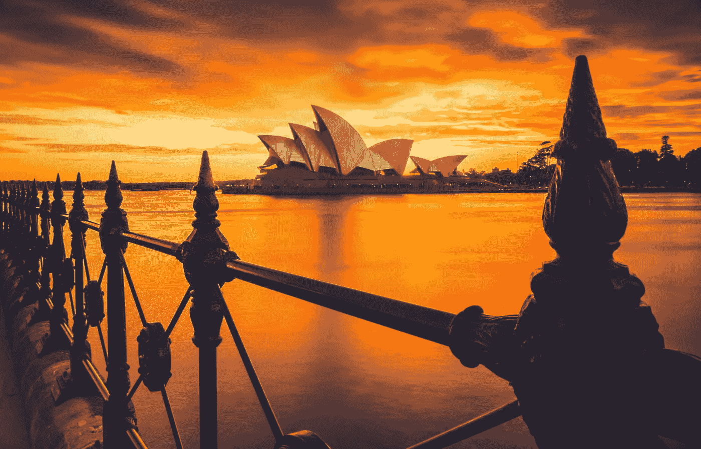
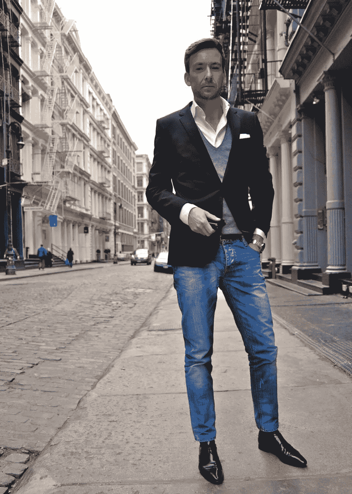
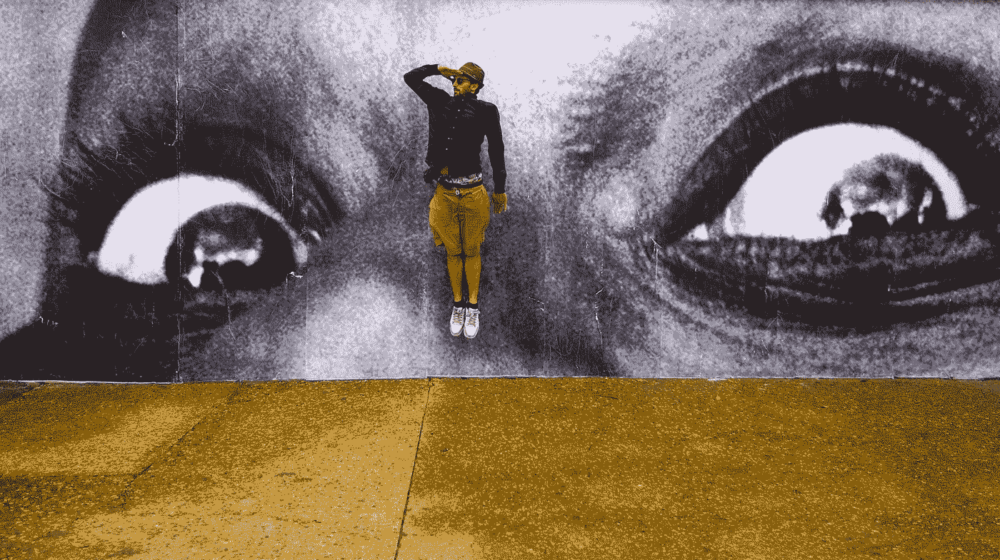

# 这就是在澳大利亚工作的感觉。

> 原文：<https://medium.com/swlh/this-is-what-its-like-to-work-in-australia-5d424719fee>

Image Credit: Unsplash/[Liam Pozz](http://Liam Pozz)

显然，我们是“幸运的国家”

显然，墨尔本(我居住的地方)是最适宜居住的城市之一。

显然，澳大利亚是悠闲和容易相处的。

让我告诉你除了你可能在有大堡礁图片的旅游手册上读到的以外，它真正的样子。

<<>>>

我在澳大利亚的墨尔本长大。与我的许多高中朋友不同，我一直在澳大利亚工作。原因主要是我几年前克服了对飞行的恐惧。

我总是想象世界科技中心——旧金山——是一个制造梦想的地方。很多年来，我都相信像苹果和亚马逊这样令人惊叹的企业永远不会在澳大利亚诞生。

> “我被骗了，相信了网上关于这山望着那山高的宣传。直到我去了旧金山”

我几乎马上意识到一些事情——这和澳大利亚没什么不同。硅谷感觉就像墨尔本的一个叫格伦韦弗利的郊区。

创业公司的创始人都不带宾利上班。

脸书办公室的内部并不全是午睡室、免费食物和全天候派对。事实上，Facebooks 的办公室和我工作的地方很相似。它有白板，张贴笔记，会议和苹果电脑。

## 那么在澳洲工作是什么感觉呢？你就是这么想的。好吧，让我告诉你。

我的一天从早上 5 点左右起床，喝一升水开始。然后，我登录电脑，力争在 90 分钟内完成两篇 LinkedIn 帖子。与此同时(由于时间不够)，我也在吃我的鸡蛋、蔬菜和泡菜早餐(为了肠道健康——我对果糖不耐受)。

然后，我准备好去上班，穿上有领衬衫、牛仔裤和棕色皮鞋，背上 Herschel 背包，走向火车站。

我过去常穿西装，但澳大利亚的气候可能相当热，西装和领带并不舒服。

> 除此之外，在过去的三年里，人们不再穿西装了。商界选择了西装外套、一条漂亮的牛仔裤、正装鞋和衬衫。

Image Credit: GQ

> “在澳大利亚，我们认为西装很装腔作势，不打领带也能看起来很专业。我们还了解到，许多穿西装的人觉得他们必须证明些什么，这不利于我们的文化。”

在去火车站的路上，我听着蒂姆·费里斯的播客。和其他国家一样，澳大利亚人也喜欢生产力。我们喜欢学习和通勤，就像世界上其他地方一样。

Tim Ferriss 在澳大利亚是一个受欢迎的播客，因为他专注于教学，而不是自我推销，广告和谈论他有多好。

当我到达办公室，我插上我的笔记本电脑然后开始工作。通常，这看起来像是试图解决许多问题，并优先考虑对客户影响最大的问题。通过即时通讯软件、电子邮件、电话和面对面的会议来解决问题。

我们有技术故障、激烈的竞争、员工问题和客户投诉。我们尽了最大努力，但有时事情会出错——这就是我们常说的商业。

澳大利亚的商业就像美国或任何其他国家一样——我们试图解决有趣的问题。许多国际人士认为，美国澳大利亚人只是每天坐在吊床上，大声喊着“朋友，你好。”

Image Credit: [Enonation](http://www.enonation.com.au/)

虽然我们经常说“伴侣”,但我们也有经济需要增长，人民需要养活。

中午 12 点左右，每个人都聚集到最近的餐馆。到下午 1 点，你在任何地方都找不到桌子。没错；我们不仅仅是内地。我们也有巨大的、人口密集的城市，它们的交通流量很大。

最受欢迎的餐馆是那些提供健康食品的餐馆。现在，这意味着两个词:戳碗…..好吃！！！

到处都有纯素、pescatarian、素食和无麸质的选择。基于你现在的饮食，你可以做出相应的选择。间歇性禁食在澳大利亚也是一件大事，所以你通常会看到很少有人在外面吃早餐。

吃完午饭，该回去工作了。对我来说，这意味着有很多国际游客(尤其是来自旧金山的)，而且几乎可以算是一名导游。我的工作(比如这篇文章)是帮助人们了解澳大利亚是什么样的，以及墨尔本的商业是如何运作的。

> 我试图说明的一点是，澳大利亚与世界上任何其他地方都没有什么不同。我的观点是:我们所有的问题都是一样的。

我们无家可归。
我们有暴力(只是没有枪)。我们有毒品问题。
我们有冗余、破产的公司和数字颠覆。

世界所看到的澳大利亚并不是真实的反映。媒体在隐藏真相方面做得很好:澳大利亚人是真正的好人，他们和其他人有着同样的问题。

我们尽我们所能做到最好。

在回家的路上，我赶火车，因为交通太拥挤了，哪里都开不动。我环顾四周，每个人都在低头看手机。一些人在看网飞，一些人在看新闻，许多人在给他们所爱的人发信息。

下班后通常是忙碌时间或健身时间。澳大利亚人是一群活跃的人，尽管由于西方饮食，我们仍然面临许多健康挑战。

不要以为我们带着漂亮的屁股和六块腹肌到处走。我们也有赘肉，而且很多！

晚上的早些时候是留给家人的。这是我们喜欢打电话给对方，询问对方一天的情况。我们也抱怨我们的老板和低劣的客户！当我回到家，我做的第一件事就是问我的女朋友她今天过得怎么样。作为一名工程师，她处理非常复杂的问题，这些问题似乎比我在一个简单的销售环境中所面临的挑战要奢侈得多。

晚饭后，是时候写作了。我什么都写，什么都写。我也寻找美丽的艺术品，我可以在这样的文章中突出。澳大利亚人也很有创造力。我们热爱艺术。艺术通常存在于社交媒体上，我们中的绝大多数人都有装有脸书、Instagram 和 LinkedIn 等典型应用的手机。

Image Credit: [JR](https://www.instagram.com/jr/?hl=en)

然后是睡觉的时间了。我通常喜欢喝一些苹果醋和生蜂蜜来帮助我入睡。玩 15 分钟的俄罗斯方块也有助于我忘记每天的挑战。

接下来是小睡八小时的时间，是醒来重新开始的时候了。

# 是一样的…

我刚才描述的和你住的地方有什么不同吗？澳大利亚人真的像你想象的那样无忧无虑、与众不同吗？

我分享我典型的一天的观点是，这是一样的。作为人类，我们面临着相似的挑战，处理着相同的职业斗争。我们都在寻找意义，发现我们生活的目的。

我们有时都会感到愤怒、恐惧和沮丧。很正常。

草永远不会更绿。在澳大利亚工作和在旧金山这样的地方工作一样具有挑战性。

# 行动呼吁

如果你想提高你的工作效率，学习一些有价值的生活窍门，那就订阅我的私人邮件列表吧。你还将获得我的免费电子书，它将帮助你成为改变游戏规则的在线影响者。

[**点击这里马上订阅！**](http://timdenning.net/free-ebook)

## 这篇文章发表在 [The Startup](https://medium.com/swlh) 上，这是 Medium 最大的创业刊物，有 355，974+人关注。

## 在这里订阅接收[我们的头条新闻](http://growthsupply.com/the-startup-newsletter/)。

