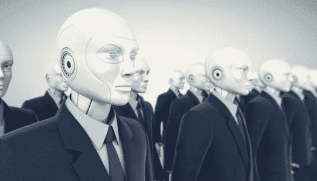

# 这是 2050 年的创业公司的样子

> 原文：<https://medium.com/swlh/this-is-what-the-startup-of-the-year-2050-looks-like-11074921decf>

你知道未来 50 年什么样的大趋势会彻底改变世界吗？惠普首席技术官谢恩·沃尔(Shane Wall)知道，他的工作是让惠普在整个 21 世纪保持活力。他最近在伦敦经济学院的一次活动中分享了他的预测。

让我们利用这些大趋势，看看你对 2050 年有什么看法。你准备好进入时光机，与尼日利亚最炙手可热的新锐企业家 Olesugun 见面了吗？

—

**2050 年 1 月 10 日**
上午 8 点。Olesugun 来到位于阿布贾中央商务区布哈里大厦 91 层的办公桌前。他很快吃完了早餐，一杯星巴克的维他命蛋白拿铁。

然后直接上班。这位年轻的企业家在尼日利亚开发了一个流行的全息约会平台，并希望**在 AMEE(非洲、中东和欧洲)推广开来**。打开市场，他就有机会在东亚自由贸易区取得成功。

他今天的第一个会议是与一家营销机构的会议，他们分享了他们对推广产品的建议:
“你应该利用我们的一系列**超高效机器人影响者**。这些机器人拥有增强的情感和文化智能，使它们非常适合与老龄化的千禧一代和‘轻浮的’21 世纪 30 年代的人打交道。”
Olesugun 印象深刻。他同意该机构的提议，并指示他的 Siri-PA 开始起草一份智能合同。

他单子上的下一项是融资计划。Olesugun 戴上他的虚拟现实护目镜，与他在印度尼西亚的首席区块链官(CBO) Abdul 会面。
“阿卜杜勒，我们如何为 AMEE 的扩张融资？cryptoseries A 的认购率相对较低，在二级市场上的交易也不太好。”
“嗯，我已经设计了一个 **cryptoseries B，它将完成这个任务**！股息可以用比特币、免费全息约会档案或 MarsTravel 彩票支付。缺乏这些多用途股票，因此它们将吸引广泛的投资者。”
Olesugun 同意新融资的测试版，将在现有股东的封闭环境中进行测试。

他摘下眼镜，决定调查自己平台的安全性:
“加载网络防御报告”
Siri-PA 开始翻腾。“网络防御报告，第 239 天。昨天我们有 54 个假约会全息图的例子，其中 35 个是军事独裁者，19 个是美国下一届顶级程序员的参赛者。都被移除了。有 98 起试图窃取个人资料数据的事件，其中 80 起是与健康相关的 DNA 数据。其中 5 例获得成功。然而**我们的自身免疫编码策略得到了加强**，我们预计未来成功盗窃的可能性会降低 5%

“那还不够好！”奥卢苏贡愤怒地喊道。他知道在《阿布贾时报》上公布这一数据盗窃事件可能会严重损害他公司的品牌。

幸运的是， **Siri-PA 检测到了求救信号**的存在。它跳出来救援，打开舒缓的软摇滚音乐，重复积极的肯定。“我是我命运的主人，我正躺在热带海滩上，很放松。”
奥卢苏贡平静下来。

他决定查看他的南非品牌大使的招聘流程。然而，他的人力资本经理阿玛勒联系不上——他得到了一个虚拟现实之外的回复。

他想，不用担心。已经上午 10 点了，无论如何他该离开办公室了。Siri-PA 被重置为自动驾驶模式，Olesugun 向高尔夫球场飞去。

—

回到 2018……**你发现了哪些大趋势？**

1-大规模城市化

2-新兴市场的崛起
- 97%的增长将由新兴市场推动
-将近一半的财富 500 强将来自新兴市场

3 区块链革命
-金融服务
-合同起草

4-自动化劳动力

5-具有同理心的人工智能

6-赛博系统开发自己的自动免疫系统

—

*喜欢这篇文章吗？跟我上*[*DrKrebbers.com*](http://www.drkrebbers.com)*&*[*推特*](https://twitter.com/arthurkrebbers?lang=en)

## 这篇文章发表在[的《创业》(The Startup](https://medium.com/swlh) )上，这是 Medium 最大的创业刊物，有 307，492+人关注。

## 在这里订阅接收[我们的头条新闻](http://growthsupply.com/the-startup-newsletter/)。

