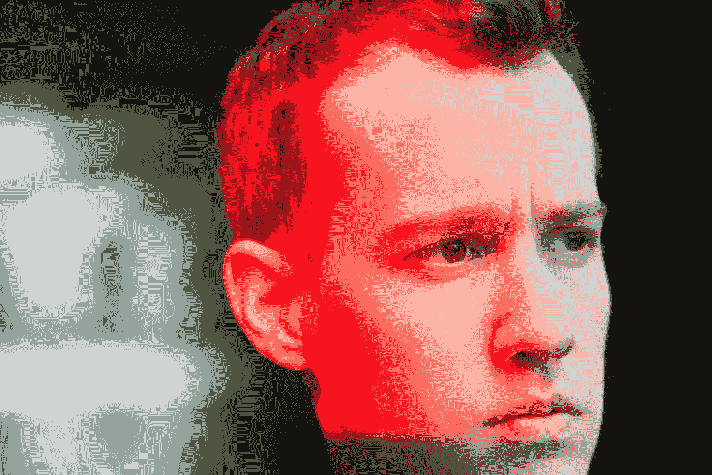

# 这就是我早上起床的原因

> 原文：<https://medium.com/swlh/this-is-why-i-get-up-in-the-morning-f648a9ec6e67>

## 一封开诚布公的信

**Read or Watch? Maybe both?**
You can now also find my content on my Youtube channel — [**SIGN OF LIFE**](https://www.youtube.com/channel/UC4211nC0IOB0FS6eGWM7x7g)

我相信我们都能从彼此身上学到难以置信的经验。不论年龄、性别、种族或宗教，这个星球上的每个人都是独一无二的。如果我们选择这样做，每个人都可以给我们上宝贵的一课，让我们终生受益。
这是我在自己的生活中遵循的原则。

当我完全意识到时，我们称之为“此刻”，我可以清楚地看到与我交往的任何人身上所有不同的品质。他们的个性，他们的生活经历——都讲述了一个特别的故事。我觉得不可思议的是**每个人的故事都与众不同。**

从每个单独的故事中至少可以吸取一个教训。我利用这些课程中的大部分来提高自己。成为更好版本的自己**。一些教训帮助我变成了一个更有同情心的人。一些人教会了我重要的生活技能。其他的教训教会了我如何不守规矩。**

# 我想在三十岁之前做 X

这是人们常说的话。有成千上万的文章和视频都是关于你应该在 30 岁之前完成的事情。这里还有一个重要的教训。**年龄只不过是我们发明的一种粗略的测量方法**。打到三十(或者二十，五十，六十四)其实没啥意思。只是我们创造了它的象征意义，使它显得如此重要。但事实上，并不是每个人都在完全相同的年龄经历相同的生理变化。这就是为什么年龄只是一个粗略的测量。然而，我们仍然感受到社会的压力，要求我们在 X 岁之前做或拥有某些东西。更重要的是，我们以此为生。

直到几年前，我还以为我想在 30 岁的时候要孩子。我也想在那之前买栋房子。现在，在我三十岁之前，我唯一想做的事情就是变得更聪明。但事实是，我也希望在我 29 岁 11 个月零 30 天之前变得更聪明。见鬼，我希望在明天到来之前变得更聪明。你知道吗？我相信我会的。因为我学到的每一课都让我变得更聪明。

# 我们都应该得到满足

令人惊奇的是，我们都是同一个物种、同一个家庭的一部分，然而我们之间却有着令人难以置信的多样性。我们都有故事要讲。要传承的一课。没有一个人是毫无价值的。这就是为什么我对人如此热情。

从我记事起，我就有这种感觉。我与人之间的这种特殊纽带是我不认为理所当然的。事实上，我称之为[我的超能力](/swlh/this-is-how-i-discovered-my-superpower-b2f1a67fb100)。
不管你怎么称呼它——一种意义、一种激情甚至是一种召唤——我都有一种在更深层次上与人交流的冲动。向他们学习，帮助他们更多地了解自己。我们都有能力提高，我们都渴望得到满足。

而这也是我当初加入 [Medium](/@saaroron) 的原因。我想找一个人们积极参与生活讨论的地方。一个人们分享他们独特故事的地方。一个人们乐于学习和提高的地方。一个社区。
因为这个原因，我最近开了一个 Youtube 频道， [**【生命迹象】**](https://www.youtube.com/channel/UC4211nC0IOB0FS6eGWM7x7g) 。我现在发布新文章和新视频，以便让那些喜欢看而不喜欢读的人更容易看到我的内容。

# **我有一个明确的任务**

我在媒体和 Youtube 上创建我的内容，心中只有一个使命:**帮助你开始或继续你的自我实现之旅。** 毫无疑问，这个星球上的每个人内心都有一种被满足的渴望。问题是，我们根本没有足够的工具来帮助我们走上这条道路。这就是为什么我尽我所能去接触更多的人。

但仅此还不够。向一个在深海中溺水的人挥手是没有用的。
为了完成我的使命，我必须致力于寻找帮助人们的最佳方式。这是我任务中最困难的部分。这不仅仅是派遣一艘救援船，而是教溺水的人如何漂浮。

有一件重要的事情我一直牢记在心:我的故事是我的。即使别人采取了和我一样的行动，也不能保证同样的结果。因此，对于我创作的每一篇文章和视频，我都专注于任何人都可以以不同方式利用的指导方针和原则。

# 生命的循环

我可以通过帮助别人实现自己来实现自己。这是我对自己了解的最美好的事情之一。帮助你进步并找到满足感是我自我实现之旅的一大部分。这就是我的生活圈。就是这种美好的同步。

## 我在这里支持你。

如果你觉得生活中有什么事情不顺心，如果你感到停滞不前、困惑或疲惫不堪——我会在这里等你。如果你觉得生活空虚，如果你过着平庸的生活，想要做出改变，我会在这里等你。你可以在 Medium 或者 Youtube 上发表评论。你可以[在](https://twitter.com/saaroron)[脸书](https://www.facebook.com/signoflifeSOL/)上给我发推文或私信。我很想听听你的故事，并帮助你完成独特的实现之旅。我是真心的。

最后，我要感谢你陪我走过这段旅程。没有你我做不到，这不是老生常谈。我保证我会继续创作内容来帮助你和我。
让我们一起不断成长进步。

你真诚的，
萨尔

## 敬请关注:

 [## 生命的迹象——Youtube

### 生命的迹象是一个由萨尔奥龙创立的频道，其唯一的使命是:创造高质量的视频来帮助你开始或继续…

www.youtube.com](https://www.youtube.com/channel/UC4211nC0IOB0FS6eGWM7x7g)  [## 萨尔·oron⁦⁦👈-中等

### 阅读萨尔·oron⁦⁦的作品👈在介质上。创建内容的唯一使命是:帮助你开始或继续你的…

medium.com](/@saaroron) 

## 这篇文章发表在 [The Startup](https://medium.com/swlh) 上，这是 Medium 最大的创业刊物，拥有+403，714 名读者。

## 在此订阅接收[我们的头条新闻](http://growthsupply.com/the-startup-newsletter/)。

