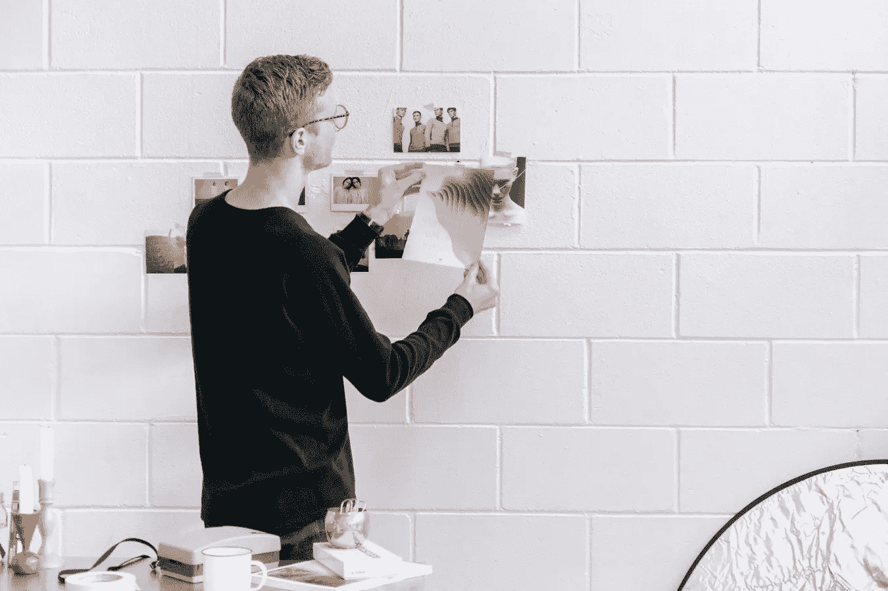

# 这就是为什么你需要重新包装你的生活

> 原文：<https://medium.com/swlh/this-is-why-you-need-to-repack-your-life-cebf43281a03>

[https://unsplash.com/photos/FIM--j1B_Rc](https://unsplash.com/photos/FIM--j1B_Rc)

我高中的时候经常听父母的话。但是当我在大学的时候，我开始偏离他们关于生活的想法和标准。

这并不是因为我不再尊重他们，而是因为我在成长，学到了他们在我这个年龄可能无法经历的东西。

你看，不是所有的时间你都需要听你父母的。有时候你得做你该做的，为自己着想。这就是你在生活中成长和学习的方式。

在大学期间，我在头脑中剥了很多皮——价值观、思想、教义等等。我重视父母的教导，但随着时间的推移，我需要以某种方式说再见。

不是他们所有的教导都会留在我的生命中。当然，有一些关于尊重别人的意见和始终保持诚实的教导，我会一直坚持，但其他的教导在这一代已经不起作用了。

我开始重新包装我的生活——缓慢而坚定。

我开始小心翼翼地挑选包里我想看的东西。

我开始停下来，看看，把那些试图阻止我或者让我的旅程如此沉重和疲惫的东西放在一边。

我慢慢和我生命中有毒的人断绝了联系，也许我也是他们生命中有毒的人。

我停用了我认识的大多数人都在关注的脸书账户。我有一个不同的名字为我的脸书粉丝页备份帐户，有令人惊讶的 5200+以下。

我不再喜欢 Instagram 上的每一张图片。我一周只用一次 Instagram，或者有时候要过两周才能再用一次。越来越擅长了。

我在推特上没有关注太多不停抱怨自己生活的人。太不鼓舞人心了。

我做了我自己的#OurSharedShelf，把我不再为了消遣而阅读的书或者已经在我的书架上积了几个月灰尘的书放在那里。六个月前，当我还在上大学的时候，我几乎把所有这些书都丢在了公园、停车场和校园里。我不是艾玛·沃特森，但我太爱她了，我想以自己的方式支持她。我也非常重视阅读，这也是我这么做的原因。

去年 3 月，我向慈善机构(主要是儿童之家)捐赠了一些衣服，并在我过去常去的教堂捐赠了毛绒玩具，我打算在年底或明年初再次捐赠给我最好的朋友将在她学校为她的项目做的慈善机构。所有的衣服、玩具、教材都将送到我们城市外的某所学校。

我不再对任何事情都说“是”。

我学会了对我不支持的事情说“不”。我只在午餐和晚餐时看电视，了解关于我的国家和世界的最新消息。

我学会了珍惜金钱，培养了与父母和其他亲戚的关系。

在过去的 11 个月里，我的大部分食物是蔬菜和鱼。天啊，我喜欢鱼。我不经常吃肉，因为它太不健康了，我太喜欢农场动物了，看到它们乞求怜悯，只是吃肉来增加体重，然后在早上锻炼时又减掉，我很难过。说真的吗？！！！我不评价肉食者，但是拜托。让我们善待动物。我知道他们有美味的肉，但吃他们的肉就像吃你自己的肉(身体)。

但更重要的是，我剥离了一些不再为我工作的部分。

你只是不需要在身体上或情感上重新包装你的生活，你还需要重新包装你的精神和心灵生活。

我和我的宗教决裂了，因为它不再让我感觉正确。我变得对别人如此苛刻，并因此而憎恨自己。尽管如此，我仍然相信和信任上帝。我可能会因为这一承认而受到审判，但我不再有责任对任何人的问题做出解释。

每天，我总是确保我的价值观/言语和行为相互关联。我确信这一点，因为我想激励人们，你可以做到言行一致。我重视正直。

现在，真正的问题是为什么你需要重新包装你的生活。

你需要重新包装你的生活，因为如果你仍然坚持旧的生锈的你，你怎么能指望宇宙给你新的好东西进入你的生活。

我一直相信生活应该充满所有你需要的东西，远离所有你不需要的东西。

重新包装你的生活就是让你的眼睛以新的视角看待事物。

重新包装你的生活就是重塑你的身心，让你更好地适应新环境，忍受日常生活中意想不到的艰难处境。

重新包装你的生活就是让新的变化发生，让好的习惯形成。

如果你想更好地重新包装你的生活，问问你自己这个问题:**我为什么带着这个？**

如果你知道答案，决定是让它永远离开还是让它一直跟着你。

放手很难。

重新包装你的生活也不容易。

但是如果你是*决定*在生活中变得更好，放弃不再为你服务的东西会很容易，重新包装你的生活会很有趣。

重新包装你的生活不会只发生一次。这是一种日常仪式。你应该继续关注你的生活。重新包装应该是一种习惯。

今晚不会如此突然地改变你。但今晚或此时此刻，你可以决定变得更好。

# 缓慢但坚定。

永远不要忘记你很棒。你能做到的。你是唯一能改变你生活的人。

## 这个故事发表在 [The Startup](https://medium.com/swlh) 上，这是 Medium 最大的企业家出版物，拥有 271，476+人。

## 在这里订阅接收[我们的头条新闻](http://growthsupply.com/the-startup-newsletter/)。

