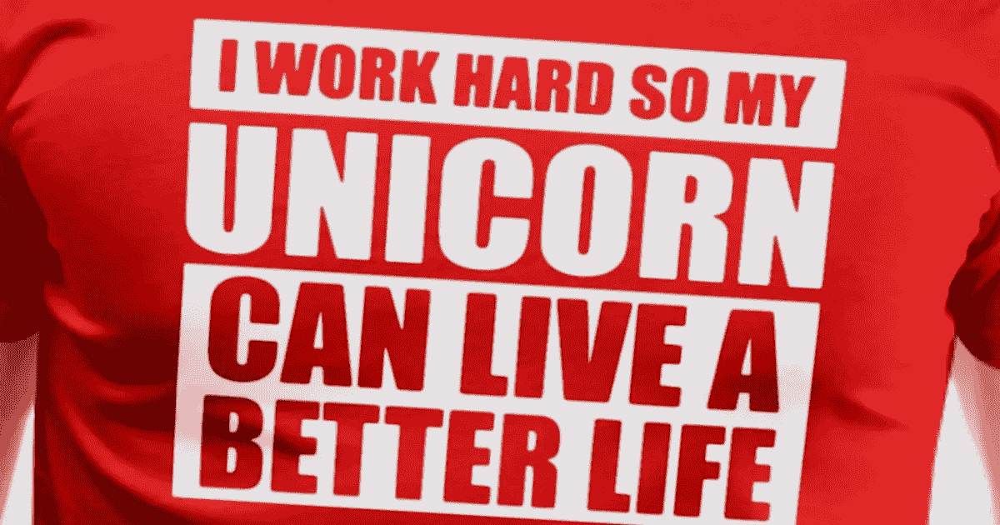

# 这就是为什么你需要开始侧推(以及一些你不应该这样做的理由)

> 原文：<https://medium.com/swlh/this-is-why-you-need-to-start-a-side-hustle-and-a-few-reasons-why-you-shouldnt-42b008de210e>

副业风靡一时。他们让你有能力在你的主要职业之内或之外赚钱，并以新的方式扩展你的经验。此外，许多机会允许你在家工作，这意味着你不必去办公室报到就能开始工作。

但是，旁门左道并不总是充满奇迹和机遇的雄伟独角兽。它们也需要大量的工作，就像[创办一家公司](https://www.inc.com/larry-kim/people-who-start-companies-are-crazy.html)，需要大量的时间来起步和维持。

如果你正在考虑投身于边缘行业，以下是你需要知道的。

# 通过副业拓展你的视野

在几乎每个人职业生涯的某个时刻，你最终会从事一份没有充分发挥你技能的工作。也许你是一名软件开发人员，为一家公司的下属工作，这家公司对拥抱最新技术不感兴趣，或者想扩展到一种[新编程语言](https://www.inc.com/larry-kim/10-most-popular-programming-languages-today.html)。也许你是一个经验丰富的专业人士，想在你的领域尝试内容创作，让你成为思想领袖。

不管具体情况如何，旁门左道让你有机会在一个新的领域深入工作，这对那些不一定想放弃现有工作安排的专业人士来说非常有吸引力。

通常，你可以挑选你接的活，所以比起日常工作，你对自己的工作方向有更多的控制权。此外，作为职业发展的一种方式，它可以提供比付费课程更多的价值，因为这些场景并不总是基于现实世界，它们会花费你一大笔钱。

如果你想增长自己的技能，并因此获得报酬，兼职或许适合你。

# 扩大你的关系网

你在兼职时建立的任何联系都会给你一个扩展人脉的机会。你将与代表他们公司的一系列专业人士进行讨论，如果你达到或超过他们的期望，你可能会指望他们成为你的联系人。

既然如此多的工作(传统的和面向演出的)可以通过口碑找到，强大的职业网络是必不可少的。侧挤可以是一个很好的工具，让你在未来几年获得更多的机会。

# 让你的职业多样化

几乎每个人都听说过为什么分散投资是最好的，这样可以确保，如果一件事失败了，你不会失去一切。

开始一个副业可以起到类似的作用，让你有能力使你的职业多样化，并建立一个安全网。

不管你的工作有多出色，或者你的雇主看起来有多了不起，事情总会出错(我们都记得安然公司发生的事情，对吗？).通过开始兼职，你可以在某种程度上保护自己免受突然失业或其他与职业相关的灾难。

虽然在极端情况下，一份兼职工作可能不会取代你所有的收入(尽管它当然可以，如果那是你的目标)，但有一些钱进来通常比没有钱好得多。

# 为你的侧推获得报酬

从本质上来说，副业包括用你的技能来换取现金。这意味着你可以在做一些让你兴奋的事情的同时补充你的收入。

已经有很多平台可以将专业人士与 Gigster、Upwork 和 WriterAccess 联系起来。有些是难以置信的利基，而其他人支持大型网络公司寻找个人来完成特定的任务。

作为奖励，许多平台协调房子的付款方，所以你不必担心发票或信用卡处理等任务。

现在，你当然可以自己协调事情，但你可能需要做一些投资才能开始。例如，如果你没有发票和付款跟踪软件，那么你可能需要在你第一次演出前支付一些资金。幸运的是，有很多选择，有些，比如 [QuickBooks](https://www.inc.com/larry-kim/want-to-learn-quickbooks-for-free-these-11-places-.html) ，甚至可以在网上免费学习。

# 每个人都应该有一个侧推吗？

虽然旁门左道对许多人来说代表了一个特殊的机会，但这并不意味着它对每个人都是正确的。

首先也是最重要的是，保持一个团队的活跃是一项艰巨的工作。完成你承担的任何任务都需要时间、精力和其他资源，所以不要低估这一部分。

另外，你需要确保次要的工作不会影响你的主要工作。当你在为你的雇主工作时，他们值得你在轮班期间全力关注(毕竟，这是他们付钱给你的目的)。如果旁敲侧击会分散你对义务的注意力，迫使你谨慎地尝试多任务处理以跟上进度，最好对加入零工经济说不。

同样，如果你目前的职位要求已经非常高了，而且你经常感觉到压力很大，那么在你的盘子里增加一些其他的东西并不是明智之举。虽然副业需要努力，但它不应该仅仅代表你生活中的另一个压力源。如果比你已经做的更多的工作(即使任务激起了你的兴趣)会让你尖叫着求饶，慢慢后退，只有当你处于更好的位置来管理工作量增加时才重新考虑这个想法。

你可能还需要考虑是否有与你现在(或以前，取决于时间的长短)的雇主不竞争的人。在某些情况下，你被禁止在特定时间内为他人从事特定类型的工作，违反竞业禁止会带来严重后果。

最终，副业代表着巨大的机会，但是在你接手之前，你必须确保它们适合你的生活。但是，如果你能投身于零工经济，这当然值得探索。

最初发表于 Inc.com 的