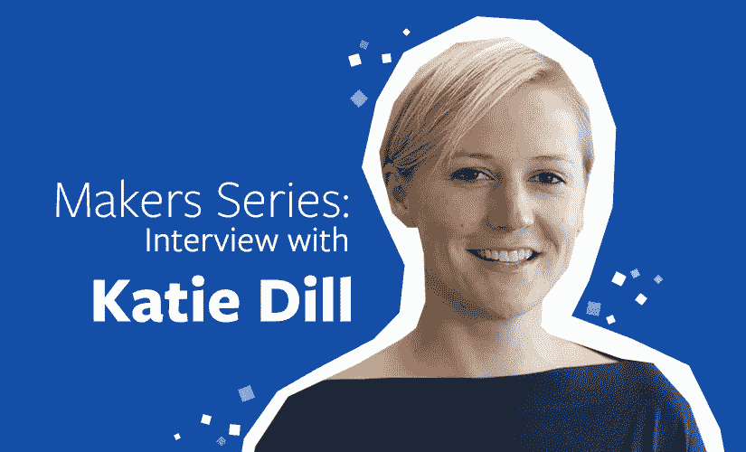
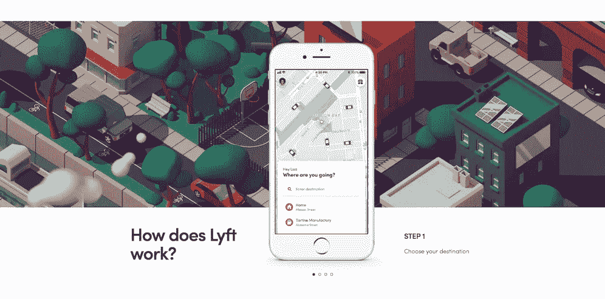
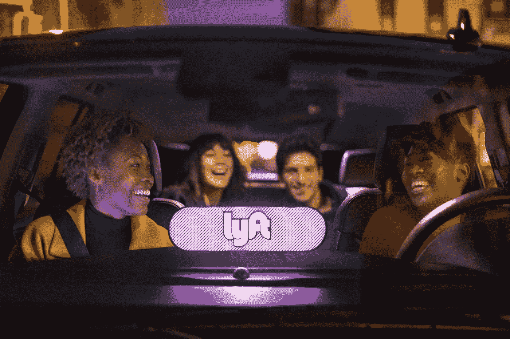
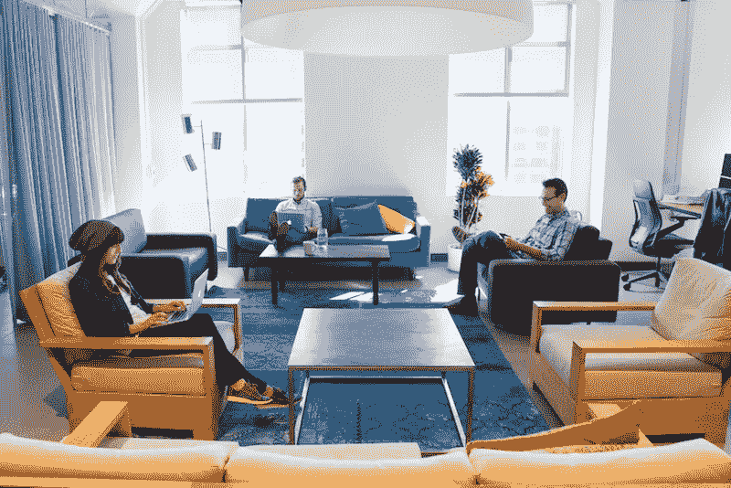
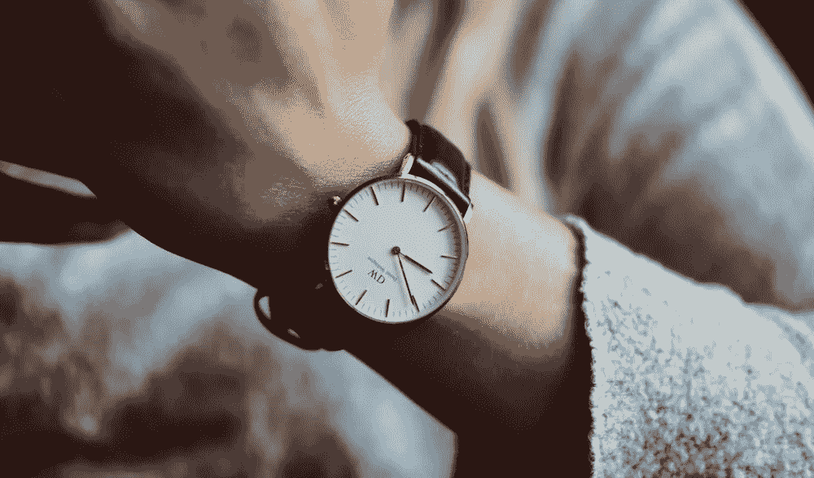

# 这就是为什么你应该设计你的过程

> 原文：<https://medium.com/swlh/this-is-why-you-should-design-your-process-b32b4c867f28>

## Lyft 的设计副总裁 Katie Dill 分享了她如何定义流程、领导和激励。

作为一名设计师并不局限于艺术工作——任何时候我们有目的地创造，我们都在设计。

当谈到经营一个成功的企业时，设计通常不是人们首先想到的。但实际上，它在组织活动中扮演着重要的角色，比如打造团队、创建流程和解决问题。

我们采访了 Lyft 的设计副总裁 Katie Dill，她分享了公司如何利用设计取得成功，获得灵感的技巧，克服障碍的想法等等。

# 凯蒂，这一切是从哪里开始的？

我在纽约长大并上学。在那个时候，产品设计不是任何人谈论的话题——它几乎只是室内设计或时装设计。

我大学毕业后搬到了波士顿。我认为我想成为一名建筑师，并试图找出如何进入这一领域。我的一个朋友想出了制作这个购物车视频的主意，我知道这个视频在设计界已经有点名气了。我看了，爱上了这个产品设计的创意。

我开始打电话给产品设计师了解更多，并意识到这是一份梦想的工作。事实上，我申请了一所令我神魂颠倒的学校——艺术中心设计学院。令人惊讶的是他们让我进来了——我不会画画。我学的是工业设计，它改变了我的生活。

# 你目前在 Lyft 的设计角色是什么样的？

我领导一个多功能设计团队。我们的设计组织由四个功能组成:设计、研究、运营和写作。团队中的大多数设计师既做交互又做视觉设计，并且端对端地拥有他们的工作。此外，我们还拥有一批优秀的系统设计师、插画师、3D 设计师和动画师。我们的研究团队比任何人都了解我们的社区，并帮助确保我们的产品能够满足他们的最大需求。运营团队，包括设计制作人，帮助组织工作。作者确保我们的产品传达清晰有效。

Example of Lyft App

# Lyft 如何成为一家专注于设计的公司？

Lyft 是由相信用户体验是伟大企业的关键部分的个人建立的。**我认为，当我们认为设计是设计师专有的东西时，这是很危险的。**从一开始，我们的创始人就将用户体验放在首位，并致力于根据乘客和司机的需求制造我们的产品。从一开始，我们就把用户体验放在我们所做的一切事情的首位和中心。

Lyft Ride

# 你做与设计相关的改变的流程是什么？

研究！我们将研究视为所有决策的基石，并在不同阶段使用不同类型的研究。在我们出发之前，我们会问“我们应该解决什么问题？”“我们从乘客和司机那里听到了什么？”“我们听到了什么想法？”一旦我们深入研究这个问题，我们将开始动笔写一些关于如何让生活变得更好的假设。

我们将把这些想法放在不同的乘客和司机面前，以获得他们的反应，然后我们将在此基础上改进设计。最后，当它发布到世界各地时，我们会回去看看人们是否按预期使用产品，或者我们是否有办法改进它。

# 说说你的创作空间吧。

由于我领导着一个大型团队，我每天都要花大量时间与不同的团队成员联系。当我坐下来开始工作时，我在我们的设计工作室里有一张桌子。它有满墙的白板，明亮的灯光，以及一个干净的开放空间，在这里思想可以自由流动。

Lyft Workspace

否则，我的许多思考工作都在家里进行。我住在旧金山的 Presidio，周围都是树。这总会带来一个禅的时刻，在那里创造力有机会展现出来。

San Francisco, CA

# 你做了什么特别的事情来获得灵感吗？

**我非常喜欢设计你的流程**。比如，想想你想得到什么？成功是什么样子的？然后从那开始向后工作，思考你需要包括哪些步骤，以及你可以在哪里插入学习和灵感。我认为引入有不同观点或接触不同事物的团队成员是一个很好的开始。

**我也很喜欢“潮流刮痧”因此，在开始工作之前，我会看看竞争对手，但更重要的是，看看类似但相关的产品。例如，在 Lyft，我们旨在提供热情好客的服务。虽然我们是拼车——但这真的是好客的问题。所以我们关注在这方面表现出色的公司。他们可能不在我们的空间，但他们以不同的方式鼓舞人心。**

# 你如何克服设计师的阻碍？

我们每天接受如此多的信息，以至于很难让我们的头脑安静下来并专注于某件事情。所以我试着把它看做“坐下来，集中注意力。”如果你失去了注意力，不要太快放弃——我认为这是有风险的。**我喜欢做的一件事是“** [**番茄工作法**](https://en.wikipedia.org/wiki/Pomodoro_Technique) **”**基本上你设置一个 20 分钟的定时器，告诉自己“什么都不要看。不要打开邮件，不要打开文字，不要查看 Instagram。只需专注 20 分钟。”

最棒的是，它足够短，让你不担心可能会错过其他东西。但是时间足够长，你可以让自己进入某种专注的领域，也许心流会从中流出。但是如果 20 分钟过去了，你仍然停滞不前，那么是时候起床，四处走走，去寻找一些灵感，然后坐下来，重新设置你的计时器，尝试一下。

# 你痴迷的一件专业设计的产品是什么？

苹果 Airpods！我爱他们。它们是经过深思熟虑的产品的典范。他们通过思考它的感觉，当它关闭时的声音，它如何与你的设备配对，当你从耳朵上取下它时，它如何停止音乐，从而正确地获得了所有细节。它的神奇之处在于它不需要太多的思考，而是在你的生活中自然地运转。

# 当一切都结束后，你希望如何被人记住？

作为一个在事业上帮助别人的人。

*最初发表于*[*【www.jotform.com】*](https://www.jotform.com/blog/katie-dill-interview/)*。*

## 这篇文章发表在 [The Startup](https://medium.com/swlh) 上，这是 Medium 最大的创业刊物，有+369，832 人关注。

## 在这里订阅接收[我们的头条新闻](http://growthsupply.com/the-startup-newsletter/)。

