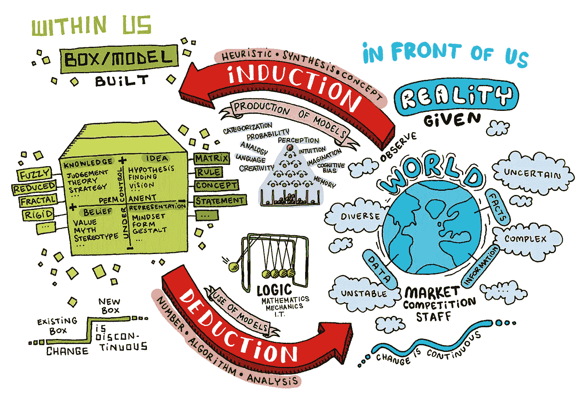
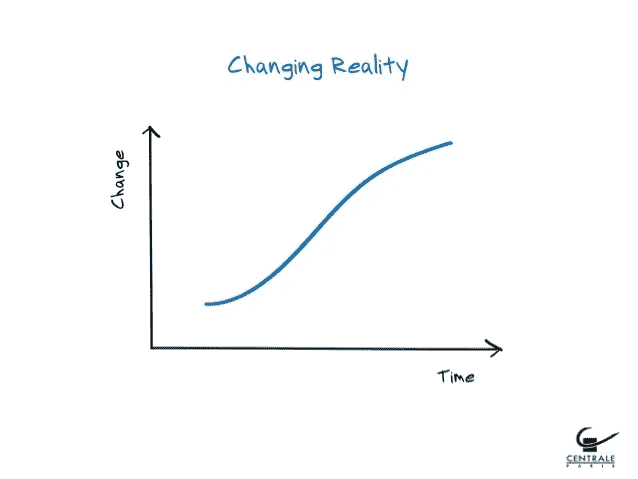
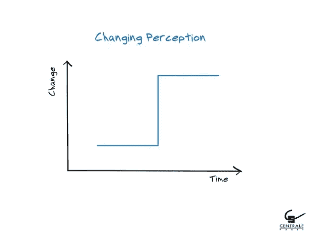
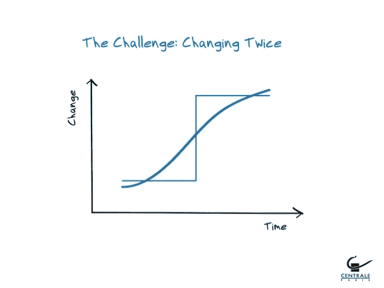

# 这就是为什么你仍然认为彩虹有 7 种颜色

> 原文：<https://medium.com/swlh/this-is-why-you-still-think-a-rainbow-has-7-colors-36f1d65b0cc3>

你看得越近，看到的就越少。

Unsplash — Jared Erondu

你注意到了吗？

在读这个故事之前，试着问问你最亲近的人**彩虹有多少种颜色。**

我知道，很简单！对吗？

*答案是 7。*

每个人都知道。

但是真的那么容易吗？你绝对肯定彩虹只有 7 种颜色吗？

事实上，彩虹是由多种颜色梯度组成的，然而我们都认为它只有 7 种颜色梯度。

为什么？

**只因为更容易。**

是的，更容易。说 7 更容易，所以我们可以画它，描绘它，梦想它，描绘它。

你被自己的思想愚弄了。这是一个**感知**的问题。

感知会造成巨大的伤害。

> 这就是为什么这么多公司被打乱:他们不能弥合感知和现实之间的差距。

# 感知与现实

感知是试图将我们周围世界的元素与现有的心理模型相匹配。

模型是一种心理建构，其中现实被极大地简化，以便根据目标被有效地理解。它允许我们思考现实并采取行动，它既是对现在的抽象，也是对建设未来的支持。

**模特不是用来描绘现实的，而是虚构的。**因此所有的模型都是假的，但这不是重点。唯一相关的问题是模型是否有用。模型的主要目的是将现实风格化，突出其重要特征。

著名的“博弈论”是经济学家、心理学家和政治家经常使用的模型的一个例子。

刻板印象也是我们创造的模型，让我们的思考过程更容易。有捷径，简化。

其他一些模型被称为表示。它们是你基于一个给定的事件或时刻创造出来的，但你无法控制。

假设我在超市排队时遇到了你。一开始你很沮丧，但当我转过身来，你意识到我是个盲人，你会改变对情况的看法，可能会平静下来。然后你被告知你被一个著名的电视节目陷害了，你可能会再次改变你的行为。所有这些都是基于你为了捕捉你周围的世界而为自己创造的表象。

有许多不同形式的模型，我们大多数人都没有意识到我们正在日常生活中使用它们。

# 如何创建新模型？

Luc de Brabandère (2016)

为此，你需要掌握**归纳推理的艺术。**

归纳是思维的真正挑战。正是通过这个过程，概念得以形成，战略得以制定，模型得以构建。

要诱导，你必须放手，花一段非理性的时间，因为完全理性是不理性的。

> 我们总是试图让未知更接近已知。

归纳过程从最具体到最不具体，从特殊到普遍，因此，归纳过程从来不是 100%准确的。答案没有对错之分。

归纳过程有一个主要问题，使其难以理解和评估:

> 从经验中得出的所有推论都假定，作为一个起点，未来看起来会和过去一样，相似的行为会产生相似的结果。
> 
> 如果一个人预测自然的进程可能会改变，过去不是未来的规则，那么所有的实验都变得无用，不能产生任何推论或结论。
> 
> 因此，不可能所有的经验证据都能证明过去与未来的这种相似性，因为它只是基于这种相似性的假设。

> 因此，完美的归纳是不可能的，因为它需要无限的时间。

那么，没有知觉，归纳过程就不可能。

感知是对当下的抽象。

它允许我们依靠自身的力量赋予眼前的事物以意义。这是一种精神状态，一种涉及感官的精神行为。

一个主要的缺点是，你的感知总是试图将观察到的现实的一些元素与你现有的一个或多个盒子、心智模型相匹配。**日复一日，你会稍微偏离现实。**

你不再挑战自己了。很容易，太容易了。

# **那么，我们该如何改变我们的感知，用全新的眼光去观察这个世界呢？**

这是可能的，但是非常困难，而且违背直觉。

要弥合感知和现实之间的差距，你需要改变两次。

一方面，我们有**创新，这是对事物现实的改变。这是一个持续的过程，变化发生在游戏中，但不改变游戏规则。**

*Luc de Brabandère (2016)*

另一方面，我们有创造力，这是我们感知事物方式的改变。这是一个不连续的过程，变化在于改变游戏规则。

Luc de Brabandère (2016)

> 改变感知总是一个强烈的冲击，因为你从一个简化到另一个。

观念的改变只能有两种形式:要么是创造力产生了影响，这种破坏是有意的，要么是造成了破坏，承认失败是残酷而不可避免的。

真正的挑战是两次改变:改变事物的现实，然后改变你对事物的看法。

Luc de Brabandère (2016)

# 让我们以 BIC 公司为例

起初， *BIC* 是一家**制笔公司**。但是，在某些时候，他们觉得如果不改变策略，他们很快就会变得无关紧要。

因此，他们决定创新，他们创造了多色笔、大笔、小笔，基本上他们只是在同一个游戏中做了一些改变，但没有改变它的规则。他们仍在生产**钢笔。这是现实中的一个变化。**

但是当他们意识到他们不是在卖钢笔，而是在卖**一次性用品的时候，只有那时他们才能够创造出改变他们认知所需要的震惊。他们突然看到一个全新的世界展现在他们面前，他们开始卖剃须刀、打火机、胶棒、电话……**

他们改变了游戏规则。他们改变了两次，他们弥合了感知和现实之间的差距。

> "改变你看待事物的方式，你看待事物的方式也会改变."
> 
> —韦恩·戴尔

## 这篇文章发表在 [The Startup](https://medium.com/swlh) 上，这是 Medium 最大的创业刊物，有 339，876 人关注。

## 在这里订阅接收[我们的头条新闻](http://growthsupply.com/the-startup-newsletter/)。

