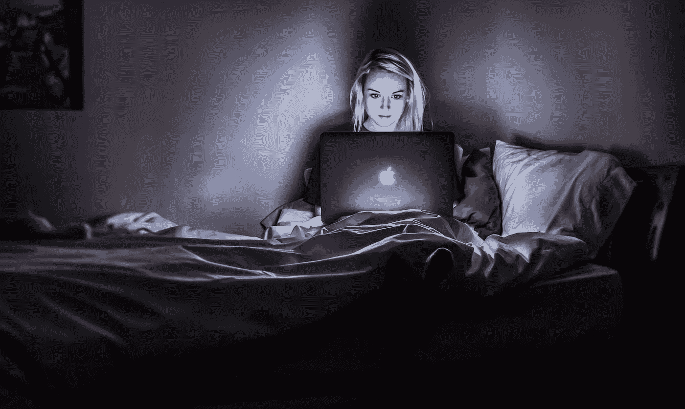

# 这就是你的生活不同步的原因(如何让和谐回归你的生活)

> 原文：<https://medium.com/swlh/this-is-why-your-life-is-out-of-sync-how-to-bring-harmony-back-to-your-life-8f7b075612e5>

Photo by [Victoria Heath](https://unsplash.com/@vheath?utm_source=medium&utm_medium=referral) on [Unsplash](https://unsplash.com?utm_source=medium&utm_medium=referral)

当我还是个孩子的时候，我经常玩。

事实上，我玩上瘾了。我想的和谈论的都是玩。

在电子游戏进入我的生活之前，我只对户外和室内游戏感兴趣。

当我开始玩电子游戏时，没有什么比假装和冒险的感觉更好了。

我被迷住了。

以至于我在学校的时候不能学习。在学校，我会和我的朋友谈论电子游戏。在家里，我大部分时间都在玩电子游戏，当我试图学习时，我无法集中注意力，因为我满脑子想的都是电子游戏。

我没有意识到我有多沉迷。它不仅摧毁了我的学术生活；这也影响了我的社交生活。

几年后，到了上大学的时候，我报名参加了一个游戏设计课程，因为游戏已经成为我的激情所在。

随着大学的开始，我发现对游戏的研究令人着迷。我终于对这些研究感兴趣了。

但是随着对游戏的研究成为我的工作，我就不玩了。

然后，我就迷上了学习。

甚至当我玩游戏时，我玩游戏是为了研究它们。我很少为了休闲玩游戏。

我所有的注意力都集中在获取尽可能多的知识上。

后来才知道，学习和工作是两回事。为了[将知识转化为智慧](https://designepiclife.com/learning-self-improvement/)，[学习必须与实施](https://designepiclife.com/self-improvement-articles/)相平衡。

成为一名内容消费者对我的生活帮助很大，直到我需要对自己的生活负责。我必须练习技能，而不是无休止地学习技能。

然后，在我的生活中有一段时间，我停止了玩耍和学习，因为我的待办事项清单上有太多的项目。我认为我不够“高效”。

我经历过极限玩耍，极限学习，极限工作。像我过去的自己，大多数人都是在这三种状态中的任意一种状态中度过一生。

孩子们有充分的自由玩耍。年轻人被告知要学习直到找到工作，而成年人则被告知要工作到退休。

这个系统在过去可能有效，但现在已经不可持续了。

今天，普通人被剥夺了玩耍、好奇心和创造力。

缺乏玩耍会导致压力和抑郁。缺乏好奇心导致平台期和平庸。缺乏创造力会导致上瘾和不满。

如果你正在读这篇文章，很可能你想从生活中得到更多。你想要过一个充满成长与和平的美好生活。

# 玩耍的重要性

> “玩耍的对立面不是工作。是抑郁症。”—简·麦克戈尼格尔

Photo by [MI PHAM](https://unsplash.com/@phammi?utm_source=medium&utm_medium=referral) on [Unsplash](https://unsplash.com?utm_source=medium&utm_medium=referral)

孩子们玩耍时心中没有烦恼。

随着我们成年，玩耍被工作所取代。你知道你需要赚钱。你需要变得成功。你需要承担责任。

这都是真的。但是，这并不意味着游戏的结束。

玩是必不可少的。玩耍给生活带来乐趣。它消除了消极的想法、压力和焦虑。它改善关系。它让你保持年轻和创造力。

现在很多成年人都没有玩耍的权利。他们因为工作狂而筋疲力尽。他们不会花时间休息他们的大脑，给他们的灵魂充电。

我们只是人类，在我们的生活中，我们需要非生产时间的空间。一直保持“在线”状态是导致灾难的一个因素。导致我们最需要的时候意志力和动力低下。

然而，如果你安排了非生产性或玩耍的时间，当你在工作时间需要的时候，你会变得有纪律和专注。

生活并不全是为了实现伟大的目标。向孩子学习。他们向我们展示了快乐是什么样子的。

所以，花点时间出去玩一会儿吧。

# 学习的重要性

> “活着吧，就像你明天就会死去一样。要像永远活着一样去学习。”圣雄甘地

Photo by [David Travis](https://unsplash.com/@dtravisphd?utm_source=medium&utm_medium=referral) on [Unsplash](https://unsplash.com?utm_source=medium&utm_medium=referral)

旧时代已经过去了。

以前，如果你继续做一般的工作，你可以坚持一份工作而不用担心失去它。

今天，世界正以前所未有的速度变化。进化论认为，为了生存，我们需要适应变化。

所以，你必须跟上新工具，一遍又一遍地成为学生。

成为一个初学者，并遵循终身学习的追求，在工作和生活中脱颖而出。

终身学习让你的大脑保持活跃和好奇。它有助于你学习新技能或提高现有技能。它能让你的个人生活和职业生活更上一层楼。

学一次、两次、三次是不够的。

我不知道你怎么样，但是我不记得在学校教我的 95%的东西。

当重复发生时，学习就发生了。如果我们一直消费内容而不反复练习或学习，我们就不能指望看到结果。

我们的潜意识需要时间才能消化信息。

当你学到一些东西的时候，做简短的总结或笔记，用它们来重温主要概念。此外，你可以阅读其他人关于同一主题的作品，以获得新的视角。

# (创造性)工作的重要性

> “你的工作是发现你的工作，然后全心全意地投入其中。”—佛陀

Photo by [rawpixel](https://unsplash.com/@rawpixel?utm_source=medium&utm_medium=referral) on [Unsplash](https://unsplash.com?utm_source=medium&utm_medium=referral)

如果你想通过做你热爱的事情来谋生，你必须成为一个创造者。如果你热爱你的工作，它会成为你人生成就的源泉。

但是，如果我们不让创造性习惯成为大脑中多巴胺产生的来源，我们就会对不健康的习惯上瘾。

吸食毒品、烟、酒、垃圾食品、色情等变得如此容易。它导致人们在任何他们想要的时候使用成瘾在他们的大脑中产生多巴胺。然后，他们需要更多相同的行为来产生相同水平的多巴胺。

要摆脱上瘾循环，学会表达，成为创造者。

创造和表达是你能做的最好的事情，来服务你的观众和你的灵魂。

当你做创造性的工作时，你不需要外部动机、应用程序或策略来保持正轨。你工作是因为那是你的家。

创建垃圾内容很容易。但是杰作是玩耍、学习和投入工作的结果。

当我生活中的娱乐、学习和工作达到平衡时，我最好的作品就会出现。

如果我跳过三者之一，我的生活就会失去平衡。同时，我确保自己不会过度沉迷于这三者中的任何一个。

你生活中落后的一件事是什么？还是你放纵过度了？

我的生活缺少一些娱乐，我可能消耗了比我需要的更多的内容来平衡我的生活。

你呢？

*本文的一个版本最初发表于*[*【DesignEpicLife.com】*](https://designepiclife.com)

# 成功是日常行动的结果…

为**高绩效和成功**设计你的每日清单。[点击此处立即下载](http://bit.ly/daily-success-list)您的免费版本。

## 这篇文章发表在 [The Startup](https://medium.com/swlh) 上，这是 Medium 最大的创业刊物，拥有 335，210 多名读者。

## 在此订阅接收[我们的头条新闻](http://growthsupply.com/the-startup-newsletter/)。

