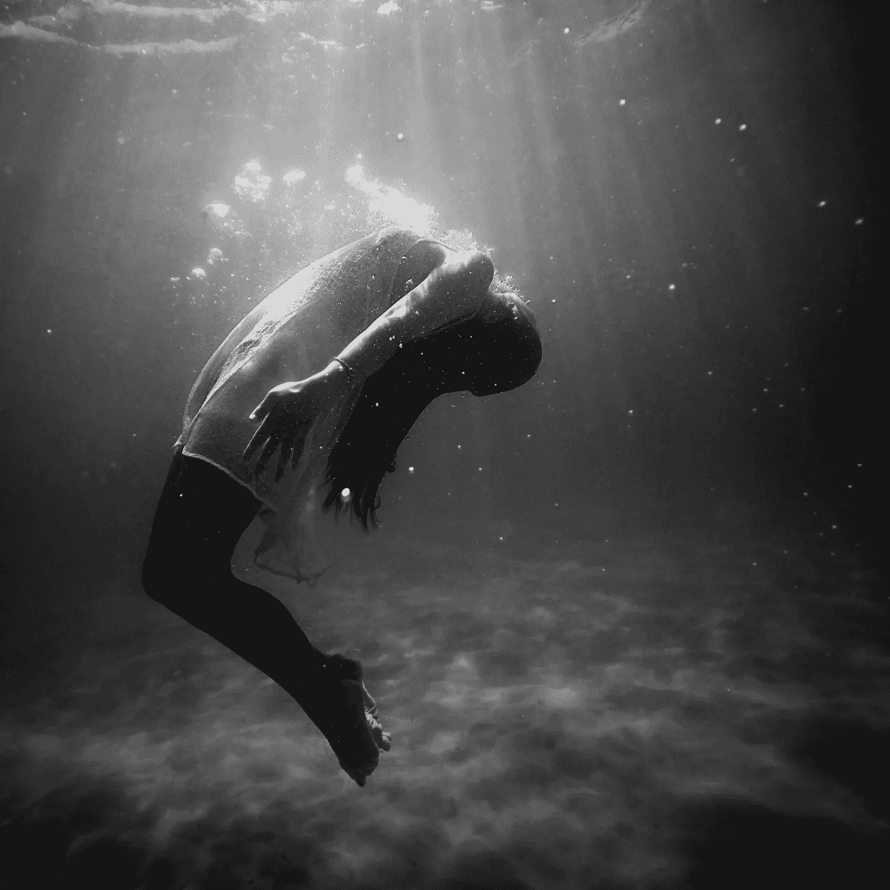

# 这就是你陷入困境和不开心的原因

> 原文：<https://medium.com/swlh/this-is-why-youre-stuck-and-unhappy-57b3385162d1>

## 生存与创造

人类和动物的区别:我们可以仅仅通过我们的思想来激活我们的战斗或逃跑。我们不必真的身处险境。我们的潜意识分不清什么是真实的，什么不是。所以我们的想法让我们进入了战斗或逃跑的状态，即使这种状态很微妙。这将我们推向更低的频率，最终使我们灰飞烟灭。暂停片刻，想想你整天都在想些什么。是的，物流就像你需要完成的事情和你晚餐想吃的东西。不带感情色彩的想法。但也有一大堆想法会产生忧虑、恐惧和压力。正确吗？这些想法正在重播。多年来一直如此。内容可能变了但感受是一样的。

我们感觉到的总是比我们认为的更有力量。我们的感觉，大象。我们的逻辑，上面的小骑手。大象会去它想去的地方。

我们的大部分想法来自恐惧和所有可能出错的事情(我们的认知扭曲)。这变成了一个恶性循环，使我们陷入生存状态。这么多年了，我们已经不在人世了。相反，我们处于恐慌状态。就像我上面提到的，这将我们推向一个更低的频率，我们开始收缩而不是扩张。我们追逐而不是吸引。那么行为就遵循这个。我们脱离。检查一下。放弃吧。不做坏事。我们开始在身体里感受到它。看我们的姿势。我们的能量会改变。久而久之，我们会生病。字面上。

大多数人都是这样生活的。

每天都是持续的生存之战。

一场战斗。

我们自己和发生的事情。

或者会发生什么？

我大半辈子都是这样过的。

这让我陷入困境，不开心。

**如果你没有通过创造新的思想来创造新的生活，产生新的感觉和新的行为，你就生活在过去。**

> 我们的想法会让我们生病。那我们的思想能让我们好起来吗？他们当然可以。
> 
> 乔·德彭扎博士

现在让我们谈谈如何摆脱你的吮吸。

简而言之，把你自己从生存模式中拉出来，进入创造者模式，这样你就不会总是处于战斗或逃跑的状态。所以你不再活在过去。所以你开始在生活中游泳，而不是像狗一样戏水。对许多人来说，溺水。

创造者模式让你活在更高的频率=创造=吸引。

想象一下，每次你有想法的时候，你都在铺设轨道。这些轨迹变成了你的道路。再读一遍这句话，因为事情就是这样。你的思想创造了你的道路。如果你总是想着产生担忧、压力、恐惧和恐慌的想法，它会让你处于一种生存状态。这种状态阻止了创造新体验所需的行为。所以你一直被困住了，无论是在你的头脑中还是在生活中。你不是向前移动，而是横向移动或者转圈。你看着其他人都在前进，你觉得自己比他们少，并对自己产生错误和限制性的信念。你成了你生活的旁观者。在看台上观看。而不是过自己的生活。

**我知道你在想什么。** *但是我已经尝试了很多次去改变我的想法和我思考的方式。它不起作用。*

你可能做了一两天了。或者一周。或者你参加了冥想课程或自我提升研讨会。但这还不够。再说一遍，我们谈论的是年复一年的布线和调节。一个周末不会改变什么。如果你想改变你每天的想法和状态，你必须把它变成一种生活方式的实践。没有别的办法了。

我知道这很难。我明白了。我也很纠结。但我不再是以前的我了。或者更准确的说，想我以前想的。或者说*我以前怎么想的*。是的，我有比别人更好的日子，但总的来说，我给了小费。我不是生活在生存模式中。我处于创造者模式。它改变了我的生活。

# 如何从生存模式到创造者模式

和爱与恨一样，生存状态和创造者状态是不能同时存在的。你可以前后翻转，但不能同时处于两种状态。如果你进入一个创造者的状态，很可能不会持续太久。你自然会默认回到生存状态。很快。随之而来的负面想法和情绪会像它们离开时一样迅速涌回。

关键是尽可能长时间保持在创造者模式。想法是延伸它。一次都没有。每天。惯例就是这样。像任何练习一样，你做得越多，你就会做得越好。直到有一天，你意识到你更多地处于创造者模式而不是生存模式。这就是事情发生的时候。

以下是一些可能有帮助的提示:

1.  **改变你看待这个过程的方式。**

你不只是改变了你的想法。你已经从不同的人、自助书籍、博客和视频中听过很多次了。现在对你来说只是噪音。这就像告诉一个身材走样的人去健身房。他们知道了。这是他们努力奋斗的动机和执行部分。你必须把这看作是一种生活方式的选择。生活方式的改变。就像你要成为素食主义者或旧石器时代的人。不是临时解决办法。知道你就是原因。我来帮你解答。因为你多年来一直生活在生存状态中，它不再为你服务。因为你厌倦了感觉糟糕和气馁。因为你希望自己过得更好。因为你不只是想活着。你想活命。

**2。将它融入你的生活**

就像你早上的咖啡。你的瑜伽练习。比如午饭，睡觉，上厕所。这是你每天都要做的事情。

当你开始你的一天时，你有意识地练习意识你的想法。然后努力去改变它们。想想新的。不一样。积极的。充满了希望和确定性。当你工作的时候。开车。吃饭。做爱。每当你意识到你的想法把你射进了黑暗的隧道，进入了恐慌状态。这将成为你的新习惯，并将成为你每日清单的重中之重。

**3。创建距离**

大多数人用冥想来制造与他们思想的距离。但是，如果这对你来说是一场斗争，不要做徒劳的冥想，去做有用的事情。我通过健身来创造距离。我通过正念创造距离，在那里我锚定自己，用我的感官停留在当下。我通过骑摩托车来创造距离。我通过洗碗来制造距离。任何能让我停下来，让我从思想的束缚中脱离出来的东西。

我拒绝和他们一起堕落。

停留在创造模式足够长的时间，你会开始看到不同的世界。你会发现自己在建造东西。冒险。希望恐惧之墙。相信自己。接受你的故事。你会开始感到充满希望。解开。好多了。开心。整体。

这是我们应该生活的状态。

我们不仅仅是为了生存。

我们注定要创造。

*   愤怒的

[获取我的每日短信](https://www.theangrytherapist.com/)

行动呼吁

[在这里保护你的关系。](https://coursecraft.net/c/theangrytherapist/splash)

如果你是单身，故意的。看看这个。

如果你想用你的故事改变他人的生活，请加入我们的[催化剂辅导强化](https://www.jrni.co/life-coach-training-program?src=medium)。

从下面获取免费的关系工具包。

## 这篇文章发表在 [The Startup](https://medium.com/swlh) 上，这是 Medium 最大的创业刊物，有+ 382，862 人关注。

## 订阅接收[我们的头条新闻](http://growthsupply.com/the-startup-newsletter/)。

