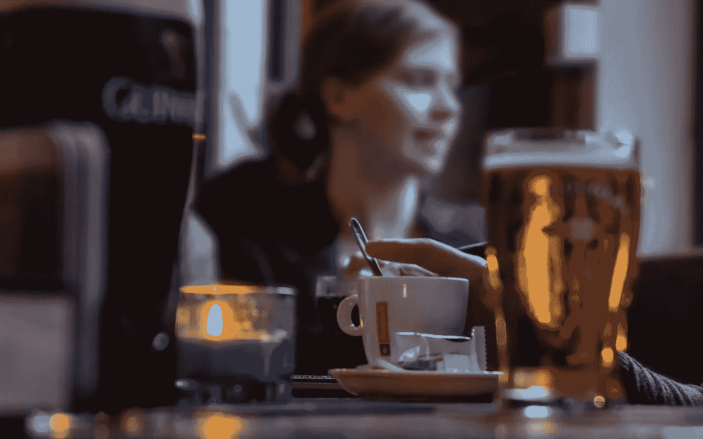

# 这是你的大脑对咖啡因和酒精的反应

> 原文：<https://medium.com/swlh/this-is-your-brain-on-caffeine-vs-alcohol-53afc60b95e0>

Originally published on [**JOTFORM.COM**](http://jotform.com)

早在 80 年代，有一个标志性的商业广告是由[无毒美国合作组织](https://drugfree.org/)制作的，叫做 [*这是你吸毒后的大脑*](https://www.youtube.com/watch?v=GOnENVylxPI) 。

这是一个很短的视频，一个看起来像典型的美国爸爸的家伙脸上带着非常失望的表情。

当他走近一盒鸡蛋和一个盒子时，他带着一种完全蔑视的表情盯着摄像机