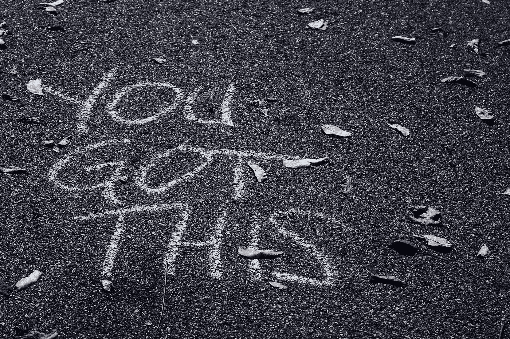

# 想实现自己的目标？首先要有人生目标

> 原文：<https://medium.com/swlh/this-morning-when-i-hit-the-cold-floor-of-my-best-friends-loft-apartment-at-4-am-an-hour-later-ce7c98cabd0e>

Photo by [sydney Rae](https://unsplash.com/@srz?utm_source=medium&utm_medium=referral) on [Unsplash](https://unsplash.com?utm_source=medium&utm_medium=referral)

今天早上 4 点，当我来到我最好朋友的阁楼公寓冰冷的地板上时——比平时晚了一个小时——我花了一点时间表示感谢。

嘿，说句公道话。据 http://www.ecology.com/birth-death-rates/,说，151，600 人今天早上没有像我这样做。所以，我真诚地感谢上帝仁慈地允许我冷冻我的屁股…