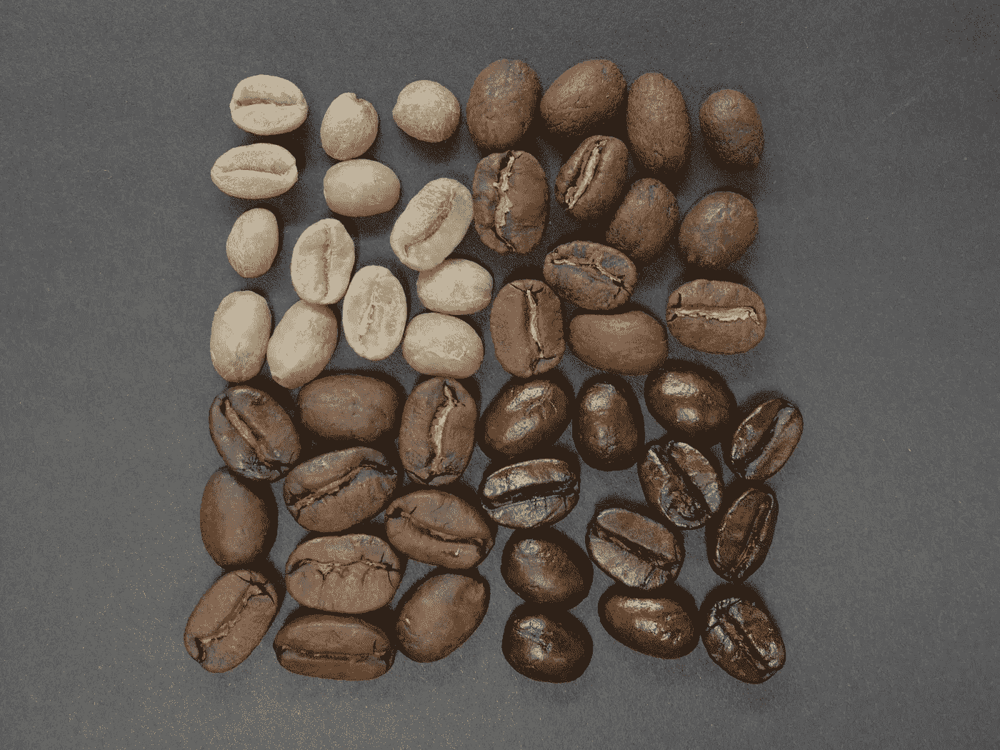
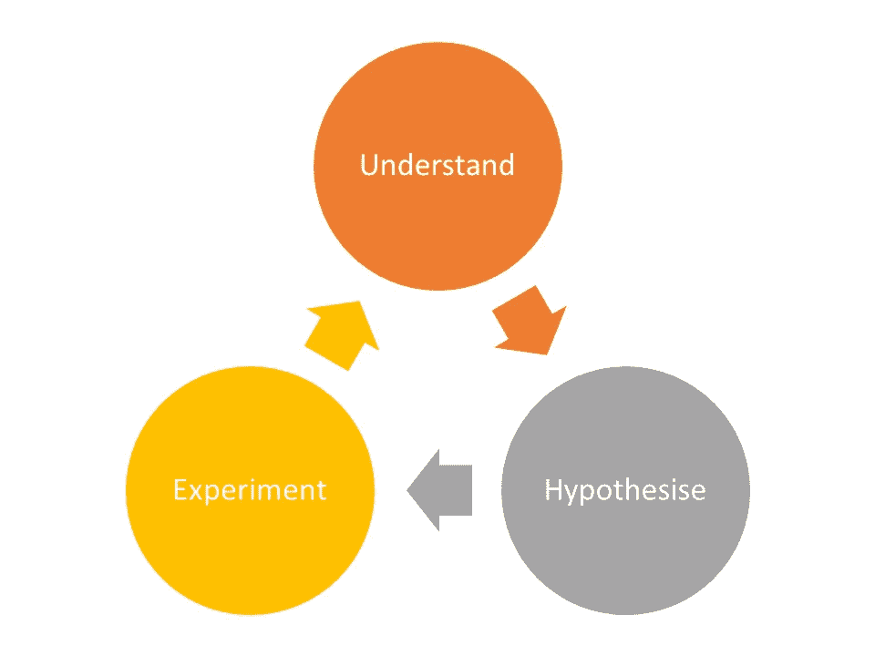
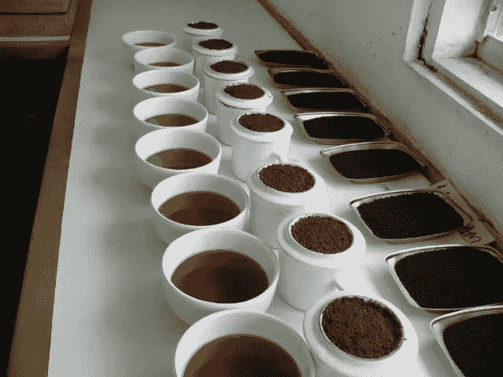

# 这一职业向创业公司展示了如何持续改进

> 原文：<https://medium.com/swlh/this-one-profession-shows-startups-how-to-consistently-improve-b68ae2790161>

Photo by [nousnou iwasaki](https://unsplash.com/photos/myPzH34VYK4?utm_source=unsplash&utm_medium=referral&utm_content=creditCopyText) on [Unsplash](https://unsplash.com/search/photos/coffee-roast?utm_source=unsplash&utm_medium=referral&utm_content=creditCopyText)

## 如何打造能够取胜的新产品、服务和创意？

大多数人在日复一日的生活中迷失了自己，并希望他们的环境会自动改变。对于早期创业者来说，这是致命的。致命是因为你是一家初创公司，这就意味着你所做的并不奏效。如果你继续做那些没用的事情，结果不会是积极的。

那么，你如何逃避日常生活，你如何改变你的环境并从结构上改善？

这个答案我在一个意想不到的地方找到了。它来自于一个非常擅长这项工作的人——不断改进他的工作成果。同时也是你找到最多答案的地方。

是我最好的朋友:鹿特丹的一个咖啡烘焙师。

让我解释一下…

你看，特色咖啡和创业成功有着共同的美丽之处:它们可以被设计。不是从软件工程的角度来说。他们的结果可以被设计。这来自于对某个流程的遵循和完善。

咖啡烘焙的工程流程是创业者可以学到很多东西的，有具体的步骤可以帮助你专注。

在这篇文章中，我将详细阐述:

*   你如何用这一个过程改善你的业务的任何部分
*   如何挖掘限制你现状的问题
*   如何始终比大多数人快 10 倍
*   如何将你的创业公司变成一家企业

所有这一切，都有以下过程:

想从结构上改善你的创业？以下是方法。

# 第一步:理解

作为第一步，我最好的朋友挖掘咖啡，以了解咖啡现在的位置。这涉及到问三个问题:

*   什么管用？
*   什么惊喜？
*   什么没用？

这是因为咖啡烘焙师知道，如果他们想提高他们的咖啡，他们首先需要清楚地了解他们目前的批次。

对于烘焙咖啡，这需要“拔罐”，或者观察煮好的咖啡的味道和气味。你可以看到下面的图片:

在此过程中，烘焙师会关注一些特定的方面:

*   身体
*   芳香
*   酸性
*   风味
*   回味

咖啡烘焙师似乎牢记在心的是，你无法改进你不了解的东西。如果你想解决一个问题，你需要彻底了解它。

我见过那么多的创始人，都异常关注日复一日的运营。随着时间的推移，评估哪些有效，哪些有效，哪些无效，这些都可以得到显著的改善。

一旦你开始关注有限数量的需要改进的元素，这个习惯就变得更有价值了。咖啡烘焙师关注 5-10 个方面。

对于一个早期创业公司的创始人来说，没有那么多事情需要关注。你需要 1)建立一个充满激情的团队来实现公司的愿景，2)做出人们喜欢的东西，3)获得、保持和发展客户以及由此带来的收入。

有了这个，你就可以对需要改进的地方形成自己的观点。您可以用以下格式编写:

> ***目前，目前最需要改进的就是* ____________(什么不行)。**

既然你知道你想改进什么，你需要弄清楚是什么导致了这一点。对于咖啡来说，味道不好可能与空气流动、热量分布、最高温度等等有关。

对于创业者来说，我经常遇到的一个例子就是转化率有问题。这可能是由于一个网站的流量没有意义，一个弱的价值主张，以及许多其他因素。

有了这些原因，你就能更深入地了解什么需要改进，以及如何改进。他有一种表达方式:

> ***这可能是由于*____________ _ _ _ _ _ _(原因 1)、_ _ _ _ _ _ _ _ _ _ _ _(原因 2) *和/或*_ _ _ _ _ _ _ _ _ _ _ _ _ _ _ _ _ _(原因 3)。**

问题是你不能同时改善所有的事情。**改善的基本原理是需要专注。**这就是为什么你需要选择一件事来改善。

这取决于每种情况，哪种改进最有可能对问题产生重大影响。最重要的是，你要想出一个有充分依据的想法，说明是什么导致了这种情况，然后进入下一步。

当你把所有这些放在一起，你会得到这样的东西:

**目前，目前最需要改进的是 ______________ ( *什么不行*)。这可能是由于 ______________( *原因 1)* 、____________ ( *原因 2)* 和/或 ______________ ( *原因 3)* 。不过，最有可能的是，如果我们改变 _____________( *最有可能的原因)*，味道会明显改善。**

一旦你清楚了这一点，你就可以进入第二步了。

# 第二步:假设

这一步主要是提出想法，设想一个改善的情况，并做出选择。

随着对当前咖啡的了解，我最好的朋友现在提出了潜在的改进。上一步的知识在这里有很大的帮助，所以实际上有更好的机会来改善整个咖啡。

这一步包括两个步骤。首先，我的朋友提出了不同的可能性。接下来，他选择最有可能改善问题的一个。

最基本的形式是这样的:

"**鉴于最有可能是由于 _ _ _ _ _ _ _ _ _ _ _ _ _ _ _ _ _ _(*什么不起作用)(*最有可能的原因)，潜在的解决方案可能是*_ _ _ _ _ _ _ _ _ _ _ _ _ _ _ _ _ _*(解决方案 1)* 、_ _ _ _ _ _ _ _ _ _ _ _ _ _ _ _ _ _(*解决方案 2)，和/或*_ _ _ _ _ _ _ _ _ _ _ _ _ _ _ _ _ _ _ _ _ _ _ _ _ _ _ _ _ _(*解决方案 3)。目前，我假设这可以通过*_ _ _ _ _ _ _ _ _ _ _ _ _ _ _ _ _ _(*最可能的解决方案)**** 来改善

说你的问题是你**没有足够的客户。你认为一旦他们进入你的漏斗，他们中的大多数都会改变。然而，让人们进入漏斗很难:你有一个**客户获取问题**。潜在的解决方案可能是**写博客，在 LinkedIn 上添加好友，或者使用付费广告。根据你预算的大小和产品的价格，你需要选择你认为最合适的产品。****

现在你已经清楚你想要改进什么，你可以进入第三步。

# 第三步:实验

我最好的朋友似乎比大多数企业家更了解基本的经济学:你想要最小化风险和成本。为此，他坚持一条原则:一批就是一个实验。正因为如此，如果他的实验真的把咖啡搞砸了，他还没有毁掉很多非常珍贵的咖啡。

我看到很多企业家花了几个月甚至几年的时间来打造他们的 100 个功能的产品。他们把所有辛苦赚来的积蓄都投入到这个非常冒险的项目中。最终，他们的产品卖不出去。他们基本上选择了一种他们认为应该烘焙咖啡的方式，并将他们所有的存货放入烘焙器中。

可以想象，迭代和精益方法工作得更好，尤其是在创新的情况下。

因此，第三步是用最少的金钱和努力将你的想法应用到现实世界中。

这个过程的美妙之处在于它是一个循环。一旦他完成了第三步，他会回到第一步，再次喝咖啡。在这里，他决定他的假设是否与现实相符。

对你想要解决的问题有一个强烈的感觉，你就有了一条清晰的道路来对下一步做什么做出明智的决定。

# 结论

这种方法的美妙之处在于，它是思考进步和解决问题的基本方式。正因为如此，它几乎可以应用于任何事情:

*   产品开发——我们应该改进什么，如何改进，这真的有用吗？
*   营销和销售——什么阻碍了我们的发展，什么可以解决这个问题，我们的想法正确吗？
*   筹款——为什么我们得不到投资，我们能做些什么来提高我们的胜算，这有任何效果吗？

通过从结构上和批判性地思考你的问题，你可以成为最好的自己，建立最好的企业。你可以消除风险，你可以在问题变得太大之前解决问题，你可以比其他人走得更快。

所以问问你自己:

我是在从结构上解决问题吗？

我想建立一个成功的创业公司吗？

你能行的。

# 喜欢这本书吗？鼓掌，这样其他人也可以阅读它，或者关注更多像这样的故事。

## 这篇文章发表在《初创企业》杂志上，这是 Medium 最大的创业刊物，有 343，876 人关注。

## 订阅接收[我们的头条新闻](http://growthsupply.com/the-startup-newsletter/)。

