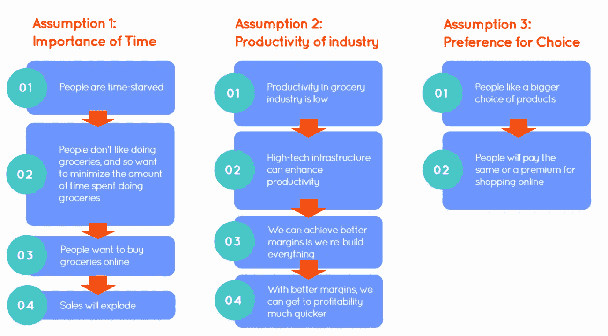
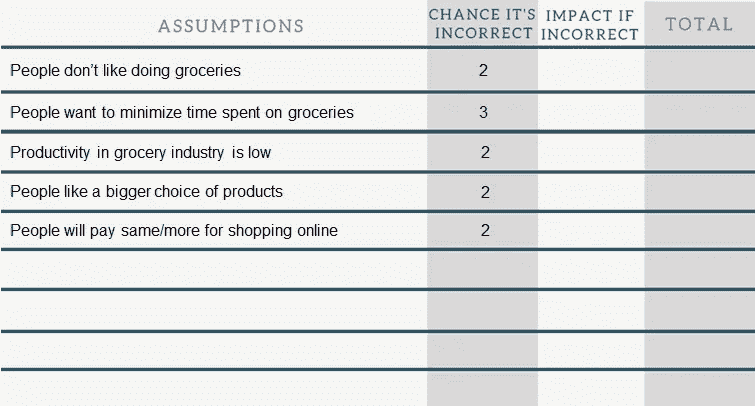
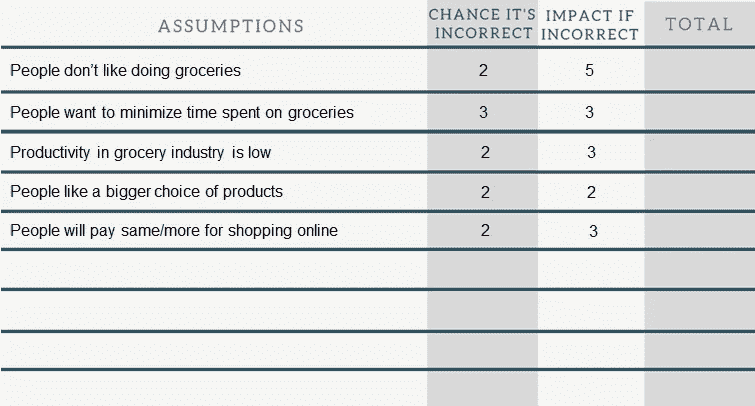
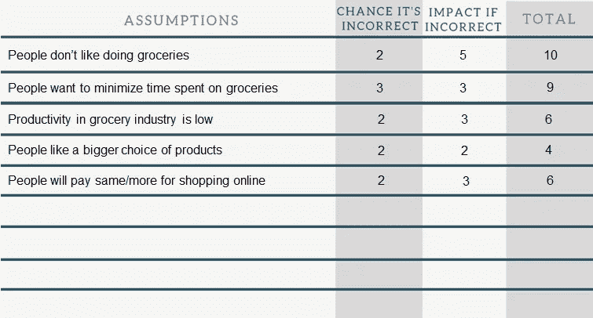

# 这一个问题会让你创业时的每一个决定都变得更容易

> 原文：<https://medium.com/swlh/this-one-question-will-make-every-decision-in-your-startup-easier-666089a79f0a>

Launch by [SpaceX](https://unsplash.com/photos/OHOU-5UVIYQ?utm_source=unsplash&utm_medium=referral&utm_content=creditCopyText)

## 根据你最危险的假设来衡量每一个决定。

Webvan 的创始人出色地勾勒出了一个令人敬畏的企业。

*   他们的眼光很敏锐:杂货店购物太乏味了，所以我们要让人们能够在网上挑选产品。
*   市场是巨大的。普通家庭每年在食品杂货上花费 5000 美元，有人每周去商店 2-3 次。
*   创始人有着出色的业绩记录，有两位连续创业的企业家开了店，还有一位首席执行官曾领导过一家大型咨询公司。
*   他们的战略是超前的:有了 3500 万美元的仓库和下一级自动化，成本可以大大降低。

就这样，他们筹集了超过 12 亿美元。

但随后他们遇到了意想不到的事情:

*   “需求弱于预期。”分析师亨利·布洛杰特
*   “这不是一个不需要解决方案的问题……人们不会抱怨去杂货店购物。”—彼得·法德尔，市场营销教授

因此，在高调推出两年后， **Webvan 宣布破产。**

据前亚马逊和 Webvan 官员称，他们的教训是:

> "扩张缓慢，将送货限制在潜在客户高度集中的地区."

当你深入探究时，你会发现他们在三个核心假设上是错误的:

*   他们认为他们能够在别人失败的地方取得成功，因为他们大量投资于高科技基础设施，他们认为这将提高生产率。这将转化为更低的成本，他们相信这将击败其他杂货商。
*   他们认为购物者时间紧迫，因此会对网上购物的便利做出反应。他们可以改变顾客的行为。
*   他们认为购物者会重视提供给他们的选择数量，从而导致他们支付更高的价格。

他们认为他们有一个可重复和可扩展的业务模型。

发射两年后，烧完所有的钱，**他们意识到他们没有。**

# 如何避免这种情况

我能听到许多企业家在笔记本电脑后尖叫:

> “他们应该制造一个最低限度的可行产品！”

**我不同意。**

MVP 已经成为新产品的标准，因此它失去了最初的意义。是本义？确保你浪费最少的时间、精力和金钱去做错误的事情。

因为它已经成为标准，人们经常错误地将 MVP 应用于产品发布的第一个蹩脚版本。结果是:他们花费时间、精力和金钱建造错误的东西。MVP 被发明的原因就是为了防止这种情况！

那么，如何避免花费过多的时间、金钱和精力来构建错误的产品呢？

# 最危险假设测试

你确定你的**最危险的假设**和**测试它**。正如[里克·海厄姆](https://medium.com/u/e4ef007a393a?source=post_page-----666089a79f0a--------------------------------)所说，你使用了最危险的假设测试。

怎么会？如下所示:

## **第一步。列出你对企业的所有假设。**

每个新想法都是基于一系列假设。找出你最重要的问题的最简单的方法是使用[精益画布](http://bmtoolbox.net/tools/lean-canvas/)。基于此，列出你对这些问题的答案:

*   我的解决方案将解决哪三大问题？
*   我的目标客户和用户是谁？
*   谁将是第一个购买我的解决方案的人？
*   他们目前如何解决这些问题？
*   我的解决方案如何优于其他解决方案，人们为什么要为此付费？
*   我的收入来源是什么？
*   我如何找到我的客户，或者他们如何找到我？

## **第二步。确定你的假设出错的可能性**

一旦你列出了你的假设，确定你在这个假设上出错的可能性有多大。您可以在 1-3 的范围内这样做，如下所示:

*   1:我已经和 20 多个同意这个观点的人谈过了
*   他说:我亲身经历过
*   他说:这是我从一份报告中得到的
*   4:我基于纯粹的本能

## **第三步。如果您的假设有误，确定对您业务的影响**

太好了！你已经评估了你的假设出错的可能性。现在，如果你错了，请评估每个假设对你的业务的影响。您可以在 1-5 的范围内这样做，如下所示:

*   1:几乎没有影响
*   他说:我必须重新调整一些事情
*   3:这需要不同的方法
*   4:这将需要不同的商业模式
*   5:这将改变我的整个生意

## **第四步。将步骤 2 和 3 的分数相乘。**

现在你想得到总分，这样你就可以确定你的哪个假设是最危险的。

## 第五步。区分优先级，并想出测试的方法

现在你已经得到了最高分的假设，你可以想出方法来测试它。这是一个完全不同的故事，我会在另一篇文章中注意这一点。

如你所见，对于 Webvan 来说，他们最危险的假设是他们业务的基础:有一个有需求的客户。

如果你想了解更多关于如何测试这个基础的内容，我在这里写了一些。

# 结论

Webvan 是一个假设过多、扩张过快的典型例子。他们并不孤单:42%的创业公司因为这个原因而失败。弄清楚你的核心假设，并着手测试它是至关重要的。

正如[灰孔雀](https://medium.com/u/4c221b5f40f3?source=post_page-----666089a79f0a--------------------------------)所说:

> “初创企业失败的首要原因不是因为他们没有打造出他们想要打造的东西，而是因为他们花费了太多的时间、金钱和精力来打造错误的产品。”

你可以通过系统地测试你最危险的假设来防止这一点。

## 最后两件事…

如果你喜欢这篇文章，请👏并分享给你的朋友。记住，你最多可以鼓掌 50 次**——这对我真的很重要。**

## **如果你想读更多我的“哦，狗屎”和“啊哈”，在这里订阅。**

****

## **这篇文章发表在 [The Startup](https://medium.com/swlh) 上，这是 Medium 最大的创业刊物，有 307，492+人关注。**

## **订阅接收[我们的头条新闻](http://growthsupply.com/the-startup-newsletter/)。**

****