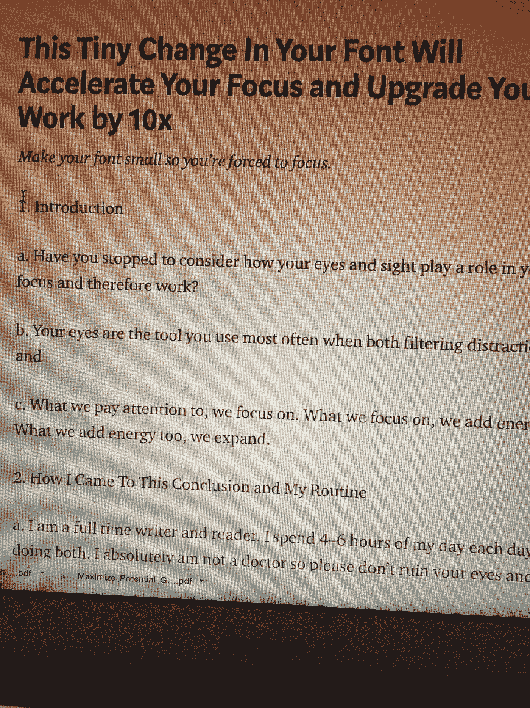

# 字体的快速变化让我的注意力和创造力提高了 10 倍(也许你也是)

> 原文：<https://medium.com/swlh/this-quick-change-in-font-upgraded-my-work-by-10x-and-why-we-love-hoodies-225d767501c>

Photo by [Joseph Gonzalez](https://unsplash.com/photos/g4PLFkpUf4Q?utm_source=unsplash&utm_medium=referral&utm_content=creditCopyText) on [Unsplash](https://unsplash.com/?utm_source=unsplash&utm_medium=referral&utm_content=creditCopyText) This little guy is focused

力函数有不同的风格。

我有一个理论，如果你把字体变小，这是一个力的作用，会导致更大的注意力——特别是如果你正在写作(或者整天发邮件)。

我们都喜欢加速我们更好发展的伟大黑客，这个发现来自我自己的使用、发现和实现。

# **语境**

我几周前才成为全职作家，所以自然地掌握写作技巧对我来说非常重要，尤其是现在。

前几天我在写一篇我认为比以前的文章有很大进步的文章，我惊讶地发现我的写作进步得如此之快。

每天以更快的速度提高性能，连接无数简洁而有意义的想法。

我的数据也证明了我是对的。我的电子邮件订阅者和追随者的增长率。

随着我的强度和信念与日俱增，话语越来越多。

# 我恍然大悟

我意识到我已经做得很好了，当我在 word doc 中用小 Calibri 字体(12)写我的初稿时，我更喜欢我制作的作品的打字体验和查看体验。

我可以在这个漂亮的博客平台(Medium)上发表文章，这个平台超级用户友好，可以写我的第一稿，但同样，我也不习惯使用 Word 和较小的字体。

我也尝试过大字体。我已经尝试了所有的字体，并且仍然对小字体有强烈的偏好。

我不得不进一步探索。

我意识到我打字时几乎一直眯着眼，而且似乎在打字时注意力更集中。

> 是那小小的字体让我的手指不停地奔跑，将文字倾注到页面上，越来越深地聚焦吗？

我必须学习更多。

# 当我们眯眼时，我们的眼睛是如何工作的

你(像我一样)可能从来没有停下来考虑过你的眼睛是如何工作得更少的，是否聚焦较小的字体所需的轻微力量会带来更大的焦点。

在从各种医学来源和医生那里探索了几个来源之后，下面的一些形式似乎是规则。下面来自内华达州 [Lasik 激光中心](http://lasikofnv.com/why-squinting-helps-you-focus-better/)。

1.  ***“我们眼睛里的晶状体是灵活的，会改变形状。在某种程度上，我们的眼睛就像照相机。它有能力通过微小的调整来专注于某事。就像摄影师可以用手的微小动作来调整他/她的镜头一样，我们眼睛的晶状体可以通过利用眼睛周围的肌肉来改变形状。***
2.  ***眯着眼也会减少允许进入眼睛的光线量。*** 有时候东西模糊的原因是因为光线太强。通过眯着眼，我们减少了[光对我们视网膜的影响](http://www.medicaldaily.com/pulse/eye-health-squinting-corrects-blurry-vision-changing-eye-shape-limiting-light-335178)，从而使我们正在看的物体看起来更清晰。"

然后，我还思考了什么最让我们分心，这是从哪里来的——也就是你的眼睛。

*   你看到邮件进来了。
*   你看到在你办公室的人来打断你。

# 注意力是如何工作的

我们关注的，我们专注的。

我们关注什么，我们就给什么添加能量。

我们增加的能量也会膨胀。

这被称为[经验依赖型神经可塑性](https://www.heysigmund.com/why-what-you-focus-on-is-what-becomes-powerful-why-your-thoughts-and-feelings-matter/)。根据国际脑科学协会的说法，大脑的变化能力是一种基本属性。所以在我的小理论的背景下，专注于你正在做的事情所需要的专注程度，自然会产生更多的专注！

# 我的日常工作和我如何形成这个理论的更多背景

我每天花 4-6 个小时阅读和写作。

我的注意力、输出和眼睛非常重要(对大多数整天坐在电脑后面的人来说也是如此)，我总是在寻找优势。

> * * *我绝对不是医生，所以请不要毁了你的眼睛，来找我治疗你的眼睛问题。这是我的正式声明。做一个实验者，尝试一些东西，看看什么对你有用。***

我要告诉你的是，这是我在写作时注意到的对我自己的关注特别有效的方法，然后将它与我在博客平台上用更大的字体写的文章(这里是中等字体)和在电子邮件中用更大的字体写的文章进行比较。

显然还有其他的因素，比如我的全职写作生涯才刚刚开始，所以对它也有着强烈的兴趣。

这就是我所做的一切，也许这比那些兼职写作的人创造了更多的强度(*这也许是为什么我会注意到像字体大小和焦点这样细微的东西，我认为这有助于发挥我的最佳水平)。*

Draft of this live piece in word

我发现，与 Medium 要求的较大字体相比，这加深了我的注意力，我每天都会特意选择这种字体:

最后对比我的邮件。

# 启动你的焦点——如果我的理论是正确的——小字体是一个力函数

> “另一边的草不更绿，你浇水的地方草更绿。”—山姆·奥文斯

我的理论是，小字体作为一种力的功能，催化你的眼睛聚焦在某个东西上的过程。

让它感觉更强大的是在键盘上打字本身——这显然是有益的，从而使它容易应用和有效。

相比之下，大字体从一开始就需要较少的注意力，而(如果我的理论是正确的)更多的注意力集中在打字上。

鉴于集中注意力的关键是消除外界刺激以消除分心，如果我们扩展更多的能量，并吸收屏幕上的文字，我们会更集中，并允许减少分心。有道理，对吧？

当我们专注于小字体(想象眯着眼，但不要让字体太小，以至于你被迫眯着眼)并被迫扩展更多的能量来关注时，正是能量输出本身增加了注意力，同时也消除了这个过程中的分心。

# 关于帽衫和它有什么关系的有趣而奇怪的结论

当我穿着帽衫的时候写这篇文章让我思考为什么我们这么喜欢帽衫，以及它们与专注有什么关系。

当一个拳击手准备进入状态时，为什么她/他要在比赛前穿上连帽衫？

Photo by Lobostudio-Hamburg-6

当你长时间锻炼后离开健身房时，为什么要穿上连帽衫来恢复体力？

为什么我们这么爱帽衫？

不管帽衫是什么，似乎有一种东西让我们穿上帽衫，把帽子戴在头上，让我们感到安全，与自己联系在一起，也许，专注？

当你戴上兜帽时会发生什么？你的视线发生了变化，变得有点狭窄。

你能看到的更少。当你眼睛周围的东西越来越少时，你会被迫去看正前方的东西，或者至少是你周围的东西越来越少(确切地说)。

再说一次，正是我们喜欢的(通常是无意识的)强迫专注的本地心理环境让我们穿上这件连帽衫，无论它是在离开健身房时阻挡所有人，还是在拳击比赛前进入我们自己的专注状态。

我不穿帽衫在外面看风景的现场照片。

Photo by Aram

现场照片我的看法与我的帽衫。

你怎么想呢?

你认为缩小你眼前的视线会导致更好的聚焦吗？

你认为你周围的环境更适合关注眼前的事情吗？

我觉得这有点道理。你知道吗？

不要看了这一块就认为是“真假”。

只是利用它来思考——这很可能意味着把它扔掉。

或者也许你只是从我的角度学习，这样你就可以决定接受什么。

毕竟，真的没有“真理”这种东西，因为[真理是主观的](https://www.sciencealert.com/watch-how-repetition-creates-an-illusion-of-truth)。

因此，我希望你尝试一下我的小理论，看看它是否对你有用，是否能提高你的注意力。

我想给你们留下这段关于知识和“真理”的引言，作者是我们这个时代的天才之一，尤瓦尔·诺亚·哈拉里博士，他是世界著名的畅销书《智人》的教授和畅销书作者。

> “对‘知识’的真正考验不是它是否真实，而是它是否赋予我们力量。科学家通常认为没有一个理论是 100%正确的。因此，真理对于知识来说是一个糟糕的测试。真正的考验是效用。一个能让我们做新事情的理论，就构成了知识。”

PS—*18 年 1 月 1 日更新我的小理论！我刚刚发现研究人员进行的以下实验证实了我是对的！这被称为认知不流利——一种现象，其中更多的***认知参与导致更深层次的处理，这有利于编码和随后更好的检索。“你可以在这里阅读更多关于这项研究的内容:*[https://www . chronicle . com/article/The-Benefits-of-Making-It/132056](https://www.chronicle.com/article/The-Benefits-of-Making-It/132056)*

**

*Art by Emily May Rose*

## *[每周一次点击接收我保证是你在互联网其他地方找不到的改变游戏规则的文章。你还会收到我的指导，告诉你如何在你所做的事情上成为世界上最好的。你不会后悔的。](https://betreatedhowyouwanttobetreated.com/optin-main)*

**

## *这篇文章发表在 [The Startup](https://medium.com/swlh) 上，这是 Medium 最大的创业刊物，拥有 277，994+读者。*

## *在此订阅接收[我们的头条新闻](http://growthsupply.com/the-startup-newsletter/)。*

**